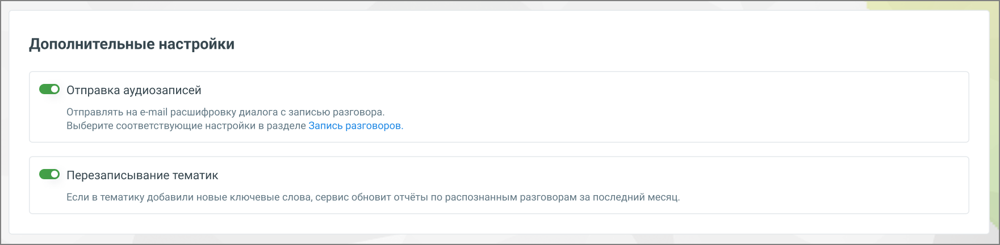

# 3.5. Дополнительные настройки

> Трассировка: PDF §3.5 · сквозные стр. 28-29 · источники: ч.1 `kb/mango-product-docs/sources/speech-analytics/RECHEVAYA-ANALITIKA_1.26.18.pdf` с.28-29.

Блок Дополнительные настройки позволяет пользователю управлять расширенными функциями обработки и распознавания разговоров.

В данном блоке доступны следующие опции: 1. Отправка аудиозаписей: • Если переключатель включен, клиенту, использующему сервис "Речевая аналитика" и подключившему услугу "Расшифровка разговоров", на электронную почту отправляются текстовая расшифровка и аудиозапись соответствующего разговора. 2. Перезаписывание тематик: Речевая аналитика | v.1.26.18 28

| 8 800 555 55 22, mango-office.ru |  |
| --- | --- |
|  | mango@mangotele.com |

• Если в тематике добавлены новые ключевые слова, сервис автоматически обновит отчёты по уже распознанным разговорам за последний месяц. Это позволяет поддерживать актуальность данных в отчетах без необходимости ручного обновления. Подробнее о тематиках узнайте здесь. Эта настройка относится ко всем добавленным тематикам и может изменить текущие данные в отчетах. ПРИМЕР: Руководителю необходимо оценить заинтересованность клиентов в приобретении товаров на период новогодних распродаж. Для этого создается тематика, и задаются условия её проставления. 15.11.2023 создается тематика “Акции” с ключевыми словами: акция, скидка, распродажа. Ознакомившись с разговорами, которым проставилась тематика, руководитель решает изменить условия проставления, сделав их более конкретными. 15.12.2018 меняются условия внутри тематики, изменяются ключевые слова: новогодняя акция, новогодняя скидка, новогодняя распродажа. Чтобы данные отчетов соответствовали новым условиям, Речевая аналитика проверит текстовые диалоги, а также записанные и распознанные звонки за последний месяц (с момента создания первой версии тематики) на соответствие внесенным изменениям и перепроставит тематику заново. Таким образом, нет необходимости ожидать накопления новых распознанных разговоров или текстовых диалогов для оценки заинтересованности клиентов. Руководитель получает уточненные (либо новые) данные немедленно, из уже имеющихся данных. И, на основе этих данных, может корректировать работу организации. Каждая из этих функций обеспечивает дополнительную гибкость и улучшение качества обработки разговоров, позволяя пользователю настраивать сервис в соответствии с его потребностями.
