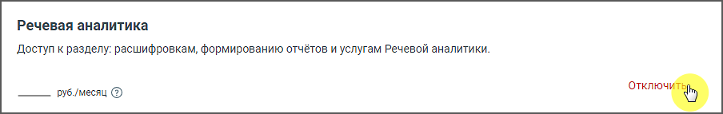

# 3.6. Отключение услуги

> Трассировка: PDF §3.6 · сквозные стр. 29-31 · источники: ч.1 `kb/mango-product-docs/sources/speech-analytics/RECHEVAYA-ANALITIKA_1.26.18.pdf` с.29-31.

При необходимости пользователь может отключить услугу Речевая аналитика. Для этого в разделе Настройки нажмите на ссылку Отключить.

В появившемся окне заполните и отправьте форму обратной связи с запросом на отключение услуги. Услуга будет отключена вашим Персональным менеджером. Речевая аналитика | v.1.26.18 29

| 8 800 555 55 22, mango-office.ru |  |
| --- | --- |
|  | mango@mangotele.com |

На странице Настройки будет отображаться статус заявки на отключение. После отключения услуги пользователь полностью теряет доступ к функционалу услуги. Речевая аналитика | v.1.26.18 30

| 8 800 555 55 22, mango-office.ru |  |
| --- | --- |
|  | mango@mangotele.com |
