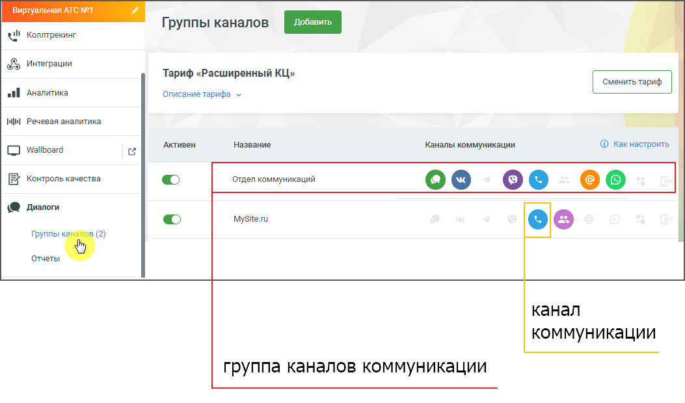
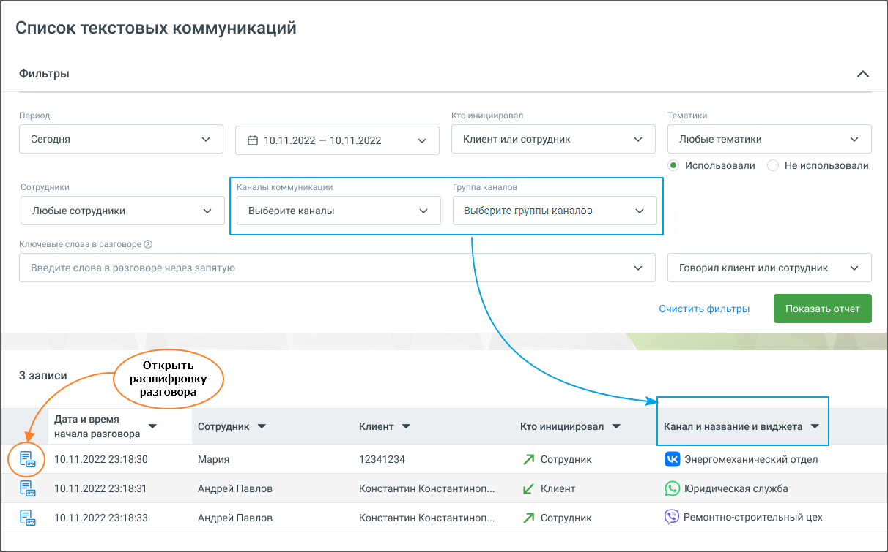

# 7.1. Список текстовых коммуникаций

> Трассировка: PDF §7.1 · сквозные стр. 60-62 · источники: ч.1 `kb/mango-product-docs/sources/speech-analytics/RECHEVAYA-ANALITIKA_1.26.18.pdf` с.60-62.

При переходе на страницу «Текстовые коммуникации» отображается панель фильтров. На панели присутствуют:

• Период – в какой период состоялись диалоги, которые должны войти в отчет. Выпадающее меню, с вариантами периода: произвольный, текущий день, текущая неделя, текущий месяц, с прошлого месяца, с позапрошлого месяца, текущий год, весь период; • Календарь – для указания временного промежутка, когда были осуществлены диалоги, которые должны войти в отчет. После выбора дат, нужно подтвердить выбор кнопкой «Выбрать»; • Выпадающий список Кто инициировал диалог – канал поиска. Варианты: клиент, сотрудник, клиент или сотрудник. • Тематики – поиск проводится как по всем распознанным текстовым сообщениям, так и по сообщениям определенной тематики. Для поиска по тематикам в выпадающем списке выберите необходимый вариант. При вводе поискового запроса производится проверка на наличие каждого слова в словаре распознавания (с учетом словоформ). Возможен выбор как включенных, так и исключенных из поиска тематик.

| Если выбрано Использовали, то в списке выводятся диалоги, на которые проставилась |
| --- |
| хотя бы одна из выбранных тематик. |

| Если выбрано Не использовали, в списке будут только те диалоги, на которые не |
| --- |
| проставилась ни одна из выбранных тематик. |

• Строка для ввода ключевых слов – терм. Подробнее о том, как формулировать поисковые запросы, узнайте здесь. В выпадающем списке доступен выбор канала, по которому будет вестись поиск. Варианты: Клиент, Сотрудник, Клиент или сотрудник. • Сотрудники – выпадающий список всех сотрудников, сгруппированный по группам. Имеется строка поиска по ФИО сотрудника и кнопка Выбрать все/Сбросить все. • Каналы коммуникации – выбор из выпадающего списка доступных в разделе «Диалоги» ЛК ВАТС каналов коммуникации. Варианты: Чат на сайте, ВКонтакте, Viber, Telegram, WhatsApp, Avito. • Группы каналов – выбор из выпадающего списка созданных в разделе «Диалоги» ЛК ВАТС групп каналов коммуникации. Речевая аналитика | v.1.26.18 60

| 8 800 555 55 22, mango-office.ru |  |
| --- | --- |
|  | mango@mangotele.com |

После настройки необходимых фильтров и добавления ключевых слов нажмите кнопку Показать отчет. Отобразится список разговоров, удовлетворяющих заданным условиям поиска.

После нажатия на кнопку Открыть расшифровку разговора, отображается текст разговора с осциллограммой. Если пользователь имеет ограниченные права доступа на просмотр текстовых разговоров, то в результатах поиска, по ключевым словам, будут только доступные ему разговоры. Речевая аналитика | v.1.26.18 61

| 8 800 555 55 22, mango-office.ru |  |
| --- | --- |
|  | mango@mangotele.com |
