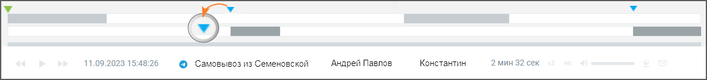

# 7.2. Метки на осциллограмме диалога

> Трассировка: PDF §7.2 · сквозные стр. 62-64 · источники: ч.1 `kb/mango-product-docs/sources/speech-analytics/RECHEVAYA-ANALITIKA_1.26.18.pdf` с.62-64.

Для отображения результатов поиска в текстовых сообщениях используется осциллограмма диалога, с выделенными фрагментами диалога.

При наведении курсора в область осциллограммы на тех участках диалога, где были вхождения терм, отображаются:

• метка для терм, найденных из строки ввода ключевых слов;

• метка для терм из тематик.

При наведении курсора на метки и осциллограммы отображается всплывающее окно с указанием канала, в рамках которого была распознана терма, а также сама терма. Поиск по текстовым сообщениям может осуществляться: • по ключевым словам, в строке поиска; • с учетом выбранных в фильтре тематик. Соответственно будут различаться метки на осциллограмме диалога.

✓ Если во всплывающем окне осциллограммы в списке тематик выбрать какую-либо тематику, то на осциллограмме будут отображены метки, принадлежащие только этой тематике, и не будут отображены метки, принадлежащие другим тематикам из списка. ✓ Если во всплывающем окне осциллограммы в списке ключевых слов выбрать какое-либо ключевое слово, то на осциллограмме будут отображены метки, принадлежащие только этому ключевому слову, и не будут отображены метки, принадлежащие другим ключевым словам из списка. Выбор термы или ключевого слова в блоке «Распознанные тематики и слова» выделяет фрагмент

диалога, с этой термой/ключевым словом. Пиктограммы позволяют быстро переключаться между фрагментами, содержащими выбранные термы/ключевые слова. Речевая аналитика | v.1.26.18 62

| 8 800 555 55 22, mango-office.ru |  |
| --- | --- |
|  | mango@mangotele.com |

Клик по пиктограмме сворачивает окно диалога в компактный формат. Для отображения окна в

<!-- изображение на стр. 63: байты не извлечены (PyMuPDF недоступен) -->

полной форме следует нажать на пиктограмму . Речевая аналитика | v.1.26.18 63

<!-- изображение на стр. 64: байты не извлечены (PyMuPDF недоступен) -->

| 8 800 555 55 22, mango-office.ru |  |
| --- | --- |
|  | mango@mangotele.com |
