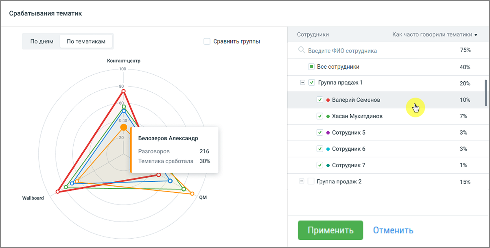

# 8.2.2. Блок визуализации срабатывания тематик

> Трассировка: PDF §8.2.2 · сквозные стр. 69-70 · источники: ч.1 `kb/mango-product-docs/sources/speech-analytics/RECHEVAYA-ANALITIKA_1.26.18.pdf` с.69-70.

Отчет предоставляет данные по количеству присвоенных звонкам тематик в разговорах сотрудников/групп, которым были присвоены выбранные тематики. Отчет доступен в срезах По дням, По тематикам. Каждый цвет кривой на графике соответствует определенному сотруднику или группе.

Рис.1. Срез «По дням» • По оси У графика «По дням» отображается сколько тематик сработало, то есть процентное значение срабатывания выбранных в "Показателях" тематик. Если чекбокс «Сравнить группы» включен, то график отображает данные по группам сотрудников. Иначе – по отдельным сотрудникам. Максимальное количество выбранных сотрудников для построения графика – 20. • По оси Х отображается временной период в разбивке по дням относительно выбранного периода в фильтре "Период". ПРИМЕР 1: В поле "Показатели" выбрано 3 тематики. За указанную дату по сотруднику "Игорь Петров" было распознано 50 разговоров. На 40 распознанных разговоров был присвоена каждая из выбранных тематик, а на оставшиеся 10 не присвоена ни одна тематика. Таким образом количество тематик, которые присвоены указанным разговорам = 120 (из возможных 150). Значение параметра "Тематик сработало" будет равняться: 120 / 150 * 100% = 80%. Речевая аналитика | v.1.26.18 69

| 8 800 555 55 22, mango-office.ru |  |
| --- | --- |
|  | mango@mangotele.com |

По клику на графике отображается всплывающее окно с информацией по сотруднику или клиенту на выбранную дату. Если чекбокс «Сравнить группы» включен, то всплывающее окно содержит данные по группе сотрудников на выбранную дату. Если чекбокс «Сравнить группы» выключен, по наведению курсора на вершину любой из кривых графика отображаются данные по конкретному сотруднику. Всплывающее окно содержит данные по сотруднику на выбранную дату. Столбец «Как часто говорили тематики» рассчитывается как среднее значение по всем значениям параметра «Тематик сработало» за установленный период.

Рис.2. Срез «По тематикам» Внутри окружности графика «По тематикам» располагается графическое отображение вхождения сработавших тематик в разговоры выбранных сотрудников (сколько тематик сработало, столько цветных фигур отображается на графике). Максимальное количество выбранных сотрудников или сработавших тематик для построения графика – 20. Если чекбокс «Сравнить группы» включен, то всплывающее окно содержит данные по группе сотрудников на выбранную дату. Если чекбокс «Сравнить группы» выключен, по наведению курсора на вершину любой из кривых графика отображаются данные по конкретному сотруднику. Всплывающее окно содержит данные по сотруднику на выбранную дату. Столбец «Как часто говорили тематики» рассчитывается как среднее значение по всем значениям параметра «Тематик сработало» для конкретного сотрудника. ПРИМЕР 2: Значение "Тематик сработало" по сотруднику "Игорь Петров" за 01.01 = 50%, а за 02.01 = 70% Соответственно, значение "Как часто говорили тематики" по сотруднику "Игорь Петров" за выбранные 2 дня равняется [(50% + 70%) / 2)] = 60%
