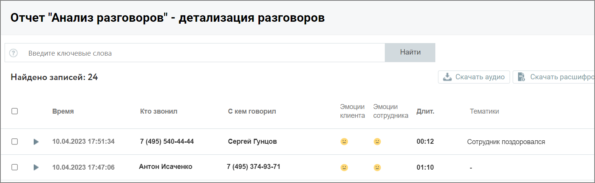
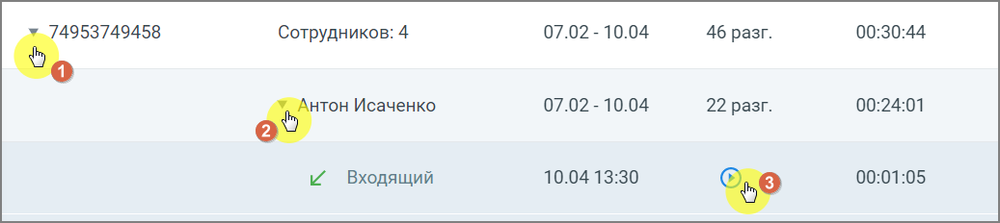

# 8.2.4. Детализация разговоров

> Трассировка: PDF §8.2.4 · сквозные стр. 74-75 · источники: ч.1 `kb/mango-product-docs/sources/speech-analytics/RECHEVAYA-ANALITIKA_1.26.18.pdf` с.74-75.

Рассмотрим пример детализации для типа записи разговора: «телефонные разговоры»:

Окно детализации разговоров содержит следующие данные о разговорах: • Дату и время разговора • Кто инициировал разговор • С кем говорил • Эмоции клиента • Эмоции сотрудника • Длительность разговора • Список тематик, которые присвоены разговору • Общая длительность записи • Длительность обоюдного молчания • Доля разговора/обоюдного молчания • Количество перебиваний сотрудником/клиентом • Доля обоюдного разговора/сотрудника/клиента • Скорость разговора сотрудника/клиента Если какие-то из показателей разговора не доступны для данного типа записи разговора или не выбраны в фильтрах, то в окне детализации они также не отражаются. В окне детализации разговоров пользователю доступны следующие действия: поиск по записям, прослушивание, просмотр расшифровки разговора (при наличии), скачивание аудиозаписи и расшифровки разговора. Речевая аналитика | v.1.26.18 74

| 8 800 555 55 22, mango-office.ru |  |
| --- | --- |
|  | mango@mangotele.com |

Клик на пиктограмму разговора открывает окно со следующей информацией: • Тематики и ключевые слова – список распознанных ключевых слов, сгруппированный по тематикам. • Расшифровка текста разговора – помимо текста разговора включает данные сотрудника и клиента, а также метки вхождений. Для внутренних разговоров – данные обоих сотрудников.

• Плеер с отметками фрагментов разговора и вхождений терм .

