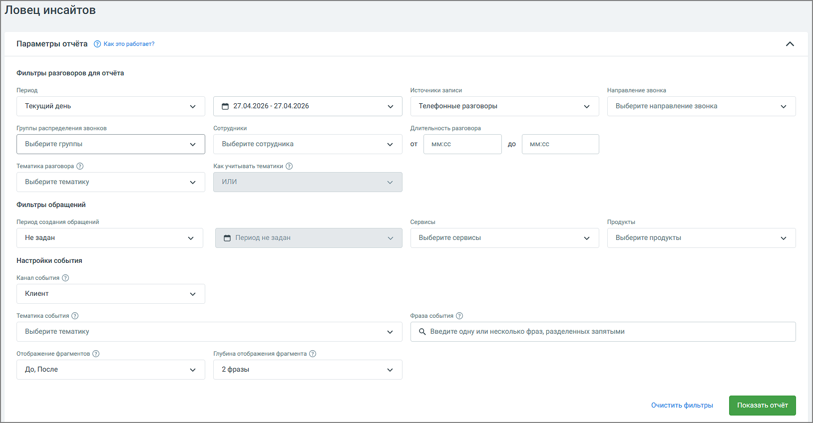

# 8.5.1. Блок параметров

> Трассировка: PDF §8.5.1 · сквозные стр. 99-100 · источники: ч.1 `kb/mango-product-docs/sources/speech-analytics/RECHEVAYA-ANALITIKA_1.26.18.pdf` с.99-100.

При формировании отчета пользователям доступна фильтрация: Речевая аналитика | v.1.26.18 99

| 8 800 555 55 22, mango-office.ru |  |
| --- | --- |
|  | mango@mangotele.com |

Период – в какой период состоялись диалоги, которые должны войти в отчет. Выпадающее меню, с вариантами периода: произвольный, текущий день, текущая неделя, текущий месяц, с прошлого месяца, с позапрошлого месяца; Источники записи – выбор типа записи разговора: телефонные разговоры, текстовые коммуникации; Направление звонка – входящий, исходящий, внутренний звонок или текстовое сообщение; Сотрудники – список всех сотрудников, сгруппированный по группам. Если ни один сотрудник не выбран, отчет формируется по всем сотрудникам; Группы распределения звонков – список всех групп сотрудников Личного кабинета. При выборе каких-либо групп в отчетах будут отображаться только разговоры сотрудников, принадлежащих к выбранным группам. Если ни одна группа не выбрана, отчет формируется по всем группам; Длительность разговора – продолжительность разговора; Тематика разговора – выбор одной или нескольких тематик, которые звучали в разговоре. Как учитывать тематики – выбор логики для тематик, с помощью которой будут фильтроваться звонки. И – в отчёт попадут разговоры, где прозвучала каждая из выбранных тематик. ИЛИ – в отчёт попадут разговоры, где прозвучала хотя бы одна из выбранных тематик; Период создания обращений – выбор периода, когда было создано обращение. Выпадающее меню, с вариантами периода: произвольный, текущий день, вчера, текущая неделя, текущий месяц, с прошлого месяца, с позапрошлого месяца; Сервисы – список доступных сервисов MANGO OFFICE; Продукты – список подключенных продуктов MANGO OFFICE; Фраза события – триггер, т.е. слово или фраза, характеризующие важное для бизнеса событие, причины и реакции которых необходимо проанализировать. Для уточнения поиска используйте символы ! и " ", как указано в пункте Правила обработки поисковых запросов; Канал события – выбор канала Клиент или Сотрудник, в котором необходимо найти событие. Тематика события – выбор тематики, характеризующей важное для бизнеса событие, причины и реакции которой необходимо проанализировать. В выпадающем окне доступны тематики, настроенные для выбранного ранее канала. Отображение фрагментов: До – это фрагмент разговора сотрудника или клиента, который звучал до искомого события. После – это фрагмент разговора, который звучал после события. Если не выбран ни один из показателей, в отчете отобразится только контекст события; Глубина отображения фрагмента – количество фраз, которые отобразятся в Блоке результатов отчета; Клик по кнопке Очистить фильтры очищает выбранные параметры фильтрации. Клик по кнопке Показать отчет отображает блок результатов.
