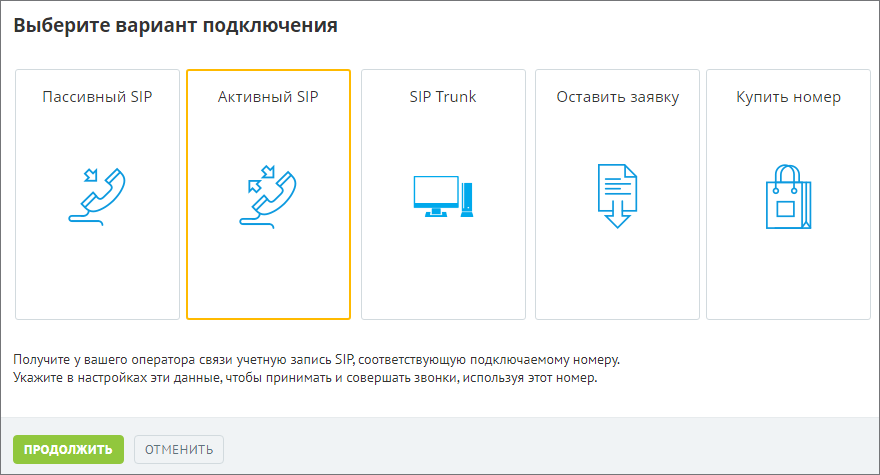
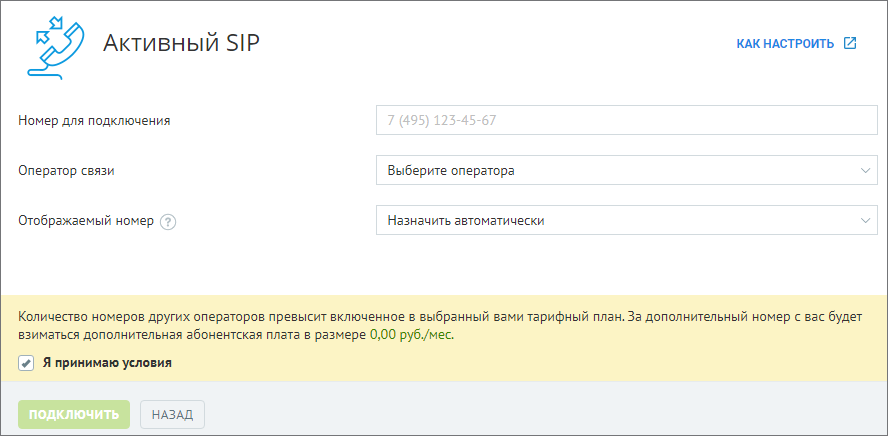
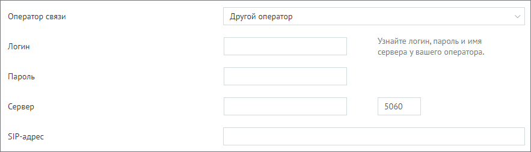
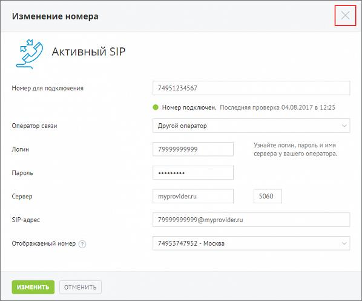
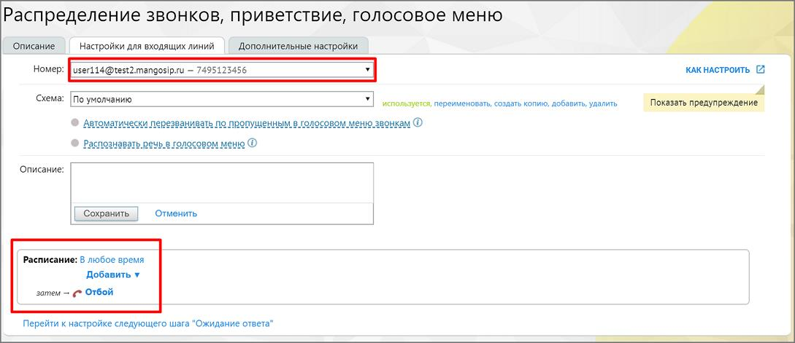
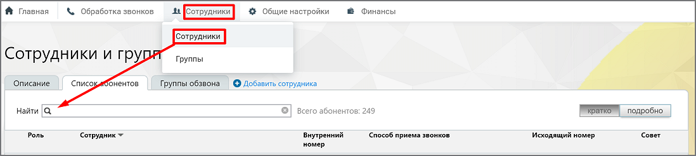
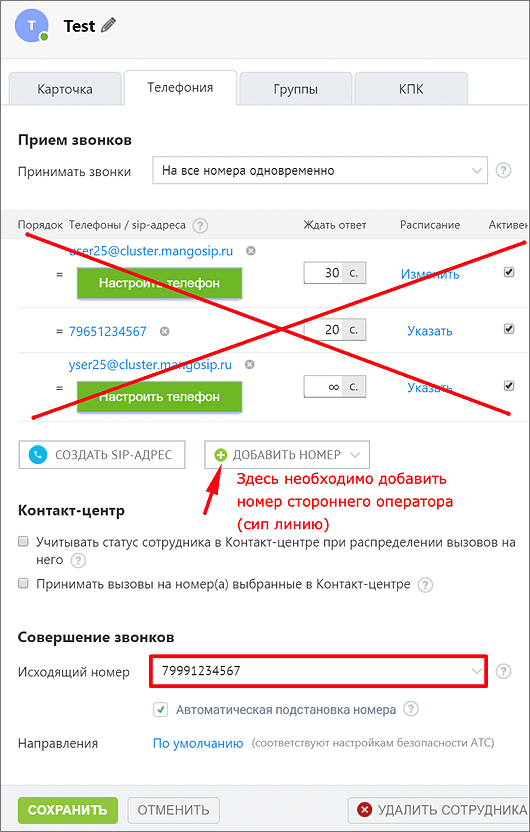

# Подключение активного SIP

> Трассировка: PDF §10.2 · сквозные стр. 112-118 · источники: ч.1 `kb/mango-product-docs/sources/speech-analytics/RECHEVAYA-ANALITIKA_1.26.18.pdf` с.112-118.

Шаг 1. Включаем услугу Активного SIP – на обзорной панели Личного кабинета в блоке "Номера других операторов" нажимаем кнопку "Подключить". В открывшемся меню выбираем пункт "Активный SIP" и нажимаем кнопку "Продолжить". Речевая аналитика | v.1.26.18 112

| 8 800 555 55 22, mango-office.ru |  |
| --- | --- |
|  | mango@mangotele.com |

Шаг 2. Вносим данные для настройки Номер для подключения – номер телефона стороннего оператора, который требуется подключить; Оператор связи – если Вы не нашли своего оператора, выберите «Другой оператор». (далее в примере рассматривается настройка «другого оператора», как более сложная). Отображаемый номер – линия ВАТС MANGO OFFICE, которая будет использоваться в качестве переадресации на мобильные телефоны.

Речевая аналитика | v.1.26.18 113

| 8 800 555 55 22, mango-office.ru |  |
| --- | --- |
|  | mango@mangotele.com |

Шаг 3. Прописываем авторизационные данные для Активного SIP

Логин – логин, который выдает сторонний оператор; Пароль – логин, который выдает сторонний оператор; Сервер – сервер, который выдает сторонний оператор. По умолчанию порт сервера – 5060, но у стороннего оператора может быть другой порт. В этом случае следует запросить у своего оператора данные порта. Нажмите Подключить. Шаг 4. Проверяем статус подключения (Регистрация не успешная) Если вы видите красный индикатор и надпись "Номер не подключен", значит регистрация на сервере стороннего оператора не прошла. В таком случае нажмите кнопку Изменить. После чего статус обновится. Если индикатор остается красным, вероятные ошибки: • введены неверные авторизационные данные; • ip-адрес, с которого идут запросы на регистрацию, заблокирован. Чтобы исправить данную ситуацию, обратитесь к Вашему стороннему оператору. Убедитесь, что у оператора не заблокирован IP MANGO OFFICE – 81.88.86.0/24, а также проверьте корректность авторизационных данных, которые Вы ввели в шаге 3. Шаг 5. Проверяем статус подключения (Регистрация успешная) После успешной настройки Активного SIP Вы увидите зеленый статус и надпись "Номер подключен". Это значит, что регистрация прошла успешно. Далее требуется настроить схему переадресации. Речевая аналитика | v.1.26.18 114

| 8 800 555 55 22, mango-office.ru |  |
| --- | --- |
|  | mango@mangotele.com |

Шаг 6. Настраиваем схему переадресации с Активного SIP Вам необходимо задать переадресацию на ваших сотрудников. Для этого возвращаемся на главную страницу личного кабинета. В разделе "Номера других операторов" находим Ваш номер, который мы указали в Шаге 3, и нажимаем на схему.

Шаг 7. Продолжаем настраивать схему переадресации с Активного SIP В поле номер Вы увидите SIP линию, которая создалась автоматически для переадресации звонка от Вашего оператора до MANGO OFFICE. Настраиваем схему согласно вашим требованиям. Теперь все звонки, которые поступают на номер стороннего оператора, будут распределяться на Ваших сотрудников. Речевая аналитика | v.1.26.18 115

| 8 800 555 55 22, mango-office.ru |  |
| --- | --- |
|  | mango@mangotele.com |

внимание Иногда требуется включить переадресацию на SIP у стороннего оператора. Например, у МЕГАФОН (услуга Multifon) для этого потребуется набрать на мобильном комбинацию *137#, далее в меню выбрать переадресацию на SIP. В противном случае звонки будут просто приходить на номер мобильного телефона. Уточните эту информацию у Вашего оператора. Речевая аналитика | v.1.26.18 116

| 8 800 555 55 22, mango-office.ru |  |
| --- | --- |
|  | mango@mangotele.com |

ШАГ 8. Настройка исходящих звонков через Активный SIP Вы можете звонить из MANGO OFFICE так, чтобы у Ваших клиентов отображался номер стороннего провайдера. Для этого возвращаемся на главную страницу личного кабинета и выбираем интересующего сотрудника.

Речевая аналитика | v.1.26.18 117

| 8 800 555 55 22, mango-office.ru |  |
| --- | --- |
|  | mango@mangotele.com |

Шаг 9. Продолжаем настраивать исходящие звонки через Активный SIP В карточке сотрудника открываем вкладку "Телефония". В поле "Исходящий номер" указываем номер Вашего стороннего оператора. Теперь, когда этот сотрудник будет звонить Вашему клиенту, звонок сначала поступит Вашему стороннему оператору, и уже он соединит Вас с конечным абонентом.

