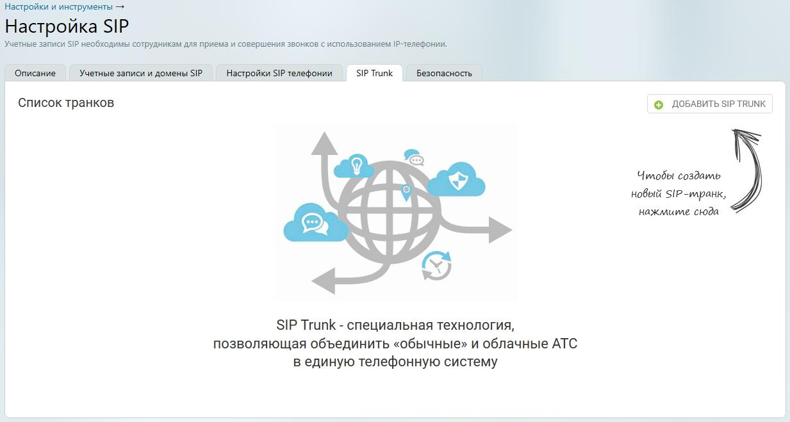

# 10.4. Точка входа «SIP Trunk»

> Трассировка: PDF §10.4 · сквозные стр. 119-121 · источники: ч.1 `kb/mango-product-docs/sources/speech-analytics/RECHEVAYA-ANALITIKA_1.26.18.pdf` с.119-121.

1) Добавление SIP Trunk 2) Активация SIP Trunk в карточке сотрудника 3) Настройка схемы распределения звонков в Личном кабинете Откройте личный кабинет по ссылке lk.mango-office.ru. На главной странице Личного кабинета ВАТС выберите раздел Общие настройки, пункт меню Настройка SIP. На вкладке SIP Trunk кликните по кнопке Добавить SIP Trunk / Внешний Речевая аналитика | v.1.26.18 119

| 8 800 555 55 22, mango-office.ru |  |
| --- | --- |
|  | mango@mangotele.com |

Речевая аналитика | v.1.26.18 120

| 8 800 555 55 22, mango-office.ru |  |
| --- | --- |
|  | mango@mangotele.com |
