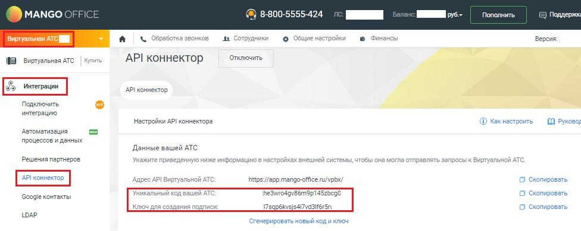

# 2.4.5. Как узнать свой уникальный код ВАТС и ключ создания подписи?

> Трассировка: PDF §2.4.5 · сквозные стр. 15 · источники: ч.1 `kb/mango-product-docs/sources/vpbx-api/MangoOffice_VPBX_API_v1.9.pdf` с.15.

Для этого в Личном кабинете MANGO OFFICE следует: 1) выберите вашу ВАТС; 2) откройте раздел "Интеграции"; 3) нажмите на пункт меню "API коннектор". На открывшейся странице в одноименных полях будут показаны уникальный код вашей ВАТС (vpbx_api_key) и ключ для создания подписи (vpbx_api_salt):

Рисунок 2
