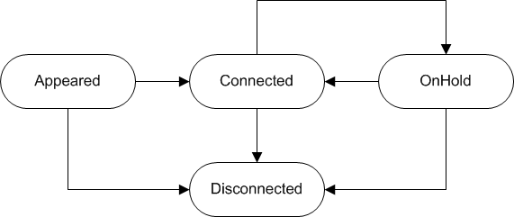
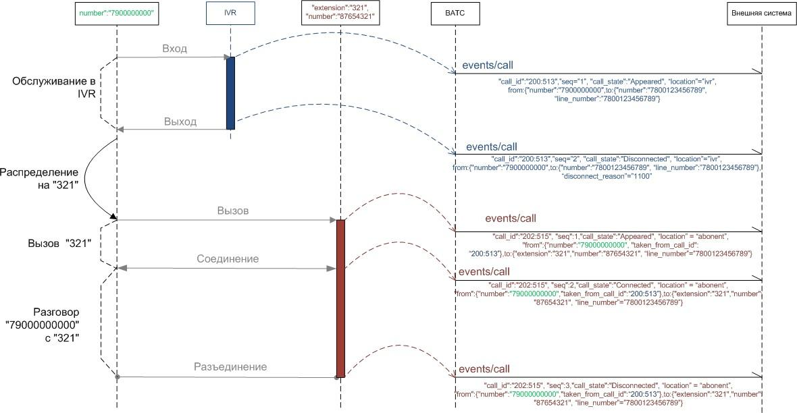

# 3.1.2. Уведомление о вызове

> Трассировка: PDF §3.1.2 · сквозные стр. 16-22 · источники: ч.1 `kb/mango-product-docs/sources/vpbx-api/MangoOffice_VPBX_API_v1.9.pdf` с.16-22.

POST https://external-system.com/events/call Уведомление содержит информацию о вызове и его параметрах. Прохождение вызова через IVR, очередь вызовов, размещение на абонента сопровождаются рассылкой уведомления о новом вызове. Завершение пребывания в очереди IVR сопровождается рассылкой события о завершении соответствующего вызова. Параметры уведомления:

| № | Параметры с уровнями вложенности |  | Тип | Обяза- тель- ный | Описание |
| --- | --- | --- | --- | --- | --- |
|  | 1 | 2 |  |  |  |
| 1 | entry_id |  | string |  | Внутренний идентификатор группы вызовов. Идентификатор назначается при поступлении вызова в ВАТС и не изменяется. Все последующие вызовы (переадресация, перевод средствами ВАТС), генерируемые в процессе обработки вызова, будут иметь одинаковое значения поля. Не имеет отношения к CALL-ID из SIP-протокола. Строка не более 128 байт. Уникальность идентификатора гарантируется ВАТС на протяжении всего периода оказания услуг по данному API. Внутренний формат идентификатора не должен как-либо использоваться внешней системой. Реализация ВАТС может изменять принцип генерации идентификатора, не нарушая при этом соглашение об уникальности. |
| 2 | call_id |  | string |  | Внутренний идентификатор вызова (плеча вызова), строка не более 128 байт. Не имеет отношения к CALL-ID из SIP-протокола. Уникальность |

| № | Параметры с уровнями вложенности |  | Тип | Обяза- тель- | Описание |
| --- | --- | --- | --- | --- | --- |
|  |  |  |  |  | идентификатора вызова гарантируется ВАТС на протяжении всего периода оказания услуг по данному API. Внутренний формат идентификатора не должен как-либо использоваться внешней системой. Реализация ВАТС может изменять принцип генерации идентификатора вызова, не нарушая при этом соглашение об уникальности. |
| 3 | timestamp |  | integer |  | Время события UTC+3 |
| 4 | seq |  | integer |  | Счетчик последовательности уведомлений по вызову. |
| 5 | call_state |  | string |  | Текущее состояние вызова. |
| 6 | location |  | string |  | Текущее расположение вызова в ВАТС, возможные значения "ivr" (голосовое меню), "queue" (очередь дозвона на группу), "abonent" (сотрудник ВАТС). |
| 7 | from |  | object |  | Данные, относящиеся к вызывающему абоненту. |
| 7.1 |  | extension | integer | Нет | Идентификатор сотрудника ВАТС для вызывающего абонента. Не передается в случае, если ВАТС не удалось идентифицировать вызывающего абонента как сотрудника ВАТС. |
| 7.2 |  | number | string | Нет | Номер вызывающего абонента (строка), в случае, если ВАТС удалось определить номер. |
| 7.3 |  | taken_from_call_id | string |  | Идентификатор вызова, в котором участвовал вызывающий абонент, до того, как был переведен в текущий вызов. |
| 7.4 |  | was_transferred | bool |  | Признак того, что данный абонент переведен на другого абонента 'командой перевод'. Доступен с версии api v.2. По умолчанию false. Возможен только в состоянии "Disconnected". Если признак в секции from, то данный вызов покинул вызываемый абонент. Если признак в секции to, то данный вызов покинул вызывающий абонент. |
| 7.5 |  | hold_initiator | bool |  | Признак того, что данный абонент поставил вызов (противоположного участника) на удержание. Доступен с версии api v.2. По умолчанию false. Возможен только в состоянии OnHold. |
| 8 | to |  | object |  | Данные, относящиеся к вызываемому абоненту, группе. |
| 8.1 |  | extension | integer | Нет | Идентификатор сотрудника ВАТС для вызываемого абонента. Не передается, если ВАТС не удалось идентифицировать вызываемого абонента как сотрудника ВАТС, у сотрудника ВАТС нет идентификатора (внутреннего номера), вызов еще не был распределен на сотрудника. |
| 8.2 |  | number | string |  | Номер вызываемого абонента (строка). |
| 8.3 |  | line_number | string | Нет | Входящая линия ВАТС, на которую поступил вызов. |
| 8.4 |  | acd_group | integer | Нет | Идентификатор группы операторов ВАТС (внутренний номер группы). Опциональный параметр. Передается в случае маршрутизации |

| № | Параметры с уровнями вложенности |  | Тип | Обяза- тель- | Описание |
| --- | --- | --- | --- | --- | --- |
|  |  |  |  |  | вызова через группу сотрудников ВАТС. Если группе не присвоен короткий номер, передается пустое значение. |
| 8.5 |  | was_transferred | bool |  | Признак того, что данный абонент переведен на другого абонента 'командой перевод'. Доступен с версии api v.2. По умолчанию false. Возможен только в состоянии "Disconnected". Если признак в секции from, то данный вызов покинул вызываемый абонент. Если признак в секции to, то данный вызов покинул вызывающий абонент. |
| 8.6 |  | hold_initiator | bool |  | Признак того, что данный абонент поставил вызов (противоположного участника) на удержание. Доступен с версии api v.2. По умолчанию false. Возможен только в состоянии OnHold. |
| 9 | dct |  | object | Нет | Данные динамического коллтрекинга (строка не более 128 байт). |
| 9.1 |  | number | string | Нет | Номер коллтрекинга (динамический или статический). |
| 9.2 |  | type | integer | Да | Тип номера, принимает следующие значения: ● 0 - не относится к коллтрекингу; ● 1 - динамический номер; ● 2 - статический номер. |
| 10 | disconnect_r eason |  | integer | Нет | Причина завершения вызова (см. ниже). Передается в состоянии вызова Disconnected. |
| 11 | transfer |  | string |  | Признак того, что вызов является следствием 'команды перевода'. Доступен с версии api v.2. Возможные значения: ● consultative: вызывающий абонент из taken_from_call_id выполняет консультативный перевод; ● blind: вызывающий абонент был переведен из taken_from_call_id другим участником вызова taken_from_call_id, который покинул разговор; ● return_blind: возврат слепого перевода. При неответе адресата перевода (консультанта), клиент (переводимый абонент) перезванивает исходному оператору (инициатору перевода). Примечание. При слепом переводе из консультативного вызова (консультант ответил и оператор положил трубку), новый вызов не создается, а будет второе "Connected" событие с подменой звонящего абонента. При этом тип перевода меняется с consultative на blind. |
| 12 | sip_call_id |  | string |  | Идентификатор входящего звонка по SIP, сформированный внешней системой (Клиентом). Примечание. sip_call_id обеспечивает возможность сопоставить входящий звонок на Виртуальную АТС с информацией, хранимой во внешней системе (Клиенте). sip_call_id формируется внешней системой и сохраняется в |

| № | Параметры с уровнями вложенности |  | Тип | Обяза- тель- | Описание |
| --- | --- | --- | --- | --- | --- |
|  |  |  |  |  | Виртуальной АТС, только если в ЛК в разделе "Дополнительные параметры API" включен флаг "Разрешаю пробрасывать идентификатор входящего звонка". |
| 13 | command_id |  | string | Нет | Идентификатор команды внешней системы, в результате которой появился вызов (строка не более 128 байт). Уникальность строки для внешней системы гарантируется внешней системой. |
| 14 | task_id |  | integer | Нет | Опционально, идентификатор задачи исходящего обзвона, в результате которой появился вызов. Передается в случае, если звонок инициирован или ObDial, или CallbackWidget, или MissGroupСallCallback. В остальных случаях отсутствует. |
| 15 | callback_initi ator |  | string | Нет | Инициатор обратного звонка, в результате которого появился вызов (строка не более 128 байт). Передается, если звонок - callback. При обычном звонке отсутствует. |

Использование счетчика последовательности seq Получение события о состоянии вызова внешней системой может происходить в последовательности, отличной от той, в которой они происходили в ВАТС (подробнее о счетчике). Это связанно с тем, что уведомления могут отправляться параллельно, без ожидания ответа на каждый запрос. При обработке событий их необходимо упорядочивать, либо просто игнорировать новое событие с меньшим значением seq. Использование инициатора обратного звонка callback Поле callback_initiator (инициатор обратного звонка) может иметь следующие значения:

| Инициатор callback | Описание |
| --- | --- |
| СС | Контакт-центр callback (Callback-вызов, инициатором которого является Контакт-центр) |
| API | API-callback (Callback-вызов, инициатором которого является API) |
| WEB | WEB-callback, (Callback-вызов, инициатором которого является Личный кабинет (Заказ звонка)) |
| ObDial | Callback-вызов, инициированный кампанией исходящего обзвона, из Контакт-центра |
| CallbackWidget | Callback-вызов, инициированный виджетом обратного звонка |
| MissGroupСallCallback | Callback-вызов, инициированный перезвоном по пропущенному в группе |
| MissInIvrCallCallback | Callback-вызов, инициированный перезвоном по пропущенному в голосовом меню |

Текущее состояние вызова call_state В поле call_state могут быть указаны следующие значения:

| Состояния вызова | Описание |
| --- | --- |
| Appeared | В ВАТС появился входящий или исходящий вызов в режиме дозвона. Вызываемый абонент известен. |
| Connected | Вызов находится (перешел) в фазу разговора двух абонентов. |
| OnHold | Вызов поставлен на удержание одним из абонентов средствами ВАТС |
| Disconnected | Вызов завершен |

Ниже показана диаграмма переходов для состояния вызова:

Начальное состояние вызова может быть любым. Это зависит от алгоритма работы ВАТС в каждом случае, но, как правило, этим состоянием является Appeared. Также уведомления о вызовах упорядочиваются не по времени поступления во внешнюю систему, а счетчиком последовательности в уведомлении. Таким счетчиком могло бы быть время наступления события в ВАТС, однако в ВАТС события могут происходить достаточно быстро, и точности в одну секунду может оказаться недостаточно. Чтобы не увеличивать точность до неизвестного предела, добавлен счетчик последовательности. Упорядоченные таким образом уведомления на стороне внешней системы будут подчиняться приведенной диаграмме. Конечным состоянием вызова является Disconnected. Описание причины завершения вызова disconnect_reason Причины завершения вызова указаны в поле disconnect_reason. В этом поле могут быть указаны следующие коды, см. "Список кодов результатов". Все коды причин завершения вызова сгруппированы в классы, перечень классов см. в таблице:

| Причина | Описание |
| --- | --- |
| 11хх | Вызов завершен в нормальном режиме |
| 2xxx | Ограничение биллинговой системы |
| 32хх | Неверно указан номер абонента |
| 42хх | Связаться с абонентом в данный момент невозможно |
| 5001 | Перегрузка |
| 5003 | Технические проблемы |

Пример вызова, поступившего на линию ВАТС:

Ограничение отправки уведомления При каждом вызове, ВАТС передает внешней системе уведомление /events/call и вносит соответствующую запись в историю вызовов. При этом, учитывается расписание приема вызовов и статус абонента в Контакт-центре. Например, если вызов пришел внерабочее время абонента, то уведомление /events/call не будет отправлено. Исключение составляет статус «не беспокоить» в Контакт-центре. Если абонент будет находиться в этом статусе и ему поступит вызов, то будет отправлено уведомление /events/call внешней системе и учтена в истории вызовов ВАТС информация о таком вызове. Поэтому, при работе с историей вызовов нужно учитывать, что в истории будет указана отправка уведомления внешней системе, хотя абонент находился в статусе «не беспокоить» и не принимал вызов. Пример уведомления: POST https://external-system.com/events/call vpbx_api_key = 1234567890qwerty, sign = 1234567890qwerty, json = { "entry_id":"1MN0Q1MDOQ==", "call_id":"MIxEyNTzTo6NDxkzNMMOzNQ==", "timestamp":1558422128, "seq":2, "call_state":"Disconnected", "location":"abonent", "from": { "number":"79001234567", "taken_from_call_id":"oMNTMyzTzNTo6NxNkDIxOxM3EMNTj" }, "to": { "extension":"29", "number":"sip:user00000@tech.mangosip.ru", "line_number":"sip:line00000@tech.mangosip.ru", "acd_group":"303" }, "disconnect_reason":1131, "dct": { "number":"74001234567", "type":1 } }
