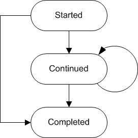
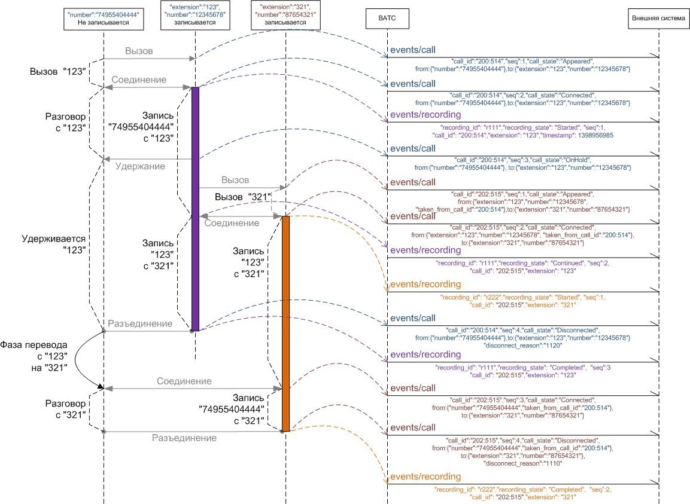

# 3.1.4. Уведомление о записи разговора

> Трассировка: PDF §3.1.4 · сквозные стр. 22-26 · источники: ч.1 `kb/mango-product-docs/sources/vpbx-api/MangoOffice_VPBX_API_v1.9.pdf` с.22-26.

POST https://external-system.com/events/recording Уведомление содержит информацию о процессе записи разговора. Запись разговора может стартовать по следующим сценариям: - по команде, отправленной внешней системой; - автоматически, в соответствие с настройками Виртуальной АТС; - по DTMF-команде, отправленной с телефонного аппарата в тоновом режиме; - по команде, отправленной другой внешней системой по отношению к обсуждаемой, либо интегрированными сервисами MANGO OFFICE (Контакт-центр, CRM). Параметры уведомления:

| № | Параметры | Тип | Обяза- тель- ный | Описание |
| --- | --- | --- | --- | --- |
| 1 | recording_id | string |  | Идентификатор записи разговора, строка не более 128 байт. Уникальность идентификатора гарантируется ВАТС на протяжении всего периода оказания услуг по данному API. Внутренний формат идентификатора не должен как-либо использоваться внешней системой. ВАТС оставляет за собой возможность изменять "содержимое" идентификатора, не нарушая при этом соглашение об уникальности. |
| 2 | recording_state |  |  | Состояние процесса записи разговора. |
| 3 | seq |  |  | Счетчик последовательности уведомлений по записи разговора. |
| 4 | entry_id |  |  | Внутренний идентификатор группы вызовов. Не имеет отношения к CALL-ID из SIP-протокола. |
| 5 | call_id |  |  | Внутренний идентификатор вызова, в котором происходит запись, строка. Не имеет отношения к CALL-ID из SIP- протокола. Если записываемый абонент переходит в другой вызов в результате перевода, значение идентификатора вызова будет обновлено. |
| 6 | extension |  | Нет | Идентификатор сотрудника ВАТС для записываемого абонента. Не передается в случае, если ВАТС не удалось идентифицировать вызывающего абонента как сотрудника ВАТС. Если у сотрудника ВАТС нет идентификатора (внутреннего номера) передается пустое значение. |
| 7 | timestamp |  |  | Время события UTC+3. |
| 8 | completion_code |  | Нет | Код завершения. Передается в состоянии Completed. |
| 9 | recipient |  | Нет | Получатель записи. Передается в состоянии Completed в случае, если запись успешно выполнена. |
| 10 | command_id | string | Нет | Идентификатор команды старта записи разговора внешней системой (строка не более 128 байт). Заполняется в случае, если запись началась по команде API. Уникальность строки для внешней системы гарантируется внешней системой (см. Включение записи вызова). |

Состояние процесса записи разговора recording_state Поле recording_state может иметь следующие значения:

| Состояние | Описание |
| --- | --- |
| Started | Запись начата. |
| Continued | Запись продолжена в другом вызове, идентификатор которого указан в call_id. |
| Completed | Запись завершена. |

Ниже показана диаграмма переходов для состояния процесса записи разговора. Начальным состоянием обычно является Started, конечным состоянием - Completed.

Результаты записи разговора Код результата записи указан в поле completion_code, см. "Список кодов результатов". Все коды результатов сгруппированы в классы, перечень классов см. в таблице:

| Группа кодов | Пояснение |
| --- | --- |
| 1000 | Действие успешно выполнено. |
| 22хх | Доступ к счету ограничен. |
| 4002 | Продолжительность записи меньше минимально возможной в ВАТС, запись не будет сохранена. |

Получатель записи recipient В поле recipient указан получатель записи разговора и может иметь следующее значение:

| Значение | Пояснение |
| --- | --- |
| Cloud | Запись вызова будет сохранена в Облачном хранилище и доступна из Личного кабинета MANGO OFFICE. |
| Mail | Запись вызова отправлена на e-mail пользователя. |
| CloudAndMail | Запись вызова будет сохранена в Облачном хранилище и дополнительно отправлена на e-mail пользователя. |

На рисунке ниже показан пример приема входящего вызова сотрудником ВАТС с последующим переводом на другого сотрудника ВАТС с предварительной консультацией. Оба сотрудника ВАТС записываются автоматически.

Примеры запроса. Пример 1. POST https://external-system.com/events/recording vpbx_api_key = 1234567890qwerty, sign = 1234567890qwerty, json = { "recording_id":"r100:777:500:256", "recording_state":"Started", "seq":1, "call_id":"100:500:256", "entry_id":"232wc3e3w3s222", "extension":"1234", "timestamp":"1399906976", "command_id":"cmd.12.vpbx.12345.external.system.com.net" } Пример 2. Запрос без идентификатора команды старта записи разговора внешней системой POST https://external-system.com/events/recording vpbx_api_key= 1234567890qwerty, sign = 1234567890qwerty, json = { "recording_id":"r500:256", "recording_state":"Started", "seq":1, "call_id":"100:500:512", "entry_id":"232wc3e3w3s222", "extension":"1342", "timestamp":"1398906976" }
