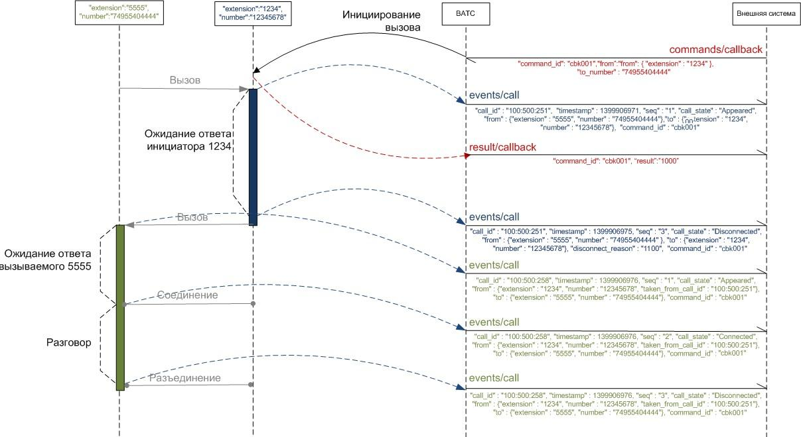

# 3.2.1. Инициирование вызова от имени сотрудника

> Трассировка: PDF §3.2.1 · сквозные стр. 33-36 · источники: ч.1 `kb/mango-product-docs/sources/vpbx-api/MangoOffice_VPBX_API_v1.9.pdf` с.33-36.

POST /vpbx/commands/callback С помощью этого запроса внешняя система инициирует исходящий вызов. Входные параметры:

| № | Параметры с уровнями вложенности |  | Тип | Обяза- тель- ный | Описание |
| --- | --- | --- | --- | --- | --- |
|  | 1 | 2 |  |  |  |
| 1 | command_id |  | string |  | Идентификатор команды (строка не более 128 байт). Формируется внешней системой. ВАТС никак не обрабатывает этот идентификатор, не анализирует и не полагается на уникальность его значения. Идентификатор можно использовать для связи команды с результатом ее выполнения и возможными последующими событиями, которые появляются в результате выполнения команды. |
| 2 | from |  |  | Да | Данные, относящиеся к вызывающему абоненту. |
| 2.1 |  | extension |  | Да | Идентификатор сотрудника. Если у сотрудника ВАТС нет идентификатора (внутреннего номера), выполнение команды от его имени невозможно. |
| 2.2 |  | number | string | Нет | Номер вызывающего абонента (строка не более 128 байт). Поле следует использовать в случае, если вызов должен быть инициирован с номера, отличного от номера по умолчанию сотрудника ВАТС. В качестве значения можно указывать: SIP, FMC и PSTN номера, но нельзя указывать внутренние номера и номера групп ВАТС. К номеру будут применены правила преобразования номеров ВАТС. Если будет указан номер, отличный от номеров сотрудника ВАТС, которому соответствует поле "extension", на время вызова этот номер будет считаться номером сотрудника. |
| 3 | to_number |  | string |  | Номер вызываемого абонента (строка не более 128 байт). Может быть идентификатором сотрудника ВАТС, внутренним номером группы операторов ВАТС или любым другим номером. К номеру будут применены правила преобразования номеров ВАТС. |
| 4 | line_number |  |  | Нет | Линия, которая была использована для размещения вызова. Если в этом поле указано значение, то ВАТС |

| № | Параметры с уровнями вложенности |  | Тип | Обяза- тель- ный | Описание |
| --- | --- | --- | --- | --- | --- |
|  |  |  |  |  | будет использовать указанную в этом параметре линию. Разрешается использовать только линии продукта, за счет которого будет происходить вызов. На данный момент поддерживаются следующие типы линий - SIP UAC, номера 7-800, DID-номера MANGO OFFICE. Важно! Чтобы вызов прошел через SIP-линию, Вам нужно указать имя этой линии (а не SIP URI) в параметре line_number. Имя SIP-линии задается в Личном кабинете MANGO OFFICE. |
| 5 | sip_headers |  |  | Нет | Список заголовков SIP, которые могут быть переданы внешней системой в ВАТС Примечание. Описание поля sip_headers приведено в Приложении 1. Допустимые заголовки для данного метода. |
| 5.1 |  | Call- Info/answer -after | string | Нет | Строка не более 64 байт. |

После получения вызываемого абонента, ВАТС попытается сопоставить его сотрудниками ВАТС, если это возможно, и присвоит им идентификатор абонента ВАТС. В ответ на команду высылается уведомление о результате обработки команды. Процесс инициирования вызова представлен следующей диаграммой:

Пример запроса: POST https://app.mango-office.ru/vpbx/commands/callback vpbx_api_key = 1234567890qwerty, sign = 1234567890qwerty, json = { "command_id":"cbk1", "from": { "extension":"1234", "number":"12345678" }, "to_number":"74955404444", "line_number":"74951234567", "sip_headers": { "Call-Info/answer-after":"0" }, } Результат: POST /vpbx/result/callback В результате обработки запроса, формируются и передаются JSON-данные, содержащие следующие параметры:

| № | Параметры | Тип | Обяза- тель- ный | Описание |
| --- | --- | --- | --- | --- |
| 1 | command_id | string | Нет | Идентификатор команды (строка не более 128 байт). |
| 2 | result |  | Да | Результат выполнения команды инициирования вызова от внешней системы. Ниже приведены возможные значения результата (см. "Список кодов результатов"): ● 1000 - команда выполнена успешно; ● 2xxx - команда запрещена биллинговой системой ВАТС; ● 3100 - переданы неверные параметры либо команда не может быть выполнена с этими параметрами; ● 4001 - команда не поддерживается; ● 5ххх - ошибка сервера. |
