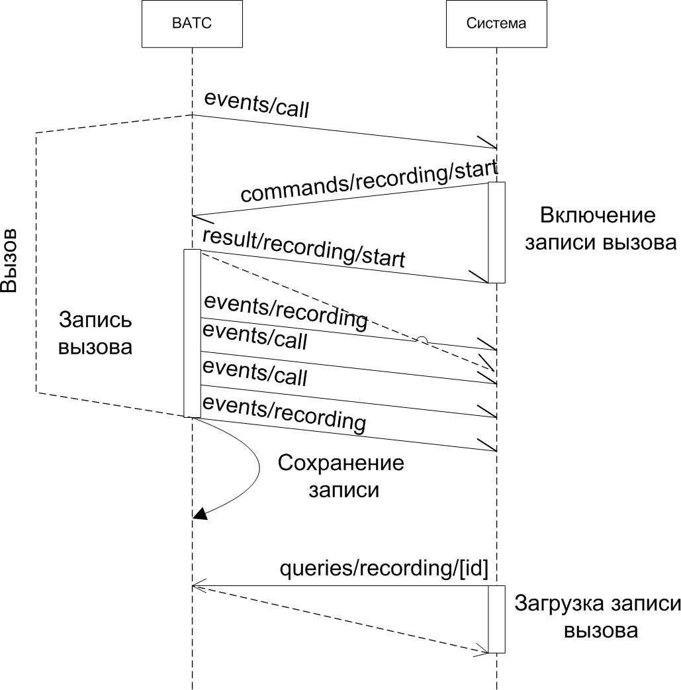

# 3.2.5. Включение записи разговора

> Трассировка: PDF §3.2.5 · сквозные стр. 41-43 · источники: ч.1 `kb/mango-product-docs/sources/vpbx-api/MangoOffice_VPBX_API_v1.9.pdf` с.41-43.

POST /vpbx/commands/recording/start Команда инициирует включение записи разговора средствами ВАТС. По логике ВАТС записывать можно только разговоры, где участвую сотрудники, созданные Виртуальной АТС. Результатом выполнения команды является уведомление о результате обработки. Запись может начаться не сразу (не все состояния вызова предполагают такую возможность), в момент фактического начала записи будет отправлено уведомление о начале записи. Входные параметры:

| № | Параметры | Тип | Обяза- тель- ный | Описание |
| --- | --- | --- | --- | --- |
| 1 | command_id | string |  | Идентификатор команды (строка не более 128 байт). Формируется внешней системой. ВАТС никак не обрабатывает этот идентификатор, не анализирует и не полагается на уникальность его значения. Идентификатор можно использовать для связи команды с результатом ее выполнения и возможными последующими событиями, которые появляются в результате выполнения команды. |
| 2 | call_id | string |  | Внутренний идентификатор вызова, строка. Не имеет отношения к CALL-ID из SIP-протокола. В случае перевода вызова, call id может меняться, если записываемый абонент сменил собеседника (см. далее диаграмму переходов для состояния процесса записи разговора). |
| 3 | call_party_num ber | string |  | Номер абонента (строка не более 128 байт), участвующего в вызове, которого нужно начать записывать. Может быть только идентификатором сотрудника ВАТС (предпочтительно) или одним из номеров сотрудника ВАТС, который указан в настройках ВАТС. К номеру будут применены правила |

| № | Параметры | Тип | Обяза- тель- ный | Описание |
| --- | --- | --- | --- | --- |
|  |  |  |  | преобразования номеров ВАТС. Если ВАТС не сможет идентифицировать сотрудника ВАТС по номеру, результат выполнения команды будет равен 3330 (Номер не найден у ВАТС или сотрудника). |

Процесс записи разговора по команде внешней системы представлен следующей диаграммой переходов для состояния процесса записи разговора:

Пример запроса: POST https://app.mango-office.ru/vpbx/commands/recording/start vpbx_api_key = 1234567890qwerty, sign = 1234567890qwerty, json = { "command_id":"cmd.1000.vpbx.12345.external.system.com.net", "call_id":"100500", "call_party_number":"123" } Результат: POST /vpbx/result/recording/start В результате обработки запроса, формируются и передаются JSON-данные, содержащие следующие параметры:

| № | Параметры | Тип | Обяза- тель- ный | Описание |
| --- | --- | --- | --- | --- |
| 1 | command_id | string | Нет | Идентификатор команды старта записи разговора внешней системой. |
| 2 | result |  | Да | Результат выполнения команды на старт записи разговора. Ниже приведены возможные значения результата (см. "Список кодов результатов"): ● 1000 - команда успешно обработана; ● 22хх - запись разговора запрещена биллинговой системой; ● 333x - не найден номер абонента, участвующего в вызове, которого нужно начать записывать; ● 4001 - команда не поддерживается; ● 41хх - выполнить команду по логике работы ВАТС невозможно; ● 5ххх - ошибка сервера. |

Пример запроса: POST https://app.mango-office.ru/vpbx/result/recording/start vpbx_api_key = 1234567890qwerty, sign = 1234567890qwerty, json = { "command_id":"cmd.20.vpbx.12345.external.system.com.net", "result":"1000" }
