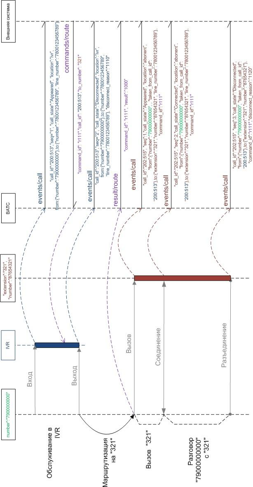
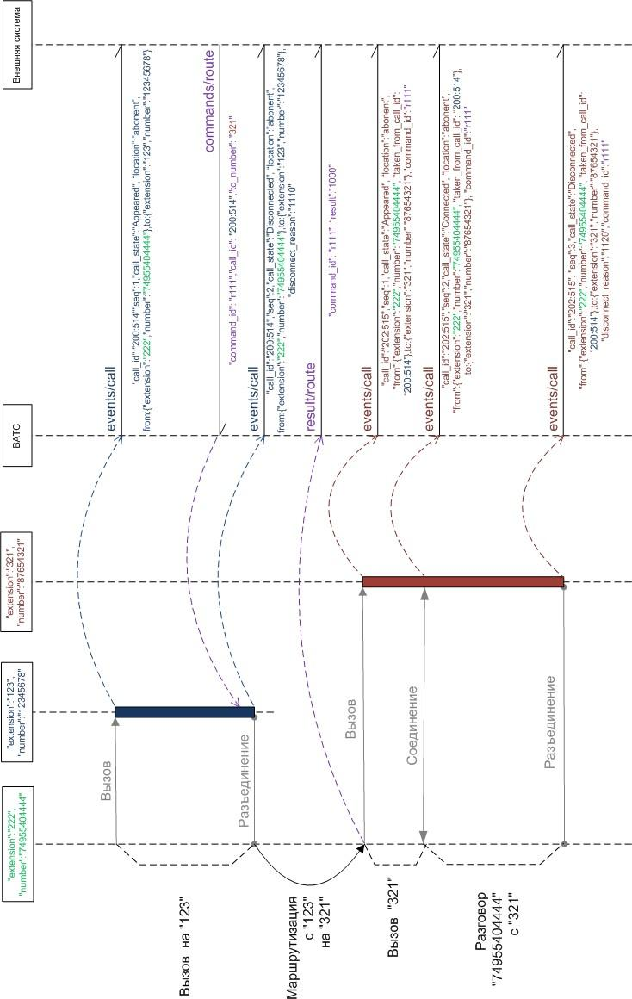

# О параметре route

> Трассировка: PDF §3.2.7 · сквозные стр. 46-49 · источники: ч.1 `kb/mango-product-docs/sources/vpbx-api/MangoOffice_VPBX_API_v1.9.pdf` с.46-49.

Команда route может работать в следующих режимах: - если параметр to_number является внутренним номером сотрудника ВАТС и маршрутизируемый вызов находится в IVR меню в состоянии Appeared, маршрутизация будет работать согласно настройкам в карточке сотрудника, аналогично тому, как если звонок был бы переадресован на сотрудника из схемы переадресации вызовов. То есть ВАТС будет принимать во внимание настройки расписания сотрудника, алгоритмов дозвона и настройки Контакт-центр; - если параметр to_number является внутренним номером группы - команда будет инициировать маршрутизацию на внутренний номер группы, согласно алгоритмам дозвона на группы; - если параметр to_number является номером в формате sip, fmc, pstn - команда будет инициировать безусловное перенаправление звонка на этот номер без каких-либо иных условий. Пример маршрутизации вызова, поступившего на внешнюю линию ВАТС:

Пример перехвата вызова сотруднику ВАТС другим сотрудником ВАТС:

Пример запроса: POST https://app.mango-office.ru/vpbx/commands/route vpbx_api_key = 1234567890qwerty, sign = 1234567890qwerty, json = { "command_id":"cmd.1.vpbx.12345.external.system.com.net", "call_id":"100500", "to_number":"74955404444", "sip_headers": { "From/display-name":"Santa Claus" } } Результат: POST /vpbx/result/route В результате обработки запроса, формируются и передаются JSON-данные, содержащие следующие параметры:

| № | Параметр ы | Тип | Обяза- тель- ный | Описание |
| --- | --- | --- | --- | --- |
| 1 | command_id | string | Нет | Идентификатор команды (строка не более 128 байт). |
| 2 | result |  | Да | Результат выполнения команды маршрутизации от внешней системы. Ниже приведены некоторые возможные значения результата (полный список см. в разделе "Список кодов результатов"): ● 1000 - команда перевода выполнена успешно; ● 22хх - команда перевода ограничена биллинговой системой ВАТС; ● 32хх - передан неверный номер либо команда перевода не может быть выполнена с этим номером; ● 4001 - команда не поддерживается; ● 4100 - перевод не предусмотрен для такого типа вызовов ВАТС; ● 4101 - вызов завершен либо не существует; ● 5ххх - ошибка сервера. |

Пример запроса: POST https://app.mango-office.ru/vpbx/result/route vpbx_api_key = 1234567890qwerty, sign = 1234567890qwerty, json = { "command_id":"cmd.2.vpbx.12345.external.system.com.net", "result":"1000" }
