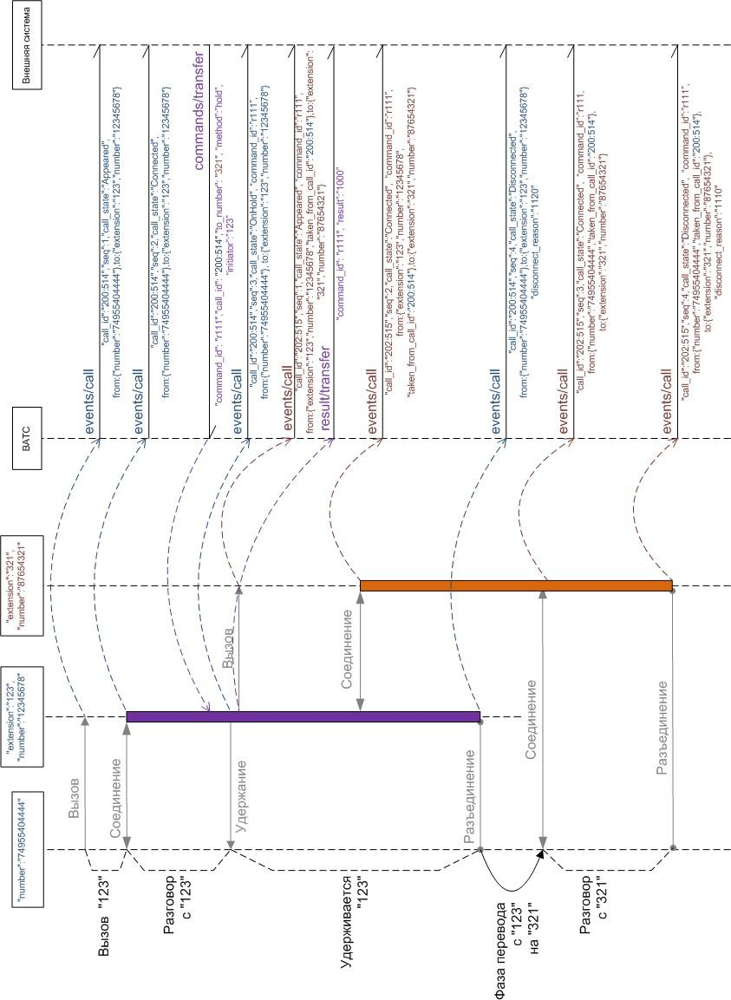
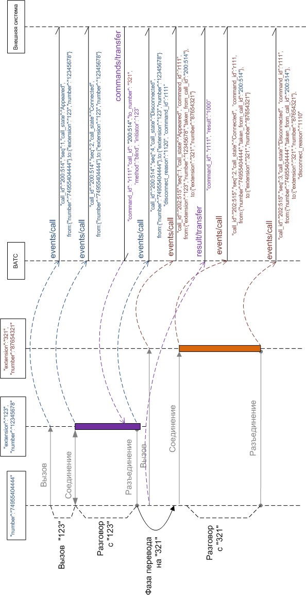

# 3.2.8. Перевод вызова

> Трассировка: PDF §3.2.8 · сквозные стр. 50-55 · источники: ч.1 `kb/mango-product-docs/sources/vpbx-api/MangoOffice_VPBX_API_v1.9.pdf` с.50-55.

POST /vpbx/commands/transfer API поддерживает два варианта перевода: перевод с консультацией и «слепой» перевод. Перевод с консультацией предполагает постановку одного из участников на удержание, при этом второй участник совершает вызов консультанту. Как только переводящий завершает разговор с консультантом (вешает трубку), абонент, ожидающий на удержании, начинает разговор с консультантом. Переводящий может вернуться к разговору с удерживаемым абонентом. В случае «слепого» перевода переводящий не совершает отдельного вызова и не ждет ответа консультанта. В процессе установления соединения с консультантом участвует только переводимый абонент. В случае если вызов к консультанту не завершается ответом, ВАТС предпримет попытку установления соединения с абонентом, выполнившим перевод. Команда может применяться для вызовов, которые находятся в состоянии Connected, для выполнения слепого или консультативного перевода. Входные параметры:

| № | Параметры | Тип | Обяза- тель- ный | Описание |
| --- | --- | --- | --- | --- |
| 1 | command_id | string |  | Идентификатор команды (строка не более 128 байт). Формируется внешней системой. ВАТС никак не обрабатывает этот идентификатор, не анализирует и не полагается на уникальность его значения. Идентификатор можно использовать для связи команды с результатом ее выполнения и возможными последующими событиями, которые появляются в результате выполнения команды. |
| 2 | call_id | string | Да | Внутренний идентификатор вызова, для которого выполняется перевод. Не имеет отношения к CALL-ID из SIP-протокола. |
| 3 | method | string |  | Строка, принимающая следующие возможные значения: "blind" – слепой перевод; "hold" – консультативный перевод. |
| 4 | to_number | string |  | Цель перевода, номер вызываемого абонента (строка не более 128 байт). Может быть идентификатором сотрудника ВАТС, внутренним номером группы операторов ВАТС или любым другим номером. К номеру будут применены правила преобразования номеров ВАТС. |
| 5 | initiator |  | Да | Участник разговора, от имени которого выполняется перевод. Должно быть заполнено значением одного из полей блока "from" или "to" переводимого вызова (например, "from.extension", "from.number", "to.extension", "to.number"). В ВАТС разрешены переводы только от имени сотрудника ВАТС. |

В процессе выполнения команды генерируется новый вызов. В случае консультативного перевода инициатор совершает консультативный вызов. В случае слепого перевода, соединение с инициатором завершается. Для отмены любого перевода следует отправить команду Hangup для вновь сгенерированного вызова, при этом, в случае консультативного перевода вызов будет возвращен в состояние Connected, а в случае слепого перевода будет предпринята попытка соединения с инициатором. Для соединения удерживаемого абонента и консультанта инициатор консультативного перевода должен повесить трубку. Важно! Командой hangup соединить удерживаемого абонента и консультанта нельзя. При звонке от А до B, и попытке консультативного перевода А от B на группу С, на которой включено удержание - метод hangup не завершит плечо между B и С, абонент B будет находится на удержании в группу C. Пример консультативного перевода:

Пример запроса: POST https://app.mango-office.ru/vpbx/commands/transfer vpbx_api_key = 1234567890qwerty, sign = 1234567890qwerty, json = { "command_id":"cmd.1.vpbx.12345.external.system.com.net", "call_id":"100500", "to_number":"74955404444", "method":"hold" "initiator":"1234" } Пример слепого перевода:

Результат: POST /vpbx/result/transfer В результате обработки запроса, формируются и передаются JSON-данные, содержащие следующие параметры:

| № | Параметры | Тип | Обяза- тель- ный | Описание |
| --- | --- | --- | --- | --- |
| 1 | command_id | string | Нет | Идентификатор команды (строка не более 128 байт). |
| 2 | result |  | Да | Результат выполнения команды маршрутизации от внешней системы. Ниже приведены некоторые возможные значения результата (полный список см. "Список кодов результатов"): ● 1000 - команда перевода выполнена успешно; ● 22хх - команда перевода ограничена биллинговой системой ВАТС; ● 32хх - передан неверный номер либо команда перевода не может быть выполнена с этим номером; ● 4001 - команда не поддерживается; ● 4100 - перевод не предусмотрен для такого типа вызовов ВАТС; ● 4101 - вызов завершен либо не существует; ● 5ххх - ошибка сервера. |

Пример запроса: POST https://app.mango-office.ru/vpbx/result/transfer vpbx_api_key = 1234567890qwerty, sign = 1234567890qwerty, json = { "command_id":"cmd.2.vpbx.12345.external.system.com.net", "result":"1000" }
