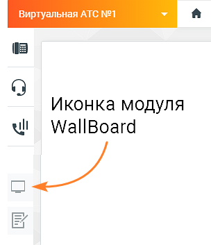
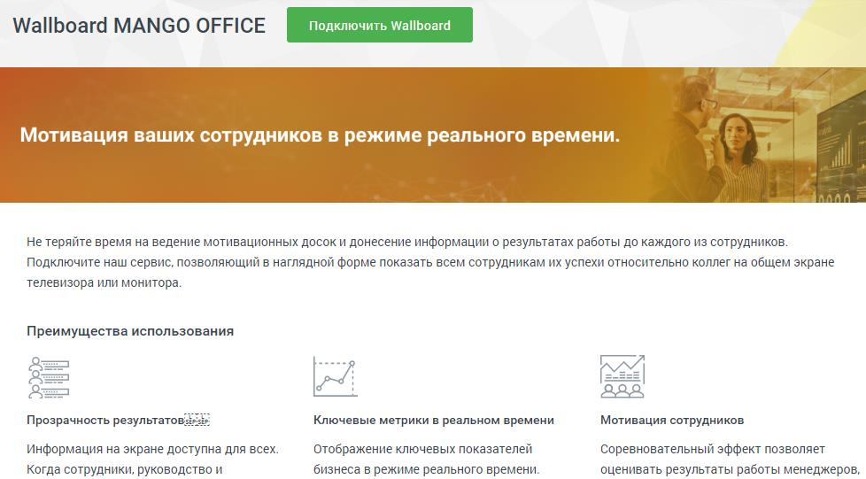
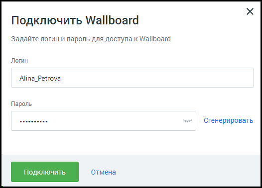
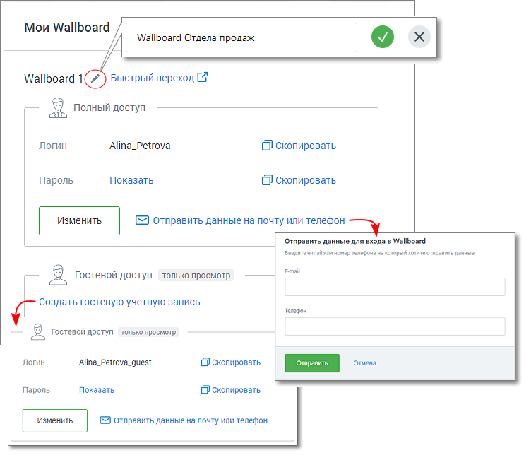
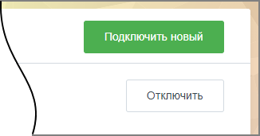

# 1. Начало работы

> Трассировка: PDF §1 · сквозные стр. 3-6 · источники: ч.1 `kb/mango-product-docs/sources/wallboard/Programma-dlya-EVM-Wallboard-Mango-Office_v7.22.25.pdf` с.3-6.

Модуль Программа для ЭВМ "Wallboard Mango Office" отражает индивидуальные или командные рейтинги операторов, а также общие показатели подразделений в режиме реального времени. Доступ к модулю осуществляется по адресу tv.mango-office.ru. Доступ к модулю есть у пользователей ВАТС с ролью Администратор. В противном случае пункт меню "Wallboard" не отображается.

## 1.1 Подключение модуля Программа для ЭВМ "Wallboard Mango Office" в

Личном кабинете ВАТС

Для подключения кликните по иконке модуля в левом вертикальном меню Личного кабинета пользователя ВАТС.

Ознакомьтесь с информацией в окне подключения, нажмите кнопку Подключить Wallboard.

## 1.2 Создание аккаунта Wallboard

Заполните поля формы создания аккаунта Wallboard. Пароль должен содержать не менее 8 символов, включать строчные, заглавные латинские буквы и цифры.

После подключения услуги иконка модуля перемещается выше, в раздел подключенных продуктов. По клику на иконку открывается страница услуги «Мои Wallboard».

На странице доступны следующие действия:

• Переименование Wallboard – для переименования кликните по пиктограмме «карандаш»; • Быстрый переход к Wallboard – по клику на ссылке открывается монитор показателей. Для новых аккаунтов – открывается окно настроек Wallboard; • Изменение данных аккаунта – для изменения данных аккаунта нажмите кнопку «Изменить»; • Копирование данных аккаунта – логин или пароль аккаунта копируются в буфер обмена; • Отправка данных аккаунта на почту или телефон; • Просмотр пароля к аккаунту; • Создание гостевой учетной записи – для каждого Wallboard может быть создана дополнительная гостевая учетная запись для доступа только в режиме просмотра; • Изменение/удаление гостевой учетной записи – для изменения данных или удаления гостевого аккаунта нажмите кнопку «Изменить»; • Удаление учетной записи Wallboard – для удаления учетной записи кликните по кнопке «Отключить» в правом верхнем углу в разделе соответствующего аккаунта на странице «Мои Wallboard». Подтвердите свое согласие на отключение; • Подключение новой учетной записи – чтобы подключить новый аккаунт Wallboard, нажмите кнопку «Подключить новый».

совет

| Настройки Wallboard хранятся для каждой учетной записи отдельно. Подключая две учетные |
| --- |
| записи, компания может использовать два Wallboard с разными настройками. Например, один |
| для отдела продаж, второй для отдела обслуживания клиентов. |
