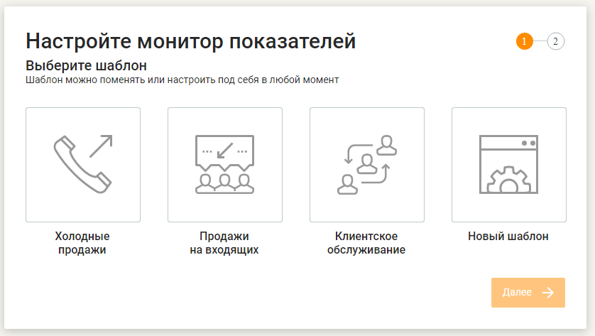
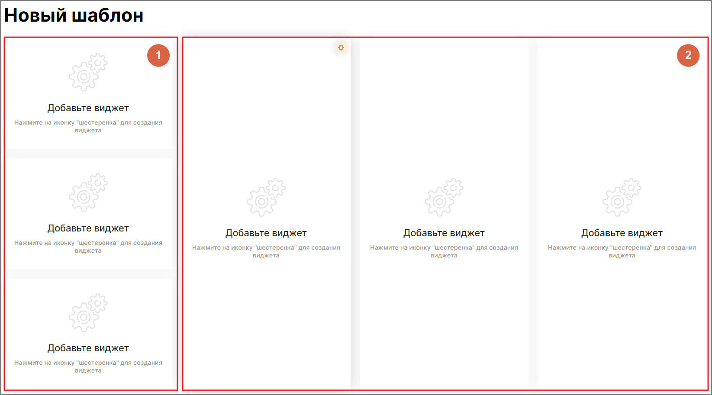
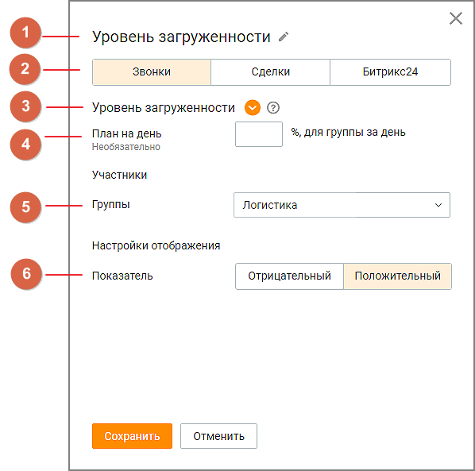
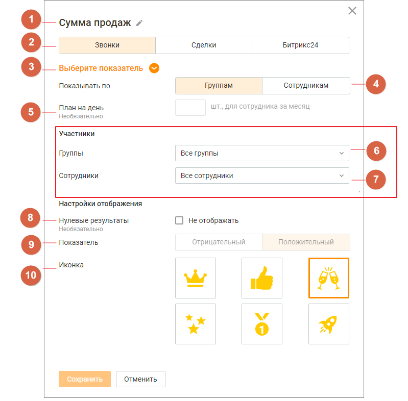

# 3. Настройка Wallboard

> Трассировка: PDF §3 · сквозные стр. 7-23 · источники: ч.1 `kb/mango-product-docs/sources/wallboard/Programma-dlya-EVM-Wallboard-Mango-Office_v7.22.25.pdf` с.7-23.

При первом входе в систему пользователь может воспользоваться одним из уже настроенных в системе шаблонов. В дальнейшем первичные настройки можно изменять в зависимости от потребностей пользователя, редактируя показатели выбранного шаблона.

| Пользователь также имеет возможность создать свой вариант монитора показателей, не используя |
| --- |
| преднастроенные шаблоны. |

## 3.1 Настройка Wallboard по шаблону

## 3.1.1 Выбор шаблона

Для того, чтобы выбрать шаблон, пользователь должен выделить соответствующую иконку и нажать кнопку «Далее». Для выбора доступны следующие шаблоны:

| 1) Шаблон «Холодные продажи» |
| --- |
| При выборе шаблона на мониторе показателей выводятся данные по следующим показателям: |

| • Количество исходящих вызовов (по группе) |
| --- |
| • Процент дозвона (по группе) |
| • Процент успешных исходящих разговоров (по группе) |
| • Процент успешных исходящих разговоров (персональный) |
| • Количество исходящих вызовов (персональный) |
| • Уровень загруженности (персональный) |

| 2) Шаблон «Продажи на входящих» |
| --- |
| При выборе шаблона на мониторе показателей выводятся данные по следующим показателям: |

| • Количество вызовов в очереди (по группе) |
| --- |
| • Количество сотрудников на персональных вызовах (по группе) |
| • Количество сотрудников на групповых вызовах (по группе) |
| • Количество принятых вызовов (персональный) |
| • Количество потерянных вызовов (персональный) |

• Процент успешных входящих разговоров (персональный)

| 3) Шаблон «Клиентское обслуживание» |
| --- |
| При выборе шаблона на мониторе показателей выводятся данные по следующим показателям: |

| • Уровень загруженности (по группе) |
| --- |
| • Процент потерянных вызовов (по группе) |
| • Процент немедленного ответа (по группе) |
| • Количество принятых вызовов (персональный) |
| • Уровень загруженности (персональный) |
| • Среднее время входящего разговора (персональный) |

| 4) Выбор собственного варианта отображения монитора показателей, с последующими |
| --- |
| настройками. |
| Выберите подходящий вариант шаблона и нажмите кнопку «Далее». |

## 3.1.2 Выбор группы для мониторинга

Если на предыдущем шаге был выбран один из трех преднастроенных шаблонов, откроется окно выбора группы.

При предварительной настройке шаблона доступен выбор только одной группы. В дальнейшем пользователь может выбрать другую группу сотрудников для мониторинга показателей. Значения групповых показателей выводятся общие по выбранной группе. Значения персональных показателей выводятся по каждому сотруднику выбранной группы.

## 3.2 Настройка «своего шаблона» показателей Wallboard

При выборе собственного варианта отображения монитора показателей открывается экран с пустыми областями для последующей настройки. Доступны виджеты общего группового показателя (блок 1) и виджеты персонального показателя – рейтинга (блок 2).

Для настройки каждого из виджетов нажмите пиктограмму в правом верхнем углу виджета. После чего откроется окно настройки.

## 3.2.1 Настройка виджета общего группового показателя

Рис. 3.2.1 – Окно настройки виджета общего группового показателя. Заполните следующие поля: 1. Название - наименование виджета, не более 60 символов; 2. Группа показателей - доступен выбор одной из вкладок:

• «Звонки» (по умолчанию) • «Сделки» • «Битрикс24» 3. Показатель - список показателей производительности, соответствующий выбранной в п.2 группе показателей. Для выбора доступен только один показатель. Подробное описание показателей приведено здесь; 4. План - поле ввода значения плана для выбранного показателя. Не является обязательным для заполнения; 5. Группы – поле обязательное для выбора. Для общего группового показателя можно выбрать только одну группу из списка; 6. Показатель - характеристика показателя: отрицательный или положительный. Для сохранения внесенных изменений нажмите кнопку «Сохранить».

## 3.2.2 Настройка виджета персонального показателя (рейтинга)

Рис. 3.2.2 – Окно настройки виджета персонального показателя (рейтинга). Заполните следующие поля: 1. Название - наименование виджета, не более 60 символов; 2. Группа показателей - доступен выбор одной из вкладок:

• «Звонки» (по умолчанию) • «Сделки» • «Битрикс24» 3. Показатель - список показателей производительности, соответствующий выбранной в п.2 группе показателей. Для выбора доступен только один показатель. Подробное описание показателей приведено здесь; 4. Отображение - переключатели настроек: • «по группам» - в рейтинге будут отображаться результаты групп по групповым показателям; • «по сотрудникам» - в рейтинге будут отображаться результаты сотрудников по персональным показателям; 5. План - поле ввода значения плана для выбранного показателя. Не является обязательным для заполнения; 6-7. Участники - списки групп и сотрудников ВАТС. Содержит поля: • Группы – поле обязательное для выбора. Для персональных показателей (рейтингов) доступен выбор нескольких групп; • Сотрудники - доступно только для персональных показателей при выбранной в п. 4 настройке отображения «По сотрудникам». Включает в себя список сотрудников ВАТС, относящихся к выбранным в поле «Группа» группам; 8. Нулевые результаты - настройка отображения: • если чекбокс проставлен - нулевые результаты будут отображаться в рейтинге; • если чекбокс не проставлен - нулевые результаты исключаются из рейтинга; 9. Показатель - характеристика показателя: отрицательный или положительный; 10. Иконка - выбранная картинка будет отображаться рядом с аватаром лидера рейтинга. Доступен выбор одной иконки. Для сохранения внесенных изменений нажмите кнопку «Сохранить».

## 3.3 Показатели производительности Wallboard

Показатели производительности, используемые в модуле Программа для ЭВМ "Wallboard Mango Office": • Основные показатели производительности (группы «Звонки» и «Сделки»); • Показатели доступные при интеграции с внешней системой Битрикс24.

важно Некоторые показатели группы «Звонки» доступны для добавления в виджет, если у пользователя подключен Контакт-центр MANGO OFFICE. Узнать больше здесь. Показатели группы «Сделки» доступны для добавления в виджет, если в Контакт-центре подключена услуга «Сделки». Узнать больше здесь. Показатели группы «Битрикс24» доступны для добавления в виджет, если в ЛК ВАТС подключена интеграция с Битрикс24.

Пиктограммой отмечены положительные показатели производительности, пиктограммой - отрицательные.

## 3.3.1 Показатели производительности группы «Звонки»

| Показатель | Тип | Расчет | Расчетный |
| --- | --- | --- | --- |
|  | показателя |  | период |
|  |  |  |  |
| Количество исходящих вызовов | Для группы/сотруд ника | Количество успешно совершенных исходящих вызовов (без учета неудачных попыток) за расчетный период | Последние 12 часов |
| Количество холодных звонков | Для группы | Количество совершенных холодных вызовов (контактам не из адресной книги) в выбранной группе сотрудников | Последние 12 часов |
|  | Для сотрудника | Количество совершенных холодных вызовов (контактам не из адресной книги) выбранным сотрудником |  |
| Количество принятых вызовов | Для группы/сотруд ника | Количество входящих внешних вызовов, принятых за расчетный период | Последние 12 часов |
| Процент успешных исходящих разговоров | Для группы/сотруд ника (%) | Процент внешних исходящих вызовов с длительностью более 30 секунд от общего количества исходящих внешних вызовов | Последние 12 часов |

| Показатель | Тип | Расчет | Расчетный |
| --- | --- | --- | --- |
|  | показателя |  | период |
|  |  |  |  |
| Процент успешных входящих разговоров | Для группы/сотруд ника (%) | Процент входящих внешних вызовов длительностью более 30 секунд | Последние 12 часов |
| Процент дозвона | Для группы/сотруд ника (%) | Процент состоявшихся внешних исходящих вызовов (длительностью более 30 сек) от общего количества исходящих внешних вызовов | Последние 12 часов |
| Процент немедленного ответа | Для группы (%) | Процент обслуженных внешних вызовов за расчетный период, которые были распределены на сотрудников без постановки в очередь, по отношению к общему количеству вызовов (как обслуженных, так и потерянных) | Последние 12 часов |
| Уровень обслуживания SL 20 сек | Для группы (%) | Процент обслуженных внешних вызовов, поступивших на группу и получивших там обслуживание, время ожидания в очереди которых меньше 20 секунд. Показатель включает всё время с момента распределения вызова на группу и до поднятия трубки каким-либо оператором группы, включая время попыток дозвона до операторов группы | Последние 12 часов |
| Количество потерянных вызовов | Для группы/сотруд ника | Количество входящих внешних вызовов за расчетный период пришедших на группу или сотрудника, по которым не состоялся разговор. Если вызов завершается во время проигрывания служебных сообщений (приветствия и т.д.), он считается пропущенным | Последние 12 часов |
| Процент потерянных вызовов | Для группы/сотруд ника (%) | Процент потерянных внешних вызовов за расчетный период по отношению к общему количеству вызовов (как принятых, так и потерянных) | Последние 12 часов |
| Количество вызовов в очереди | Для группы | Текущее количество вызовов, находящихся в очереди в данный момент | Настоящий момент |

| Показатель | Тип | Расчет | Расчетный |
| --- | --- | --- | --- |
|  | показателя |  | период |
|  |  |  |  |
| Уровень загруженности | Для группы/сотруд ника (%) | Процент времени за расчетный период, потраченного непосредственно на обслуживание внешних вызовов (входящих и исходящих), без учета участия в конференциях | Последние 12 часов |
| Количество сотрудников на персональных вызовах | Для группы | Количество сотрудников, которые разговаривают на текущий момент по входящим вызовам, которые не были на них распределены с групп, в которых они состоят (Входящие вызовы напрямую на номер сотрудника, Входящие вызовы переведенные на сотрудника) | Настоящий момент |
| Количество сотрудников на групповых вызовах | Для группы | Текущее количество сотрудников, обслуживающих вызовы, распределенные на них алгоритмом автоматического распределения вызовов | Настоящий момент |
| Количество свободных сотрудников | Для группы | Количество сотрудников в статусе «На линии» или в пользовательском статусе, созданном на основе «На линии», которые не заняты разговорами в данный момент | Настоящий момент |
| Среднее время ожидания в очереди | Для группы | Среднее время ожидания клиентов в очереди за расчетный период, в течение которого входящие вызовы (исключая вызовы, которые получили немедленный ответ) находятся в очереди. Показатель включает всё время с момента распределения вызова на группу и до поднятия трубки каким-либо оператором группы, включая время попыток дозвона до операторов группы | Последние 12 часов |
| Среднее время входящего разговора | Для группы/сотруд ника | Среднее «чистое» время обслуживания входящих внешних вызовов (исключая время нахождения вызова в очереди, на удержании, время поствызывной обработки) за расчетный период | Последние 12 часов |
| Среднее время исходящего | Для группы/сотруд ника | Среднее «чистое» время обслуживания исходящих внешних вызовов (исключая время нахождения вызова в очереди, на удержании, время поствызывной | Последние 12 часов |

| Показатель | Тип | Расчет | Расчетный |
| --- | --- | --- | --- |
|  | показателя |  | период |
|  |  |  |  |
| разговора |  | обработки) за расчетный период |  |
| Максимальное время ожидания вызова в очереди | Для группы | Максимальное время за расчетный период, в течение которого вызовы ожидали ответа. Показатель включает всё время с момента распределения вызова на группу и до поднятия трубки каким-либо оператором группы, включая время попыток дозвона до операторов группы | Последние 12 часов |
| Интенсивнос ть работы группы | Для группы | Среднее количество внешних исходящих вызовов, совершенных сотрудниками группы за расчетный период | Последние 12 часов |
| Суммарное время разговоров | Для группы/сотруд ника | Суммарное «чистое» время исходящих и входящих внешних вызовов (исключая время дозвона, поствызывной обработки, нахождения вызова в очереди, на удержании) за расчетный период | Последние 12 часов |
| Суммарное время исходящих разговоров | Для группы/сотруд ника | Суммарное «чистое» время исходящих внешних вызовов (исключая время дозвона, поствызывной обработки, нахождения вызова в очереди, на удержании) за расчетный период | Последние 12 часов |
| Суммарное время входящих разговоров | Для группы/сотруд ника | Суммарное «чистое» время входящих внешних вызовов (исключая время поствызывной обработки, нахождения вызова в очереди, на удержании) за расчетный период | Последние 12 часов |
| Количество сотрудников в разговоре | Для группы | Количество сотрудников, которые разговаривают на текущий момент по внешним входящим и исходящим вызовам (исключая время дозвона, поствызывной обработки, нахождения вызова в очереди, на удержании) | Настоящий момент |
| Количество активных сотрудников | Для группы | Количество сотрудников, находящихся в любом статусе, отличном от «не в сети» | Настоящий момент |

<!-- изображение на стр. 18: байты не извлечены (PyMuPDF недоступен) -->

<!-- изображение на стр. 18: байты не извлечены (PyMuPDF недоступен) -->

<!-- изображение на стр. 18: байты не извлечены (PyMuPDF недоступен) -->

<!-- изображение на стр. 18: байты не извлечены (PyMuPDF недоступен) -->

<!-- изображение на стр. 18: байты не извлечены (PyMuPDF недоступен) -->

<!-- изображение на стр. 18: байты не извлечены (PyMuPDF недоступен) -->

<!-- изображение на стр. 19: байты не извлечены (PyMuPDF недоступен) -->

## 3.3.2 Показатели производительности группы «Сделки»

| Показатель | Тип | Расчет | Расчетный |
| --- | --- | --- | --- |
|  | показателя |  | период |
|  |  |  |  |
| Количество созданных сделок | Для группы | Количество заведенных сделок (и не удаленных на момент обновления данных), дата создания которых попадает в текущий календарный месяц, и ответственный исполнитель которых является участником выбранной группы | Текущий календарный месяц |
|  | Для сотрудника | Количество заведенных сделок (и не удаленных на момент обновления данных), дата создания которых попадает в текущий календарный месяц, по ответственному исполнителю |  |
| Количество продаж | Для группы | Количество сделок, переведенных в текущем календарном месяце в статус «Состоялась» и находящихся в нем же, ответственный исполнитель которых является участником выбранной группы | Текущий календарный месяц |
|  | Для сотрудника | Количество сделок, переведенных в текущем календарном месяце в статус «Состоялась» и находящихся в нем же, по ответственному исполнителю |  |
| Сумма продаж | Для группы | Сумма значений поля «Сумма сделки» всех сделок, переведенных в текущем календарном месяце в статус «Состоялась» и находящихся в нем же, ответственный исполнитель которых является участником выбранной группы | Текущий календарный месяц |
|  | Для сотрудника | Сумма значений поля «Сумма сделки» всех сделок, переведенных в текущем календарном месяце в статус «Состоялась» и находящихся в нем же, по ответственному исполнителю |  |
| Количество сделок в работе | Для группы | Количество сделок, находящихся в данный момент в статусе «В работе», ответственный исполнитель которых является участником выбранной группы | Настоящий момент |
|  | Для сотрудника | Количество сделок, находящихся в данный момент в статусе «В работе», по ответственному исполнителю |  |

<!-- изображение на стр. 19: байты не извлечены (PyMuPDF недоступен) -->

<!-- изображение на стр. 19: байты не извлечены (PyMuPDF недоступен) -->

<!-- изображение на стр. 19: байты не извлечены (PyMuPDF недоступен) -->

<!-- изображение на стр. 19: байты не извлечены (PyMuPDF недоступен) -->

<!-- изображение на стр. 20: байты не извлечены (PyMuPDF недоступен) -->

| Показатель | Тип | Расчет | Расчетный |
| --- | --- | --- | --- |
|  | показателя |  | период |
|  |  |  |  |
| Сумма сделок в работе | Для группы | Сумма значений поля «Сумма сделки» по всем сделкам, находящимся в статусе «В работе», ответственный исполнитель которых является участником выбранной группы | Настоящий момент |
|  | Для сотрудника | Сумма значений поля «Сумма сделки» по всем сделкам, находящимся в статусе «В работе», по ответственному исполнителю |  |
| Количество проигранных сделок | Для группы | Количество сделок, переведенных в текущем календарном месяце в статус «Не состоялась» и находящихся в нем же, ответственный исполнитель которых является участником выбранной группы | Текущий календарный месяц |
|  | Для сотрудника | Количество сделок, переведенных в текущем календарном месяце в статус «Не состоялась» и находящихся в нем же, по ответственному исполнителю |  |
| Сумма проигранных сделок | Для группы | Сумма значений поля «Сумма сделки» по всем сделкам, переведенным в текущем календарном месяце в статус «Не состоялась» и находящихся в нем же, ответственный исполнитель которых является участником выбранной группы | Текущий календарный месяц |
|  | Для сотрудника | Сумма значений поля «Сумма сделки» по всем сделкам, переведенным в текущем календарном месяце в статус «Не состоялась» и находящихся в нем же, по ответственному исполнителю |  |

<!-- изображение на стр. 20: байты не извлечены (PyMuPDF недоступен) -->

<!-- изображение на стр. 20: байты не извлечены (PyMuPDF недоступен) -->

<!-- изображение на стр. 20: байты не извлечены (PyMuPDF недоступен) -->

Показатели с периодом расчета "за текущий месяц" обновляются 1 раз в 15 минут.

## 3.3.3 Показатели производительности группы «Битрикс24»

Показатели производительности, доступные при интеграции с Битрикс24.

| Показатель | Тип | Расчет | Период расчета |
| --- | --- | --- | --- |
| Количество созданных | Для группы | Общее количество сделок, заведенных в Bitrix24 за текущий месяц, ответственными исполнителями которых (на момент выгрузки данных) являются сотрудники выбранной | Текущий месяц |

<!-- изображение на стр. 21: байты не извлечены (PyMuPDF недоступен) -->

| Показатель | Тип | Расчет | Период расчета |
| --- | --- | --- | --- |
| сделок |  | группы. |  |
|  | Для сотрудника | Количество сделок, заведенных в Bitrix24 за текущий месяц, в которых на момент выгрузки данных ответственным исполнителем является выбранный сотрудник |  |
| Количество выигранных сделок | Для группы | Общее количество сделок, перешедших в стадию «Сделка заключена» и находящихся в ней же, ответственными исполнителями которых (на момент выгрузки данных) являются сотрудники выбранной группы |  |
|  | Для сотрудника | Количество сделок, перешедших в стадию «Сделка заключена» и находящихся в ней же, ответственным исполнителем которых (на момент выгрузки данных) является выбранный сотрудник |  |
| Количество проигранны х сделок | Для группы | Общее количество сделок, перешедших в любую стадию группы «Сделка провалена» и находящихся в ней же, ответственными исполнителями которых (на момент выгрузки данных) являются сотрудники выбранной группы |  |
|  | Для сотрудника | Количество сделок, перешедших в любую стадию группы «Сделка провалена» и находящихся в ней же, ответственным исполнителем которых (на момент выгрузки данных) является выбранный сотрудник |  |
| Сумма выигранных сделок | Для группы | Общая сумма сделок, перешедших в стадию «Сделка заключена» и находящихся в ней же, ответственными исполнителями которых (на момент выгрузки данных) являются сотрудники выбранной группы |  |
|  | Для сотрудника | Сумма сделок, перешедших в стадию «Сделка заключена» и находящихся в ней же, ответственным исполнителем которых (на момент выгрузки данных) является выбранный |  |

<!-- изображение на стр. 21: байты не извлечены (PyMuPDF недоступен) -->

<!-- изображение на стр. 21: байты не извлечены (PyMuPDF недоступен) -->

<!-- изображение на стр. 21: байты не извлечены (PyMuPDF недоступен) -->

<!-- изображение на стр. 21: байты не извлечены (PyMuPDF недоступен) -->

<!-- изображение на стр. 22: байты не извлечены (PyMuPDF недоступен) -->

| Показатель | Тип | Расчет | Период расчета |
| --- | --- | --- | --- |
|  |  | сотрудник |  |
| Сумма выставленн ых счетов | Для группы | Общая сумма выставленных счетов по сделкам, ответственными исполнителями которых (на момент выгрузки данных) являются сотрудники выбранной группы, где дата выставления счета попадает в текущий месяц |  |
|  | Для сотрудника | Сумма выставленных счетов по сделкам, ответственным исполнителем которых (на момент выгрузки данных) является выбранный сотрудник, где дата выставления счета попадает в текущий месяц |  |
| Сумма проигранны х сделок | Для группы | Общая сумма сделок, перешедших в любую стадию группы «Сделка провалена» и находящихся в ней же, ответственными исполнителями которых (на момент выгрузки данных) являются сотрудники выбранной группы |  |
|  | Для сотрудника | Сумма сделок, перешедших в любую стадию группы «Сделка провалена» и находящихся в ней же, ответственным исполнителем которых (на момент выгрузки данных) является выбранный сотрудник |  |
| Количество сделок в работе | Для группы | Общее количество сделок, находящихся на момент выгрузки данных в любой рабочей стадии (не завершенные и не отмененные), ответственными исполнителями которых (на момент выгрузки данных) являются сотрудники выбранной группы | Текущий момент |
|  | Для сотрудника | Количество сделок, находящихся на момент выгрузки данных в любой рабочей стадии (не завершенные и не отмененные), ответственным исполнителем которых (на момент выгрузки данных) является выбранный сотрудник |  |
| Сумма сделок в | Для группы | Общая сумма сделок, находящихся на момент выгрузки данных в любой рабочей стадии (не завершенные и не отмененные), кроме группы |  |

<!-- изображение на стр. 22: байты не извлечены (PyMuPDF недоступен) -->

<!-- изображение на стр. 22: байты не извлечены (PyMuPDF недоступен) -->

<!-- изображение на стр. 22: байты не извлечены (PyMuPDF недоступен) -->

<!-- изображение на стр. 23: байты не извлечены (PyMuPDF недоступен) -->

| Показатель | Тип | Расчет | Период расчета |
| --- | --- | --- | --- |
| работе |  | стадий «Сделка провалена», ответственными исполнителями которых (на момент выгрузки данных) являются сотрудники выбранной группы |  |
|  | Для сотрудника | Сумма сделок, находящихся на момент выгрузки данных в любой рабочей стадии (не завершенные и не отмененные), ответственным исполнителем которых (на момент выгрузки данных) является выбранный сотрудник |  |

<!-- изображение на стр. 23: байты не извлечены (PyMuPDF недоступен) -->
