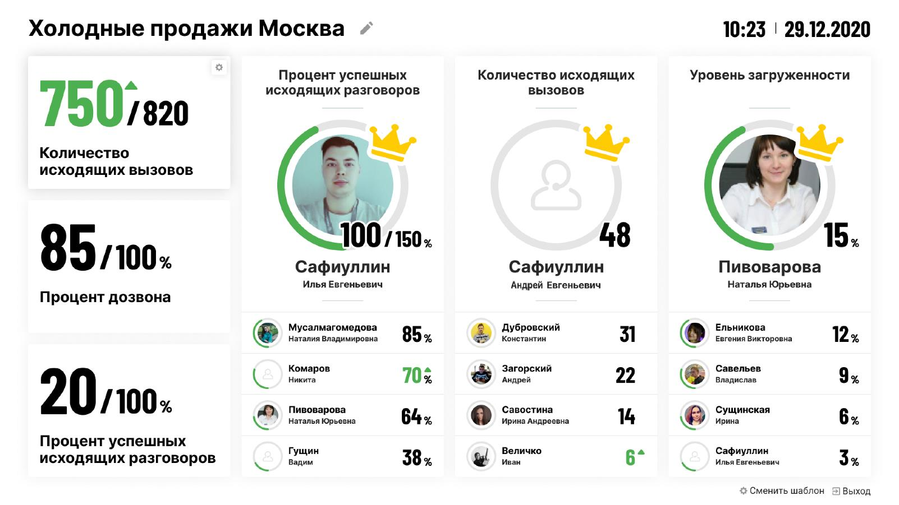
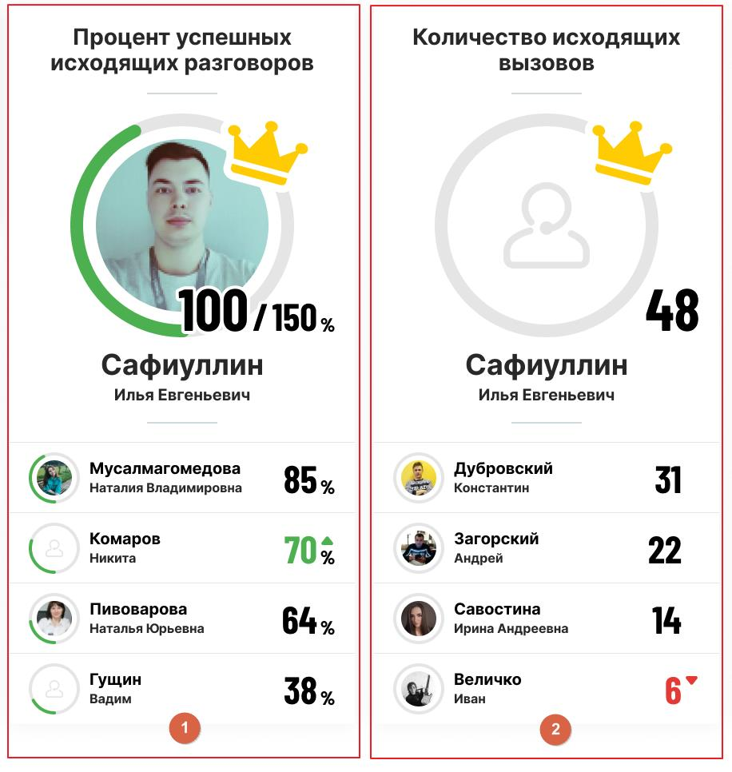
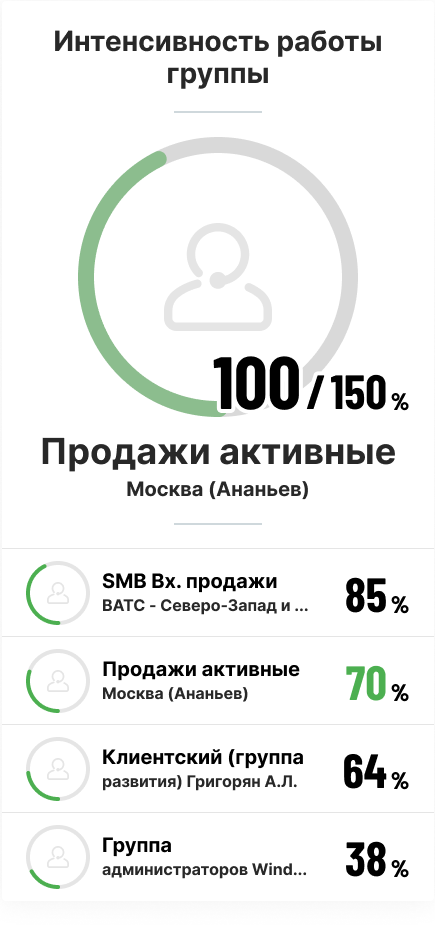
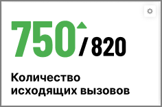

# 4. Главное окно модуля

> Трассировка: PDF §4 · сквозные стр. 23-28 · источники: ч.1 `kb/mango-product-docs/sources/wallboard/Programma-dlya-EVM-Wallboard-Mango-Office_v7.22.25.pdf` с.23-28.

На главном окне отображаются:

1) Наименование монитора – его можно отредактировать кликом по пиктограмме «карандаш»; 2) Текущие дата и время; 3) Три блока общих групповых показателей; 4) Три блока персональных показателей - рейтингов;

5) Пиктограмма смены шаблона – клик по пиктограмме открывает окно выбора шаблона;

6) Пиктограмма выхода из учетной записи.

## 4.1 Персональные показатели (рейтинги)

Рейтинг может быть сформирован: • по сотрудникам, если в настройках виджета задано условие «Показывать по Сотрудникам»; • по группам, если в настройках виджета задано условие «Показывать по Группам».

## 4.1.1 Рейтинг по сотрудникам

Сотрудники располагаются в рейтинге в порядке убывания значения показателя. Лидер рейтинга выделяется крупным аватаром с серым, зелёным или красным прогресс-баром выполнения.

Рис. 1 – плановое значение показателя задано. Рис. 2 - плановое значение показателя не задано. Если плановое значение показателя задано: плановое значение показателя отображается у лидера рейтинга (на рис. 1 плановое значение равно 150%). Выполнение плана визуально отображается на аватаре сотрудника в виде рамки – прогресс-бара – зелёного (положительный показатель) или красного (отрицательный показатель) цвета. План считается выполненным, когда значение показателя равно или больше планового значения. В

этом случае прогресс-бар заполняется на 100%, рядом с аватаром лидера рейтинга отображается выбранная в настройках «положительная» или «отрицательная» иконка.

| Если плановое значение показателя не задано: цветная рамка лидера и сотрудников не имеет |
| --- |
| функции прогресс-бара, а «положительная» или «отрицательная» иконка у лидера отображается |
| постоянно. |
| Рост и снижение показателей отмечаются треугольниками зеленого и красного цветов |
| соответственно. |
|  |
| Если после формирования виджета сотрудник был добавлен в группу или удален из группы, то: |

| • в случае настройки виджета «Все сотрудники», результат добавленного сотрудника |
| --- |
| появляется в рейтинге (а результат удаленного - удаляется из рейтинга) без необходимости |
| перенастройки виджета; |
| • в случае если в настройках виджета выбран удаленный сотрудник, его результат удаляется |
| из рейтинга без необходимости перенастройки виджета; |
| • в случае если в настройках виджета выбраны не все сотрудники, результаты добавленного |
| сотрудника не появляются в рейтинге, при этом он доступен в настройках виджета. |

|  |
| --- |
|  |
|  |
|  |
|  |
|  |
|  |
|  |
|  |
|  |
|  |
|  |
|  |
|  |
|  |
|  |
|  |
|  |
|  |
|  |
|  |

## 4.1.2 Рейтинг по группам

Группы располагаются в рейтинге в порядке убывания значения показателя.

Если плановое значение показателя задано: плановое значение показателя отображается у лидера группового рейтинга (на рисунке выше плановое значение равно 150%). Выполнение плана

визуально отображается на аватаре группы в виде рамки – прогресс-бара – зелёного (положительный показатель) или красного (отрицательный показатель) цвета. План считается выполненным, когда значение показателя равно или больше планового значения. В этом случае прогресс-бар заполняется на 100%, рядом с аватаром лидера группового рейтинга отображается выбранная в настройках «положительная» или «отрицательная» иконка.

| Если плановое значение показателя не задано: цветная рамка группы-лидера и других групп не |
| --- |
| имеет функции прогресс-бара, а «положительная» или «отрицательная» иконка у лидера |
| отображается постоянно. |

## 4.2 Общие групповые показатели

Блок содержит: • Наименование показателя; • Данные о текущем и плановом (если задано) значении показателя. Для положительных показателей текущие данные выводятся зеленым цветом, для отрицательных – красным; • Пиктограмма «треугольник» динамики показателя (зелёный – рост, красный - снижение).

| Если после формирования виджета сотрудник был добавлен в группу или удален из группы, при |  |  |  |
| --- | --- | --- | --- |
| ближайшем обновлении данных значение показателя учитывает изменения в составе группы без |  |  |  |
| необходимости перенастройки виджета. |  |  |  |
|  |  |  |  |
|  |  |  |  |
