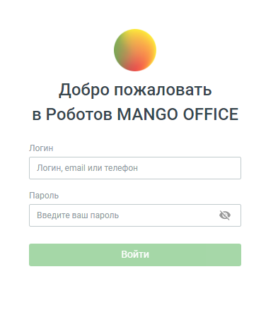

# 1. Страница авторизации

> Трассировка: PDF §1 · сквозные стр. 5-6 · источники: ч.1 `kb/sources/cov-robot-fil/Модуль ЦОВ Робот Фил 2,0_manual_v7.26.28.pdf` с.5-6.

Доступ к модулю ЦОВ «Робот Фил 2,0» осуществляется по ссылке robot.mango-office.ru. При первом входе на страницу открывается форма авторизации:

В качестве логина используются: Логин сотрудника, e-mail, номер телефона – для доступа к учетной записи сотрудника. Данные для доступа имеются в карточке сотрудника в Личном кабинете пользователя ВАТС. После ввода корректного пароля и нажатия кнопки Войти сотрудник получает доступ к модулю ЦОВ «Робот Фил 2,0».

| Важно: Доступ к модулю ЦОВ «Робот Фил 2,0» имеют сотрудники ВАТС с ролью Администратор, а также |
| --- |
| сотрудники с ролью, которой были делегированы права на доступ к продукту «Роботы» в ЛК ВАТС. |

Меню модуля содержит разделы: Робот-администратор, Чат-боты, Роботы, Настройки интеграций и Услуги. В правой части шапки страницы отображаются:

 кнопка – ссылка на Руководство пользователя;  аватар пользователя;

 кнопка – выход из учетной записи

 кнопка – вызов формы обратной связи.
