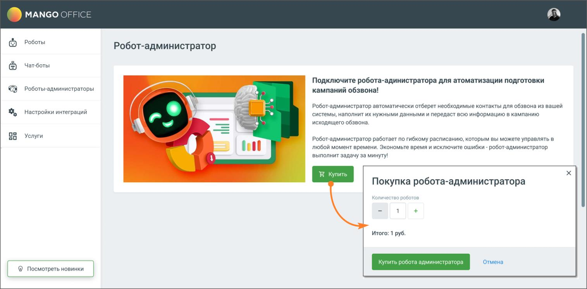
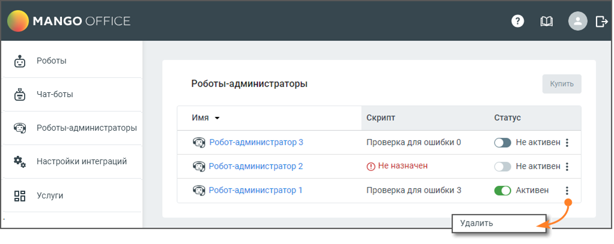

# 2. Робот-администратор

> Трассировка: PDF §2 · сквозные стр. 6-7 · источники: ч.1 `kb/sources/cov-robot-fil/Модуль ЦОВ Робот Фил 2,0_manual_v7.26.28.pdf` с.6-7.

Для подключения робота-администратора нажмите кнопку Купить, в открывшемся окне выберите необходимое количество и нажмите кнопку Купить робота администратора.

После покупки робот-администратор будет доступен в соответствующем разделе модуля. Максимальное доступное количество роботов-администраторов – 3.

Страница содержит:  Роботы-администраторы – в столбце отображается имя робота-администратора. По клику на имя открывается Карточка робота-администратора.  Скрипт – название скрипта, назначенного роботу-администратору.  Статус – переключатель статуса робота активен/не активен.  Кнопка «Купить робота» – по клику на кнопку открывается форма покупки робота. После покупки трех роботов кнопка не доступна для нажатия.

 Пиктограмма – клик по пиктограмме открывает меню действия с роботом-администратором. Откройте карточку робота-администратора, кликнув на имя робота, и произведите настройки.
