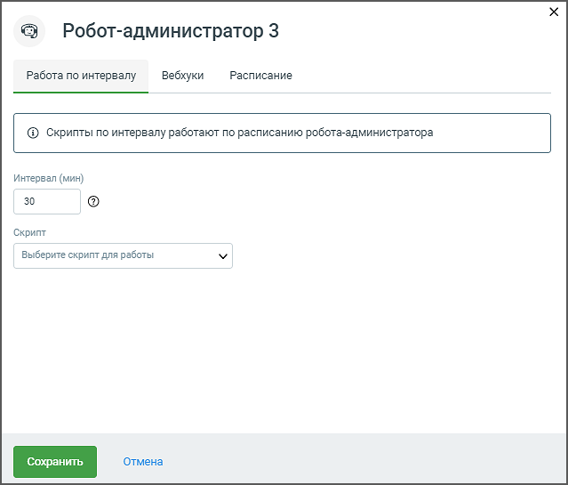
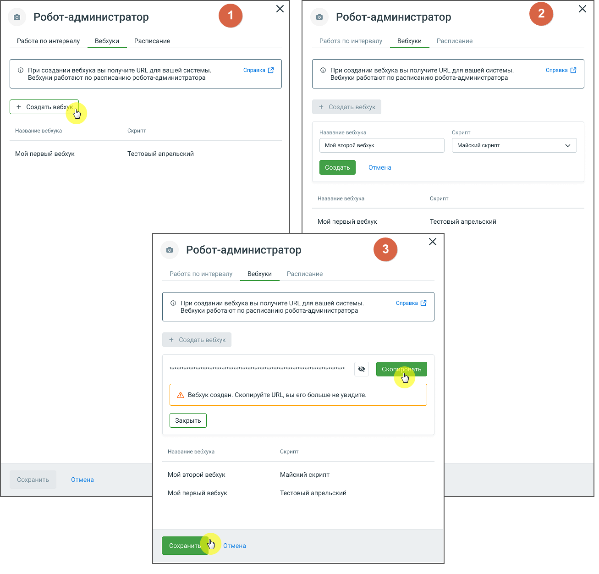
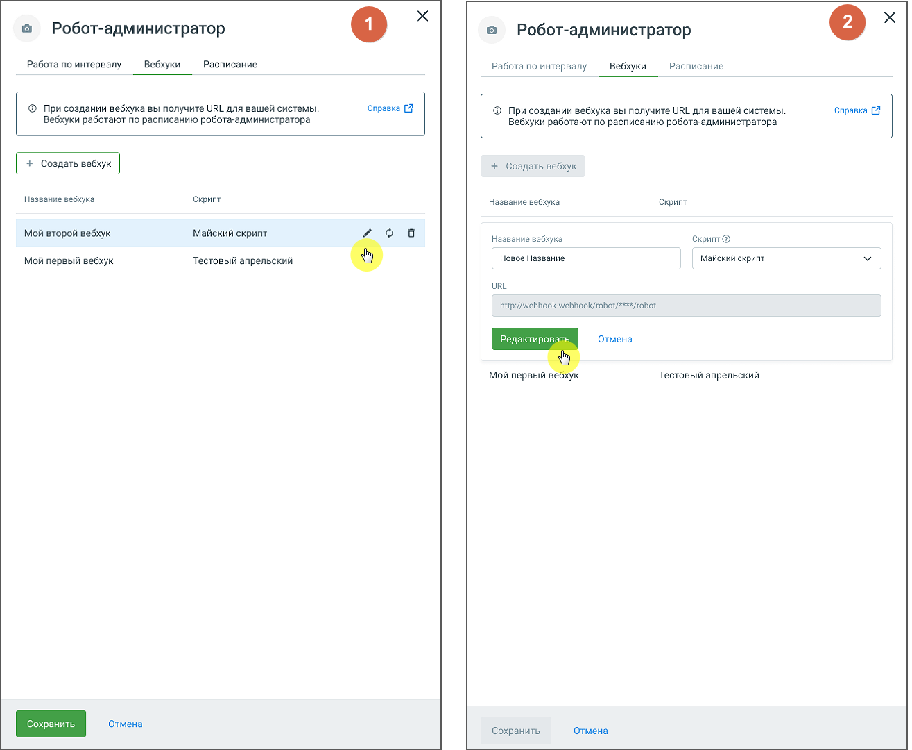
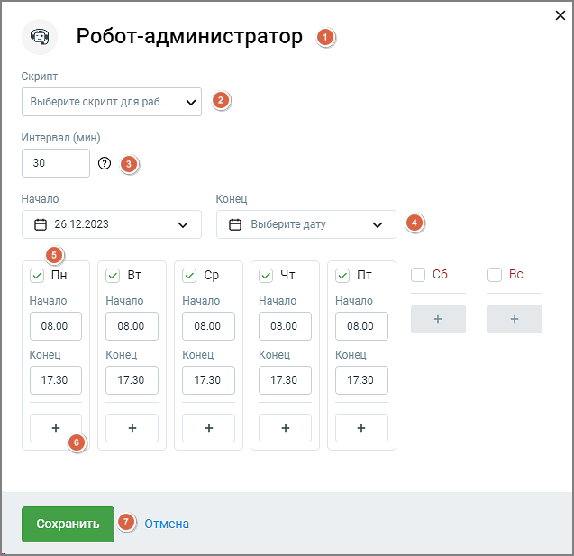

# 2.1. Карточка робота-администратора

> Трассировка: PDF §2.1 · сквозные стр. 7-12 · источники: ч.1 `kb/sources/cov-robot-fil/Модуль ЦОВ Робот Фил 2,0_manual_v7.26.28.pdf` с.7-12.

Клик по наименованию робота-администратора открывает его карточку. Вкладка "Работа по интервалу" Вкладка "Работа по интервалу" предназначена для автоматизации выполнения задач, которые должны происходить с регулярной периодичностью. Это может быть полезно для процессов, требующих регулярного обновления данных, мониторинга состояния системы или выполнения плановых операций без вмешательства пользователя. Например, робот может регулярно собирать данные из различных источников и передавать их в систему для дальнейшей обработки.

Элементы интерфейса вкладки: 1. Интервал (мин): Поле для ввода временного интервала в минутах, через который робот будет выполнять скрипт. 2. Скрипт: Выпадающий список, позволяющий выбрать скрипт, который будет выполняться через заданный интервал. Пока робот активен, изменение интервала и скрипта невозможно. Для внесения изменений робота- администратора следует остановить. Вкладка «Вебхуки» Робот-администратор предоставляет администраторам возможность создавать и настраивать вебхуки для получения данных. Это позволяет внешним системам определять время и адрес отправки данных, обеспечивая гибкость и автоматизацию процессов. Создание вебхука для робота-администратора.

Элементы интерфейса вкладки: 1. Нажмите на кнопку "Создать вебхук". 2. В появившемся окне введите название вебхука в поле "Название вебхука", не более 50 символов. Далее выберите имеющийся скрипт из выпадающего списка скриптов. Для выбора доступны только скрипты, не привязанные к другим вебхукам.

3. После ввода названия и выбора скрипта, модуль «Роботы» сгенерирует URL для вашего вебхука. Скопируйте URL-адрес созданного вебхука. 4. Нажмите кнопку "Сохранить" для завершения создания вебхука, для размещения в системе. 5. Новый вебхук будет добавлен в список существующих вебхуков для данного робота- администратора. 6. Далее следует открыть выбранный скрипт в режиме редактирования, кликнуть по пиктограмме "настройки" в горизонтальном меню скрипта и произвести настройки вебхука. Редактирование или удаление вебхука

Элементы интерфейса вкладки:

1. В списке вебхуков найдите тот, который хотите отредактировать и нажмите на пиктограмму "карандаш". 2. В появившемся окне внесите изменения в поле "Название вебхука" и выберите новый скрипт из выпадающего списка "Скрипт". 3. Нажмите кнопку "Редактировать" для сохранения изменений. 4. Для удаления вебхука в списке вебхуков найдите тот, который хотите удалить и нажмите на пиктограмму "корзина". В открывшемся окне подтвердите удаление. При назначении нового скрипта все сопоставленные данные будут автоматически перенесены в новый скрипт. Вкладка "Работа по расписанию"

Элементы интерфейса вкладки:

1. Имя робота-администратора. Клик по пиктограмме позволяет изменить имя робота. Сохраните внесенные изменения, кликнув в любой области экрана, либо кнопкой Ввод/Enter на клавиатуре компьютера. 2. Скрипт – в выпадающем меню представлен список доступных скриптов. Выберите необходимый для задания конкретного действия, которое робот должен выполнять. В один промежуток времени роботу может быть назначен только один скрипт. 3. Интервал – устанавливает временной интервал в минутах (от 10 до 300 минут) между выполнением задач. 4. Поля «Начало» и «Конец» – задают дату начала и окончания работы робота-администратора. 5. Чекбоксы графика работы – предоставляет возможность установить расписание работы  по дням недели  по времени на каждый день 6. Кнопка « + » – добавляет связку полей «Начало» и «Конец». 7. Кнопки "Сохранить" и "Отмена" – позволяют сохранить или отменить внесенные изменения в настройках робота-администратора.
