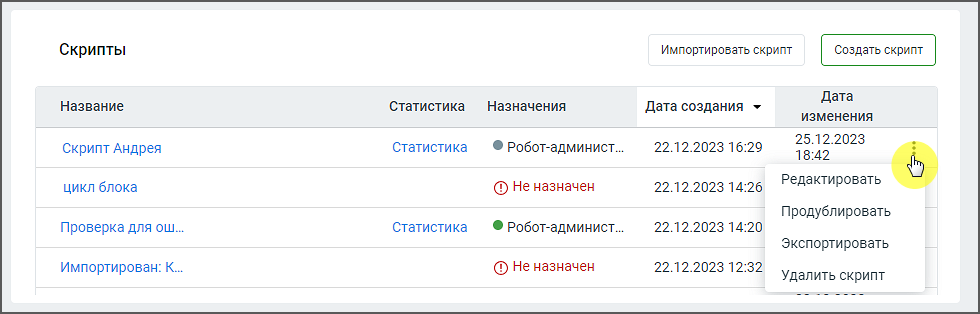

# 2.2. Скрипты робота-администратора

> Трассировка: PDF §2.2 · сквозные стр. 12-13 · источники: ч.1 `kb/sources/cov-robot-fil/Модуль ЦОВ Робот Фил 2,0_manual_v7.26.28.pdf` с.12-13.

Страница раздела содержит блок списка скриптов для робота-администратора, где пользователь может управлять списком скриптов и их параметрами. Пример внешнего вида блока:

Элементы блока: 1. Кнопка «Импортировать скрипт» – позволяет загружать ранее экспортированные в Конструкторе скрипты. 2. Кнопка «Создать скрипт» – открывает окно создания нового скрипта в Конструкторе скриптов. 3. Название – название скрипта. По двойному клику на название открывается карточка сценария скрипта.

4. Статистика – переход на страницу статистики для данного скрипта (если скрипт отработал хотя бы один раз). 5. Назначения – имя робота-администратор, которому назначен скрипт. Скрипты для робота- администратора не доступны для назначения на них голосовых роботов или чат-ботов. 6. Дата создания – дата создания скрипта в формате дд.мм.гггг чч:мм. 7. Дата изменения – дата последнего внесения изменений в скрипт в формате дд.мм.гггг чч:мм.

8. Пиктограмма – предоставляет возможность выполнить различные клик по пиктограмме открывает меню действий со скриптом:  Редактировать – изменение настроек или блоков скрипта.  Продублировать – создание копии скрипта для последующего использования или модификации.  Экспортировать – экспорт скрипта.  Удалить скрипт – удаление скрипта. Скрипт не может быть удален, если на него назначен вебхук.

| Важно: При удалении всех роботов-администраторов пользователю остаются доступны список скриптов роботов- |
| --- |
| администраторов и все действия со скриптами. |
