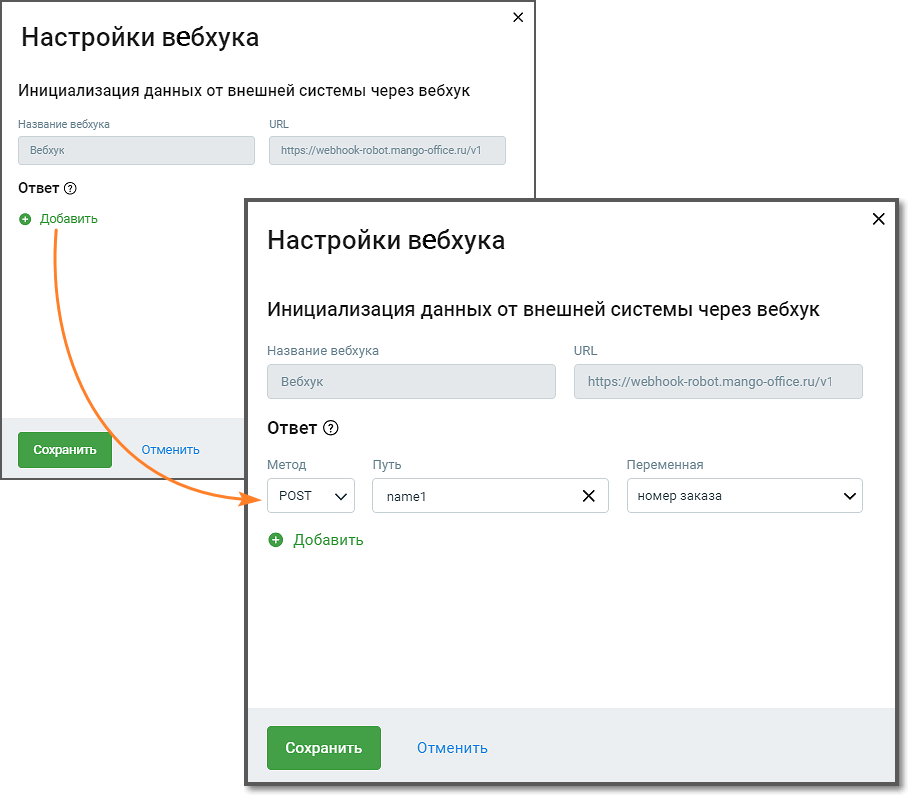

# 2.3. Настройки вебхука робота-администратора

> Трассировка: PDF §2.3 · сквозные стр. 13-15 · источники: ч.1 `kb/sources/cov-robot-fil/Модуль ЦОВ Робот Фил 2,0_manual_v7.26.28.pdf` с.13-15.

Прежде, чем переходить к настройкам необходимо создать вебхук в карточке робота-администратора. Кликните по кнопке «Настройки» в правом верхнем углу страницы создания скрипта, привязанного к вебхуку в карточке робота-администратора. Откроется окно с названием и URL привязанного вебхука.

Элементы интерфейса: 1. Метод – метод http-запроса. Выпадающий список содержит: GET, POST 2. Поля «Путь» и «Переменная». При заполнении поля «Путь» следует руководствоваться информацией, расположенной под пиктограммой «?». 3. Кнопка « + » – добавляет связку полей «Метод», «Путь» и «Переменная». 4. Кнопка «Сохранить» – клик по кнопке сохраняет внесенные изменения. 5. Кнопка «Отменить» – клик по кнопке отменяет внесенные изменения и возвращает к предыдущим настройкам.

