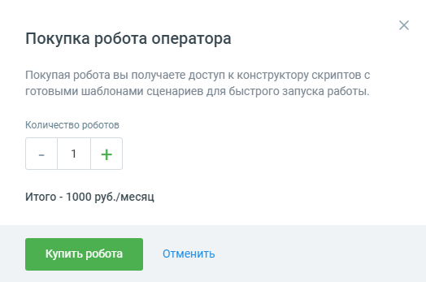

# 3.1. Форма покупки роботов

> Трассировка: PDF §3.1 · сквозные стр. 15-16 · источники: ч.1 `kb/sources/cov-robot-fil/Модуль ЦОВ Робот Фил 2,0_manual_v7.26.28.pdf` с.15-16.

Форма покупки роботов открывается при первом входе пользователя в модуль ЦОВ «Робот Фил 2,0». Ознакомьтесь с условиями и выберите необходимое количество роботов. Нажмите кнопку Купить робота.

После нажатия кнопки Купить робота в левом верхнем углу страницы появляется уведомление Успешно создано __ роботов, с указанием количества созданных роботов.

| Примечание: при недостатке средств на счету покупка не осуществляется. О недостатке средств пользователь |
| --- |
| уведомляется системным сообщением. |

Кнопка Отменить закрывает форму покупки без сохранения изменений. После создании робота, сотрудник-робот появляется в разделе Сотрудники Личного кабинета ВАТС, а также других продуктах аналогично обычным сотрудникам. В списке сотрудников сотрудник-робот

отображается с пиктограммой и ролью «Робот». Робот попадает в статистику аналогично другим

сотрудникам, может быть добавлен в группы и участвовать в схеме переадресации. В системе ведется поминутный учет длительности разговоров сотрудника-робота.
