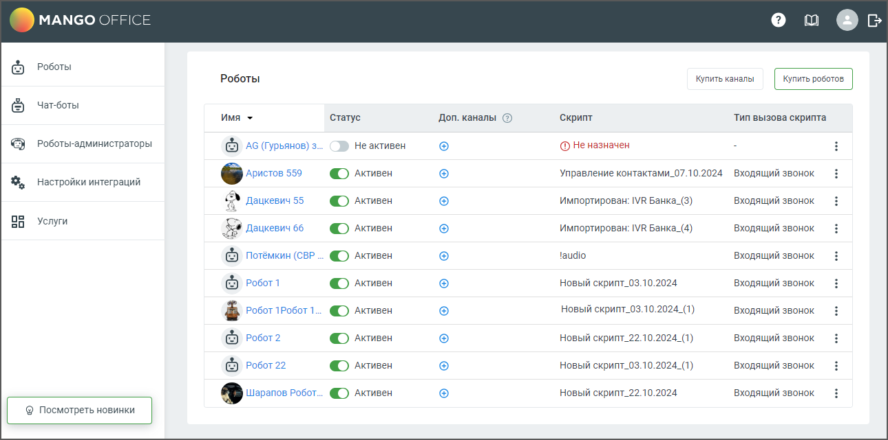

# 3.2. Страница «Роботы MANGO OFFICE»

> Трассировка: PDF §3.2 · сквозные стр. 16-17 · источники: ч.1 `kb/sources/cov-robot-fil/Модуль ЦОВ Робот Фил 2,0_manual_v7.26.28.pdf` с.16-17.

После покупки робота-оператора у пользователя открывается страница Роботы, на которой размещен список имеющихся роботов и краткая инструкция по работе с роботом. Пример внешнего вида страницы представлен на рисунке ниже.

Страница содержит:  Робот – в столбце отображается аватар робота, имя робота. По клику на имя открывается Карточка робота.  Статус – переключатель статуса робота активен/не активен.  Доп.каналы – количество дополнительных каналов (услуга "Многоканальный робот").  Скрипт – название скрипта, назначенного роботу.  Тип вызова скрипта – входящий звонок или исходящий обзвон.  Кнопка «Купить робота» - по клику на кнопку открывается Форма покупки робота.  Кнопка «Купить каналы» - по клику на кнопку открывается форма перехода на страницу услуг.  Ссылка справку Роботов  Ссылка на форму обратной связи  Пиктограмма выхода из аккаунта

Откройте карточку робота-оператора, кликнув на имя робота, и заполните данные на вкладках.
