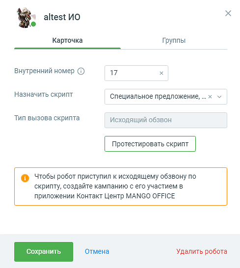
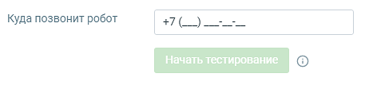
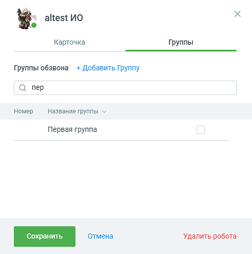

# 3.3. Карточка робота

> Трассировка: PDF §3.3 · сквозные стр. 17-20 · источники: ч.1 `kb/sources/cov-robot-fil/Модуль ЦОВ Робот Фил 2,0_manual_v7.26.28.pdf` с.17-20.

Карточка робота-оператора содержит две вкладки: Карточка и Группы.

Робот, как участник кампании Исходящего обзвона, может:  Произносить значения полей ИО, выбранных при создании кампании;  Отправлять значения полей ИО в смс и e-mail;  Использовать значения полей ИО в http-запросе;  Записывать произнесенную абонентом фразу/часть фразы в поле ИО.

На вкладке Карточка размещаются следующие настройки:

 Имя и фото робота. Клик на пиктограмму в поле аватара открывает окно для загрузки аватара

при помощи стандартных диалоговых средств Windows. Клик по пиктограмме позволяет изменить имя робота. Сохраните внесенные изменения, кликнув в любой области экрана, либо кнопкой Ввод/Enter на клавиатуре компьютера.  Статус робота: активен (если роботу назначен скрипт), не активен. Управлять статусами робота

можно следующими способами:  активация/деактивация робота через список роботов;  активация/деактивация скрипта - меняет статус всех роботов, которым назначен скрипт.  Внутренний номер – внутренний номер сотрудника-робота, не более 5 символов. Номер может быть сгенерирован автоматически, либо задан вручную пользователем.  Назначить скрипт – выпадающий список имеющихся скриптов. Скрипты, сделанные под заказ, имеют дополнительный текст «Сделан под заказ». При выборе пункта «Создать скрипт» открывается форма Выбор шаблона.  Тип вызова скрипта – в зависимости от настроек выбранного скрипта исходящий обзвон или входящий звонок.  Кнопка «Протестировать скрипт» – по нажатию на кнопку появляется поле для ввода номера телефона, на который позвонит робот после нажатия кнопки «Начать тестирование».

Примечание: Кнопка «Протестировать скрипт» доступна только при наличии назначенного роботу скрипта. На вкладке Группа размещаются следующие настройки:

 Группы обзвона – поле выбора групп обзвона. Осуществляет поиск по группам, содержащим введенные символы в названии или номере группы. В списке групп отображаются только группы, содержащие введенные символы. Возможен поиск как по полным данным, так и по частичному наименованию. Группы в списке отображаются в алфавитном порядке.  Данные групп – номер и название группы ВАТС. К обоим вкладкам относятся:  Кнопка «Сохранить» – сохраняет внесенные в карточку изменения, карточка закрывается.  Кнопка «Отмена» – по нажатию кнопки внесенные изменения отменяются, карточка робота закрывается.  Кнопка «Удалить робота» – удаление созданного робота. По нажатию на кнопку подтвердите согласие на удаление. Если робот в момент удаления обрабатывает звонок, он заканчивает текущий разговор, после чего удаляется.

