# 3.4. Скрипты для роботов

> Трассировка: PDF §3.4 · сквозные стр. 20-28 · источники: ч.1 `kb/sources/cov-robot-fil/Модуль ЦОВ Робот Фил 2,0_manual_v7.26.28.pdf` с.20-28.

Пример внешнего вида блока "Скрипты для роботов":

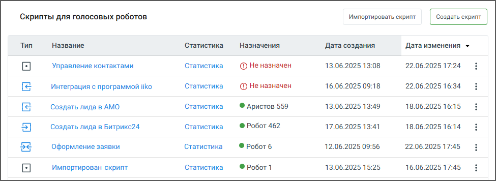

Блок содержит следующие элементы:  Кнопка «Создать скрипт» – по клику на кнопку открывается пользователь переходит к первом шагу создания скрипта – выбору шаблона.  Кнопка «Импортировать скрипт» – по клику на кнопку открывается поле для импорта скрипта.  Название – название скрипта, сохраненное при создании. По двойному клику на название открывается Карточка сценария скрипта. Скрипты, созданные под заказ, перед наименованием

помечаются иконкой , и недоступны для просмотра и редактирования. Скрипты с активным

фоновым сценарием, помечаются иконкой .  Статистика – открывает окно статистики прохода скрипта.  Назначен – имя робота, которому назначен скрипт. Если скрипт назначен нескольким роботам, назначение обозначается пиктограммой «робот» и числом. По наведению на значок, появляется всплывающая подсказка с перечнем имён роботов через запятую.  Дата создания – дата и время создания скрипта в формате дд.мм.гггг чч:мм.  Дата изменения – дата и время последнего изменения скрипта дд.мм.гггг чч:мм.

 Пиктограмма – открывает меню доступных действий со скриптом: назначить робота, редактировать, изменить тип вызова, продублировать, остановить работу (только для назначенных скриптов роботов), удалить скрипт, активировать скрипт (отображается, если нет ни одного активного робота), экспортировать скрипт.  Тип – иконки типа скрипта. Варианты: без переходов, с исходящим переходом, с входящим переходом, с входящим и исходящим переходом. Нажатие на иконку открывает всплывающее окно с информацией о входящих и исходящих переходах между скриптами, а также возможностью открыть любой из них в новой вкладке:

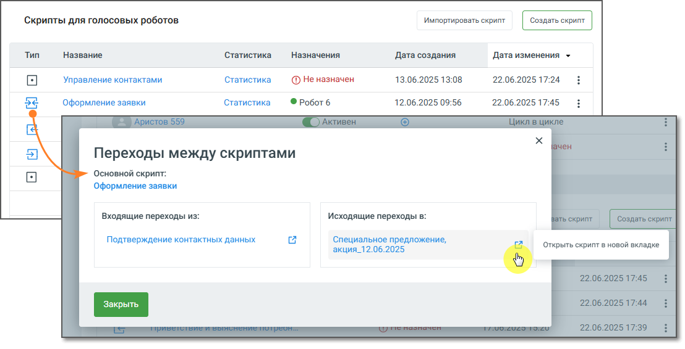

3.4.1. Создание скрипта В Конструкторе скриптов скрипт для Роботов может быть создан по одному из преднастроенных шаблонов, либо без шаблона, а также может быть импортирован. Также скрипт может быть создан разработчиком под заказ, вне интерфейса конструктора.

| Важно: В скрипте «под заказ» пользователю недоступны для просмотра и редактирования настройки и схема |
| --- |
| скрипта. Также пользователю недоступны дублирование скрипта, отображение результатов работы скрипта в |
| статистике, изменение типа запуска скрипта и его экспорт. |

В скрипте «под заказ» пользователь самостоятельно может только изменить наименование скрипта и просмотреть список роботов, работающих по скрипту. 3.4.2. Выбор шаблона для скрипта Помимо стандартных шаблонов скриптов для Роботов в этом окне также можно заказать разработку скрипта под ключ для конкретного бизнес-процесса.

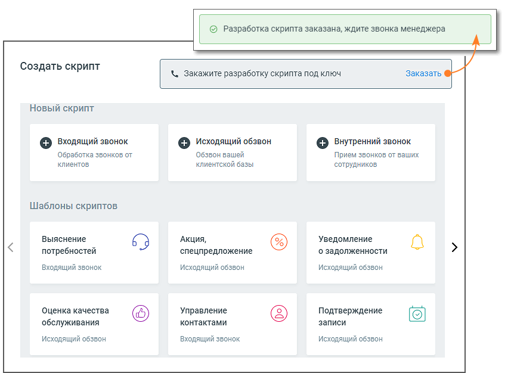

Из списка преднастроенных шаблонов выберите вариант, отвечающий целям создаваемого скрипта, и кликните на окно шаблона. В окне сценария скрипта отредактируйте блоки скрипта и текст в блоках. Узнать больше в разделе Конструктор скриптов. Для создания скрипта без шаблона в окне Создать скрипт кликните на тип создаваемого скрипта: исходящий обзвон, внутренний или входящий звонок. Откроется окно конструктора скрипта, с именем скрипта по умолчанию Новый скрипт <дата создания дд.мм.гггг>.

3.4.3. Назначение скрипта роботу

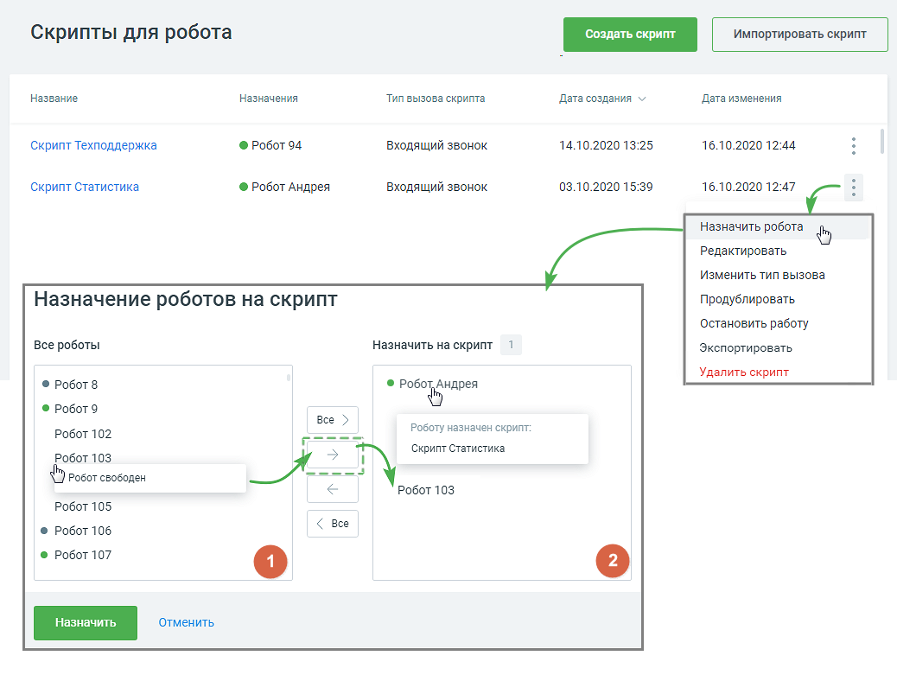

Чтобы назначить робота для работы по скрипту, откройте главную страницу раздела Скрипты и кликните

по пиктограмме в строке выбранного скрипта. Клик в строке Назначить робота всплывающего меню откроет форму Назначение роботов на скрипт.

- в левом окне «Все роботы» формы размещается список всех роботов, доступных для назначения.

- в правом окне «Назначить на скрипт» размещается список роботов, назначенных на данный скрипт.

Роботы, которым назначен скрипт, отображаются со значками статуса – активен, не активен.

Свободные роботы значка статуса не имеют. При наведении курсора на имя робота появляется уведомление «Робот свободен» или «Роботу назначен скрипт: наименование скрипта». Для перемещения роботов между окнами используются следующие кнопки:

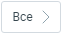

- перенести всех доступных роботов в окно-2;

- перенести выбранных в окне-1 роботов в окно-2;

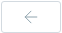

- перенести выбранных в окне-2 роботов в окно-1;

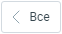

- перенести всех роботов в окно-1. Важно: Один робот не может быть назначен на два скрипта одновременно. Если роботу уже назначен скрипт, происходит переназначение, и роботу назначается новый скрипт с предварительным системным уведомлением. Переназначение происходит после завершения роботом текущего вызова. Сохраните сделанные назначения кнопкой Назначить. По клику на кнопку Отменить форма назначения закрывается без изменений. Назначенный на скрипт робот начинает работу по скрипту сразу по назначении:  При работе по скрипту с типом «исходящий обзвон» робот скажет первую фразу (начнет скрипт) только после того, как абонент возьмет трубку и скажет какую-либо фразу.  При работе по скрипту с типом «входящий звонок» или «внутренний звонок» робот скажет первую фразу (начнет скрипт) сразу после установления соединения с абонентом.

3.4.4. Остановка работы по скрипту

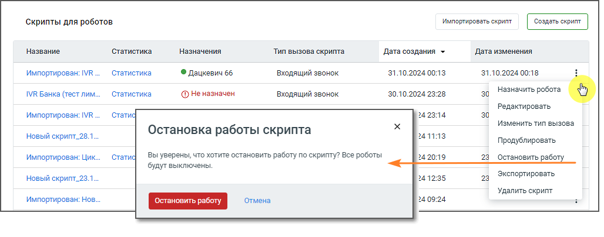

Чтобы остановить работы по скрипту, откройте главную страницу раздела Скрипты и кликните по

пиктограмме в строке выбранного скрипта. Клик в строке Остановить работу всплывающего меню откроет форму Остановка работы скрипта. Подтвердите свое согласие на остановку нажатием кнопки Остановить работу. Также пользователь может остановить работу по скрипту, сменив статус робота в списке роботов на «Не активен». Если робот в момент остановки обрабатывает звонок, он заканчивает текущий разговор, после чего останавливает работу. Статус робота меняется на «Не активен». По клику на кнопку Отменить форма остановки работы по скрипту закрывается без изменений. Важно: Активация/деактивация скрипта влияет на статус всех роботов, которым назначен скрипт. 3.4.5. Редактирование скрипта Для редактирования созданного скрипта откройте главную страницу раздела Скрипты и кликните по

пиктограмме в строке выбранного скрипта. Клик в строке Редактировать всплывающего меню откроет форму Редактирования скрипта. Перемещайтесь по скрипту, зажав правую клавишу мыши. Также редактирование скрипта доступно из окна просмотра Статистики скрипта.

3.4.6. Импорт и экспорт скрипта Импорт/экспорт скриптов MANGO OFFICE возможен как внутри одного, так и между различными лицевыми счетами системы. Для импорта скрипта кликните по кнопке «Импортировать скрипт» на главной странице раздела Скрипты.

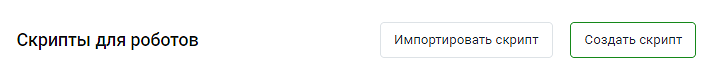

Максимальный размер файла импортируемого скрипта не более 10 Мб. При импорте производится проверка соответствия данных импортируемого скрипта с текущими данными системы:  Соответствие переменных и полей  Соответствие тематик  Соответствие сотрудников и групп  Соответствие ответов в Справочнике ответов В случае, если при проверке в блоках системы отсутствуют какие-либо данные, то импортируемые данные автоматически исключаются. Пользователь может просмотреть информацию об исключенных данных, а также сохранить текст ошибок в текстовый файл .txt. Пример 1. В импортируемом скрипте в блоке "Фраза робота", в поле "Произнести текст" имеется переменная "ФИО" из Адресной книги КЦ. Система ищет переменную ФИО только среди полей Адресной книги КЦ Пример 2. В импортируемом скрипте в блоке "Голос в текст", в поле "Записать то, что сказал абонент в переменную" имеется переменная "Ответ клиента" из справочника переменных робота. Система ищет переменную "Ответ клиента" только среди переменных справочника переменных робота в текущей системе Для экспорта созданного скрипта откройте главную страницу раздела Скрипты и кликните по

пиктограмме в строке выбранного скрипта. Клик в строке Экспортировать всплывающего меню инициирует загрузку скрипта в формате .enc. Скрипт загружается в папку, указанную пользователем для загрузки файлов в настройках браузера. При экспорте скрипта в файл сохраняется следующая информация:  Наименование скрипта  Тип запуска скрипта

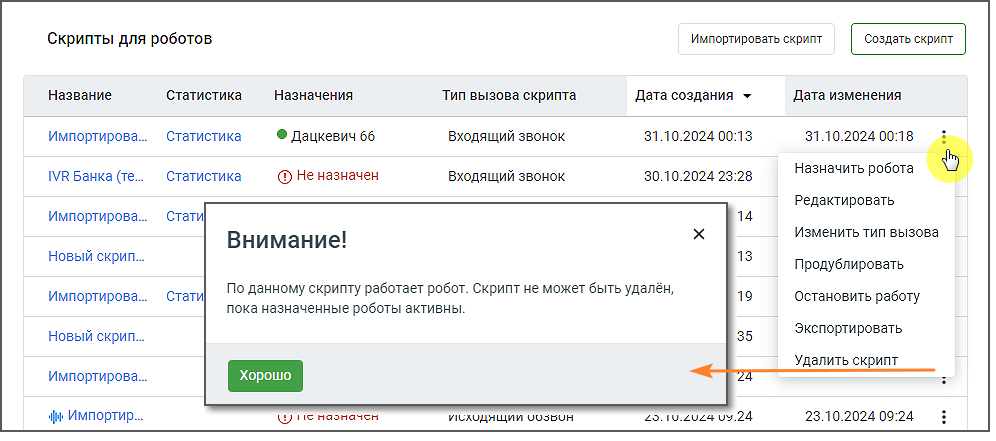

 Блоки (с той же последовательностью и расположением) и связи между блоками  Настройки блоков, в том числе настройки перевода звонка на оператора  Текст, переменные, поля (название, тип и раздел/справочник переменных и полей) и значения в настройках блоков

| Важно: Статистика, пользовательские переменные, справочник ответов и настройки робота - не экспортируются и |
| --- |
| не импортируются. |

3.4.7. Удаление скрипта

Чтобы удалить скрипт, откройте главную страницу раздела Скрипты и кликните по пиктограмме в строке выбранного скрипта. Клик в строке Удалить скрипт всплывающего меню откроет форму Удалить скрипт. Если назначенные на скрипт роботы в момент удаления скрипта обрабатывают звонки, они заканчивают текущие разговоры, после чего скрипт удаляется, статусы роботов автоматически меняются на «Не активен». Важно: Невозможно удалить скрипт, если он используется как дочерний при переходе из других скриптов. Если скрипт не назначен роботам, либо назначенные роботы не активны, скрипт удаляется с предварительным предупреждением. Подтвердите свое согласие на удаление нажатием кнопки Удалить.

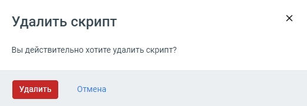

<!-- изображение на стр. 28: байты не извлечены (PyMuPDF недоступен) -->

По клику на кнопку Отмена форма удаления скрипта закрывается без изменений.
