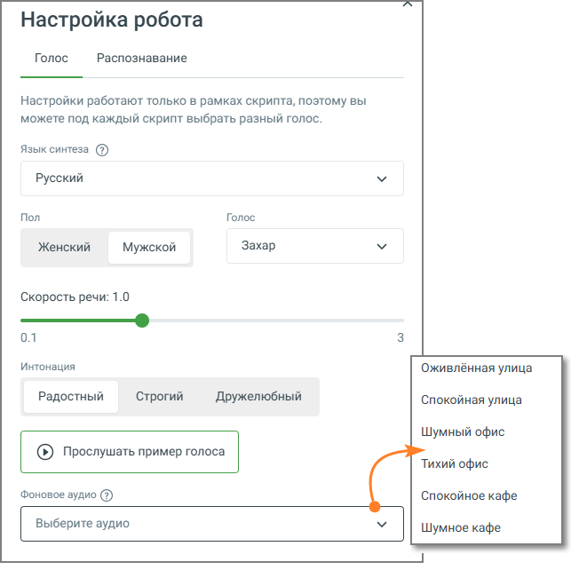
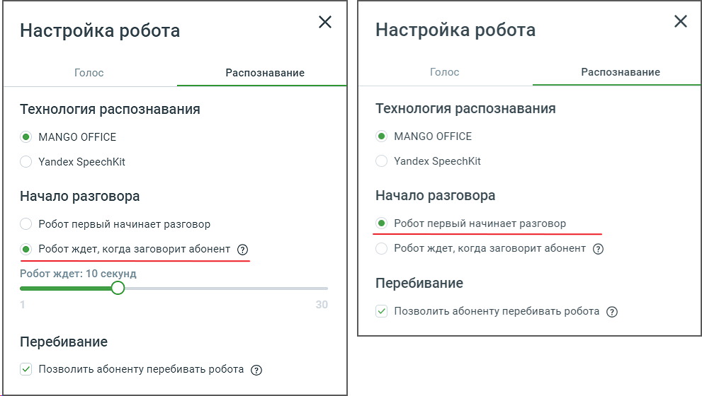
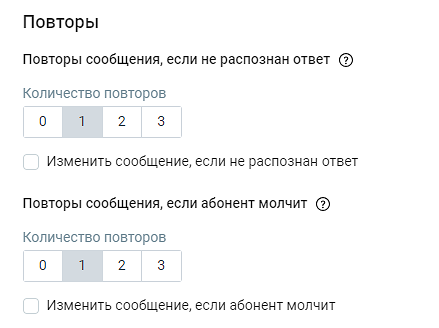
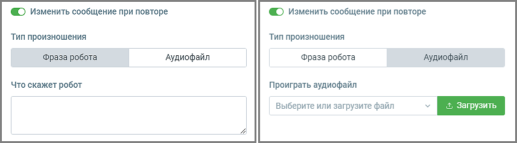
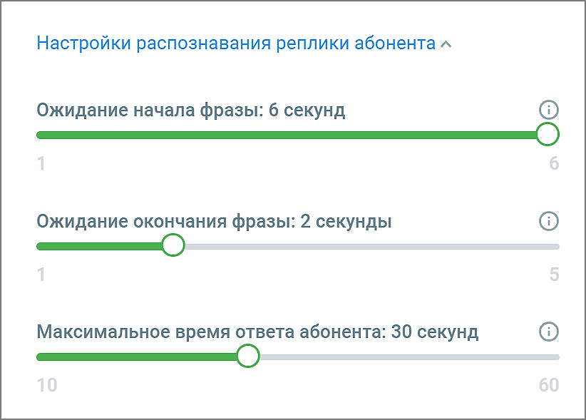

# 3.5. Настройки Робота

> Трассировка: PDF §3.5 · сквозные стр. 28-32 · источники: ч.1 `kb/sources/cov-robot-fil/Модуль ЦОВ Робот Фил 2,0_manual_v7.26.28.pdf` с.28-32.

Важно: Настройки голоса робота и распознавания ответа абонента задаются индивидуально для каждого скрипта. Кликните по кнопке «Настройки» в правом верхнем углу страницы создания скрипта и заполните форму настроек. Форма настроек состоит из двух вкладок: Голос и Распознавание.

Вкладка «Голос» содержит следующие элементы: 1. Язык синтеза – выпадающий список, позволяющий выбрать язык, на котором будет говорить робот. Доступны языки: русский, английский, казахский, немецкий, узбекский. 2. Переключатель «Пол» – выбор мужского или женского голоса робота. 3. Голос – выпадающий список, содержащий имена доступных голосов для выбранного пола и языка. 4. Скорость речи – ползунок регулировки скорости воспроизведения речи от 0.1 (самая медленная) до 3.0 (самая быстрая). По умолчанию установлено значение 1.0. 5. Интонация – переключатели выбора интонации речи: «Радостный», «Строгий» и «Дружелюбный».

6. Фоновое аудио – непрерывно воспроизводимый звуковой фон (например, шум офиса или улицы), который сопровождает выполнение скрипта и создаёт эффект реального окружения во время вызова. Фон зацикленно воспроизводится в рамках текущего скрипта и его процедур. 7. Кнопка «Прослушать пример голоса» – при нажатии воспроизводится фрагмент речи в соответствии с текущими настройками.

Вкладка «Распознавание» содержит следующие элементы: 1. Технология распознавания – на выбор два варианта: MANGO OFFICE, Yandex SpeechKit. 2. Начало разговора:  Робот первый начинает разговор – робот будет произносить текст либо проигрывать аудиофайл, как только абонент примет вызов;  Робот ждет, когда заговорит абонент – робот не начинает диалог до момента, пока абонентом не будет произнесена какая-либо фраза. 3. Позволить абоненту перебивать робота:  переключатель включен – робот будет произносить текст либо проигрывать аудиофайл до конца, и только по завершении проигрывания начнет распознавать ответ абонента.  переключатель выключен – если в процессе произнесения роботом фразы либо проигрывания аудиофайла абонент произнесет фразу, робот остановит свою речь и продолжит скрипт по подходящей ветке.

4. Повторы сообщения, если не распознан ответ: Количество повторов – если робот не распознает ответ абонента с первого раза, робот повторит свой вопрос указанное количество раз. 5. Переключатель «Изменить сообщение при повторе»:  если переключатель выключен, при работе по скрипту робот будет при повторах воспроизводить фразу, настроенную в блоке Фраза робота, ответ на которую не был распознан роботом.  если переключатель включен, добавляются поля для ввода текста или загрузки аудиофайла, которые робот воспроизведет при повторе сообщения.  если переключатель включен, но иной текст/аудио не добавлен, робот воспроизводит фразу, настроенную в блоке Фраза робота.

6. Повторы сообщения, если абонент молчит: Количество повторов – если абонент промолчит, робот повторит свой вопрос указанное количество раз.

7. Переключатель «Изменить сообщение при повторе» – действует аналогично п.10. 8. Настройки распознавания реплики абонента – робот будет распознавать фразу абонента согласно заданным настройкам времени. Это позволяет оптимизировать стоимость звонка.

Настройки:  ожидание начала фразы – если в блоке «Фраза робота» настроен ответ абонента фразой, распознавание, когда абонент молчит, прекратится через указанное количество секунд. Минимально допустимое значение –1. Максимально допустимое значение – 6. Поле обязательно для заполнения.  ожидание окончания фразы – если в блоке «Фраза робота» настроен ответ абонента фразой, распознавание, когда абонент молчит, прекратится через указанное количество секунд. Минимально допустимое значение –1. Максимально допустимое значение – 5. Поле обязательно для заполнения.  максимальное время ответа абонента – время, в течение которого робот ожидает завершения фразы абонентом. Настройка необходима для того, чтобы робот не переходил к следующему блоку не дослушав до конца абонента, тем самым не собрав всю необходимую обратную связь. Минимально допустимое значение – 1 секунда. Максимально допустимое значение – 180 секунд. По умолчанию установлено время в 10 секунд.
