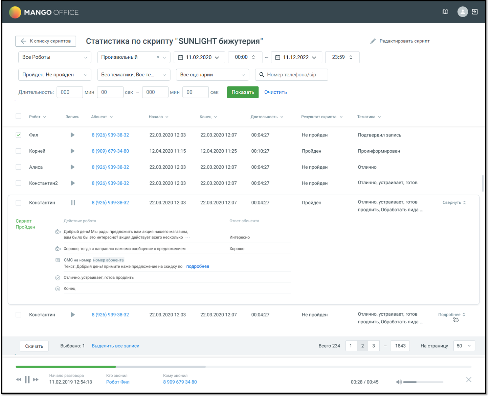
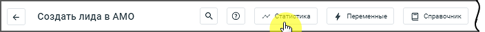

# 3.6. Статистика по скрипту робота

> Трассировка: PDF §3.6 · сквозные стр. 32-36 · источники: ч.1 `kb/sources/cov-robot-fil/Модуль ЦОВ Робот Фил 2,0_manual_v7.26.28.pdf` с.32-36.

Чтобы просмотреть статистику по скрипту робота, кликните по кнопке «Статистика» в строке выбранного скрипта. Если по скрипту не было ни одного разговора, его статистика не отображается.

В окне статистики по скрипту задайте параметры фильтрации:  Роботы – по умолчанию выбраны все роботы, которым назначен данный скрипт. Если выбрать опцию «Все роботы», то в таблице отображаются звонки по всем роботам, в том числе удаленным;  Период – выбор одного из значений: Текущий день / Текущая неделя / Текущий месяц / Произвольный;  Результаты – общий результат разговора по скрипту.  «Пройден» - будут выбраны звонки, где диалог с абонентом прошёл от блока «Начало» до блока «Завершение разговора» в соответствии со скриптом;  «Не пройден» - будут выбраны звонки, где диалог с абонентом не дошел до блока «Завершение разговора» в соответствии со скриптом, а был прерван в процессе разговора;  Тематики – cписок тематик Контакт-центра MANGO OFFICE. По умолчанию выбраны все тематики. Также в фильтре имеется возможность выбора звонков «Без тематики»;

 Сценарии – выбор одного из значений: С фоновым сценарием, Без фонового сценария, Все сценарии;  По номеру телефона – работает поиск по введенным символам  По длительности разговора – по умолчанию, значение «От» = 00 минут 00 секунд, значение «До» = 10 минут 00 секунд  Время – по умолчанию, значение «От» = 00:00, «До» = 23:59

| Примечание: Блок «Фоновые события» и все связанные с ним блоки, попадают в статистику только в случае, |
| --- |
| если Фоновые события активен, и робот перешел на «Фоновые события». |

Для отображения результатов с учетом фильтрации нажмите кнопку Показать. Клик по пиктограмме очищает поле фильтра. Клик по кнопке «Очистить фильтры» сбрасывает значения фильтров к значениям по умолчанию. Помимо параметров фильтрации, для каждого робота, работавшего по скрипту, доступна следующая информация:  Робот – название робота, который участвовал в диалоге.

 Суммаризация диалога GPT – клик по иконке предоставляет возможность быстро получить краткую информацию о диалоге, сгенерированную YandexGPT, без необходимости прослушивать запись или просматривать весь скрипт.  Запись – пиктограмма, позволяющая воспроизвести запись диалога.  Клиент – имя абонента (если имеется в Адресной книге) или номер телефона. Для внутренних вызовов отображается имя или внутренний номер сотрудника. Клик по имени клиента открывает окно информации о клиенте.  Начало – дата и время начала разговора в формате дд.мм.гггг чч:мм;  Конец – дата и время окончания разговора в формате дд.мм.гггг чч:мм;  Длительность – длительность разговора в формате дд.мм.гггг чч:мм;  Тематика – классификация тематик диалога.  Действие робота – в блоке «Действие робота» отображаются действия, последовательно в соответствии со схемой скрипта. Клик по кнопке Подробнее приводит к отображению полного текста смс/e-mail во всплывающем уведомлении.  Ответ абонента – если в схеме скрипта в блоках «Фраза робота» настроены ответы собеседника, в колонке «Ответ абонента» отображается текст распознанной речи собеседника в ответ на соответствующую фразу робота.  Результат перевода звонка и статус оператора, на которого был переведен звонок – если в процессе прохода скрипта робот перевел звонок на один из доступных вариантов.  Сценарий взаимодействия  Статус отправки запросов – варианты: успешный, ошибка  Выбранный режим распознавания для блока «Фраза робота» – информация помогает анализировать качество распознавания  Процедуры – вход в процедуру, информация о работе в процедуре, выход из процедуры

Запись разговора можно прослушать при помощи встроенного плеера. Способ хранения записи разговоров - в облачном хранилище или на внешнем ftp-сервере - настраивается в Личном кабинете ВАТС. В модуле ЦОВ «Робот Фил 2,0» значение этой настройки не изменяется. Для экспорта статистики выберите записи и нажмите кнопку Скачать. Доступны следующие форматы выгрузки статистики: 1. Отчет по разговорам - в файл .csv будет выгружена следующая информация (выгрузка в csv поддерживает до 300 тысяч звонков):  Данные скрипта: id скрипта/ Название скрипта  Данные разговора: id разговора/Робот/Абонент/Начало/Конец/Длительность/Результат скрипта/Тематика  Диалог робота с абонентом: id действия /Тип действия/Фраза(действие)робота/Ответ абонента  Результат перевода звонка и статус оператора, на которого был переведен звонок 2. Записи разговоров - скачивание аудиозаписей всех выбранных разговоров в едином архиве, где:  Формат имени аудиозаписей: «ГГГГ-ММ-ДД_ЧЧ-ММ-СС_Номер абонента_SIP Сотрудника_Номер АТС.mp3»  Имя скачиваемого архива формируется в зависимости от времени скачивания: «ГГГГ-ММ- ДД_ЧЧ-ММ-СС.zip» По нажатию кнопки «Выделить все записи» происходит выбор записей на всех страницах. Просмотр статистики также доступен из карточки скрипта в режиме редактирования.

