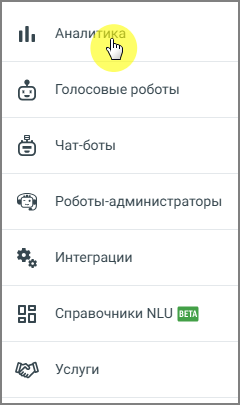
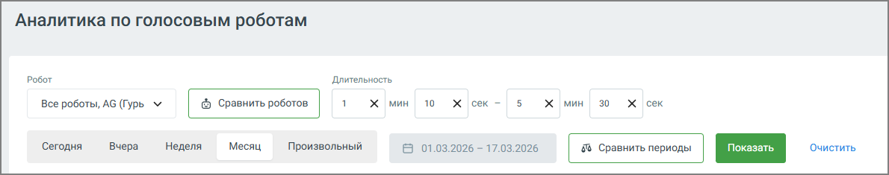
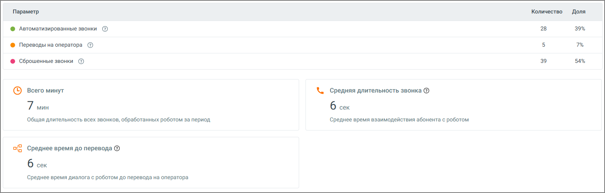
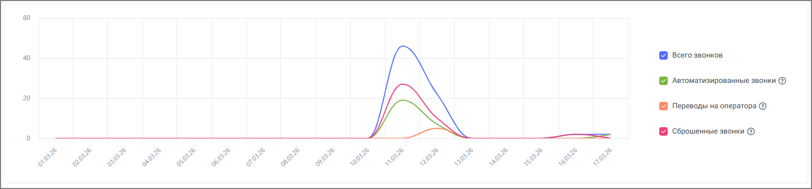
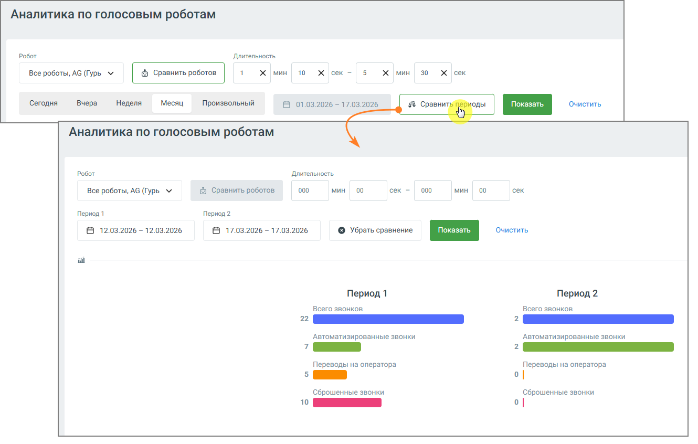
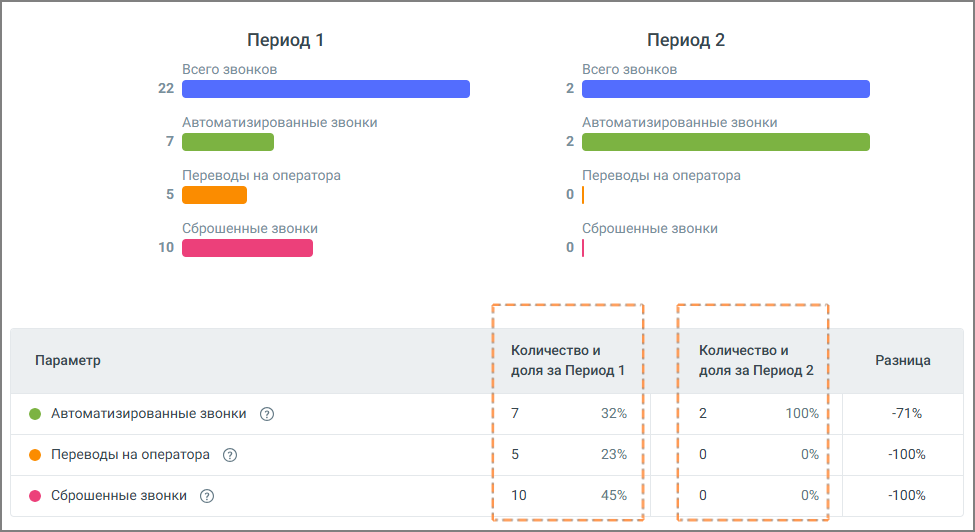

# 3.7. Аналитика по голосовым роботам

> Трассировка: PDF §3.7 · сквозные стр. 36-39 · источники: ч.1 `kb/sources/cov-robot-fil/Модуль ЦОВ Робот Фил 2,0_manual_v7.26.28.pdf` с.36-39.

Страница предназначена для оперативной оценки работы голосовых роботов. Здесь в одном месте собраны ключевые показатели, которые позволяют понять, как проходят звонки, насколько эффективно работает автоматизация и где возникают потери. 3.7.1. Фильтры и управление данными

Перед построением отчета можно задать условия отбора данных:  По роботам – выбрать один, несколько или все голосовые роботы  По скриптам – отфильтровать по используемым сценариям

 По периоду – доступны быстрые варианты (сегодня, вчера, неделя, месяц) или произвольный диапазон После выбора параметров нажмите кнопку Показать, чтобы обновить данные. Дополнительно доступны:  Очистить – сбрасывает все выбранные фильтры  Сравнить периоды – позволяет сопоставить два временных интервала  Сравнить роботов – включает режим сравнения двух роботов между собой  Полноэкранный режим – разворачивает дашборд для более детального анализа 3.7.2. Как читать дашборд

На дашборде выводятся агрегированные показатели за выбранный период:  Всего звонков – общее количество всех зафиксированных вызовов  Автоматизированные звонки – звонки, полностью обработанные роботом без участия оператора  Переводы на оператора – звонки, завершившиеся переводом в на оператора Контакт-центра или на внешний номер  Сброшенные звонки – звонки, которые абонент завершил в течение заданного короткого интервала после начала  Среднее время до эскалации – среднее время звонков, которые закончились переводом на оператора Контакт-центра или внешний номер  Всего минут – суммарная длительность всех звонков  Средняя длительность звонка – среднее время взаимодействия с роботом  Среднее время до перевода – среднее время до момента эскалации на оператора Показатели даны как в абсолютных значениях, так и в долях, что позволяет быстро оценить структуру звонков.

Ниже расположен график, который показывает изменение показателей по времени. Это удобно для выявления пиков, аномалий и влияния изменений в сценариях.

3.7.3. Режим сравнения В системе предусмотрены два варианта сравнительного анализа:  Сравнение роботов – два робота сравниваются в рамках одного периода  Сравнение периодов – один и тот же набор роботов анализируется в разные даты

В режиме сравнения дашборд делится на две части. Для каждой стороны отдельно показываются одинаковые метрики. Это позволяет быстро увидеть различия в количестве звонков, уровне автоматизации и доле переводов. График также отображается в режиме сравнения.

3.7.4. Как пользоваться аналитикой Страница используется для регулярного мониторинга и точечной диагностики:  если растет доля сброшенных звонков – вероятна проблема в начале сценария  если увеличивается количество переводов – робот не справляется с обработкой части обращений  если падает средняя длительность – возможно, сценарий стал короче или пользователи чаще завершают звонок Основание для таких выводов – сопоставление метрик между собой и анализ динамики на графике. Если нужно быстро понять эффект от изменений, используйте сравнение периодов. Если задача – выбрать более эффективного робота, используйте сравнение роботов.
