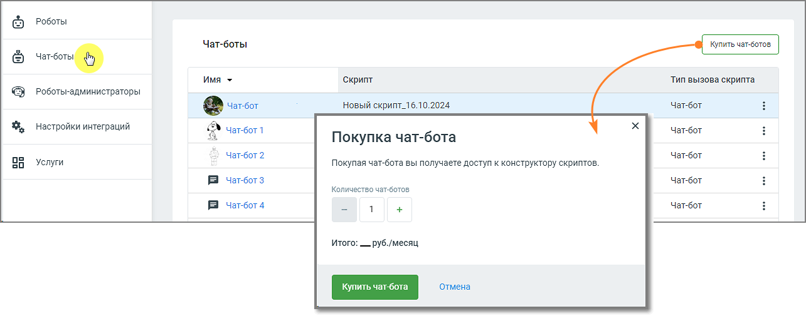
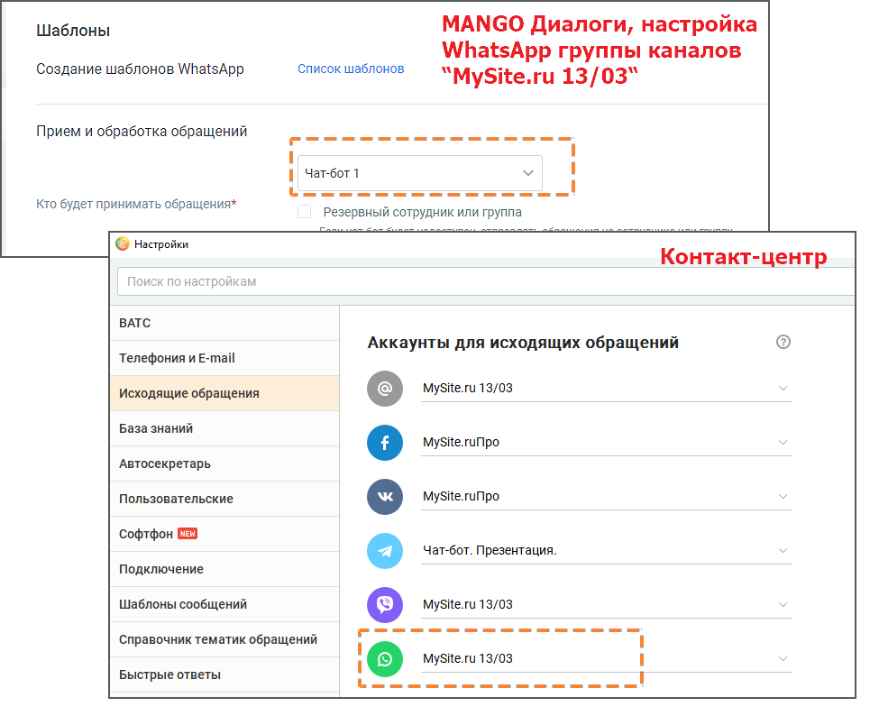

# 4. Чат-боты

> Трассировка: PDF §4 · сквозные стр. 39-41 · источники: ч.1 `kb/sources/cov-robot-fil/Модуль ЦОВ Робот Фил 2,0_manual_v7.26.28.pdf` с.39-41.

Чат-бот – это программа-собеседник, имитирующая человеческую речь с помощью текстовых диалогов, поддерживая диалог по заданному скрипту. Если вопрос требует вовлечения человека, чат-бот может

переключить диалог на сотрудника. Чат-бот может общаться с клиентами во всех каналах коммуникации Манго Диалоги, где он выбран, как «сотрудник». Чтобы использовать чат-бота в диалоге с клиентом, необходимо:  купить чат-бота;  создать скрипт диалога в Конструкторе скриптов или экспортировать ранее созданный скрипт;  назначить скрипт чат-боту;

После выбора необходимого количества чат-ботов в форме заказа в графе Итого отобразится сумма оплаты. Клик по кнопке Купить чат-бот закрывает форму заказа и передает данные сотрудникам MANGO OFFICE, которые оперативно свяжутся с заказчиком для консультации. После уточнения потребностей заказчика чат-бот и назначенный ему скрипт будут доступны в модуле Роботы в списке чат-ботов. Далее вы можете настроить текстовые каналы в Личном кабинете Манго Диалоги и выбрать чат-бота как «сотрудника». Ознакомится с инструкцией по настройке текстовых каналов можно здесь. Например, пользователь чат-бота может настроить передачу информации из текстовой кампании Контакт- центра, чтобы чат-бот обладал необходимой информацией о клиенте, и мог использовать эти данные в диалоге. Чтобы в бот приходили данные о кампании, необходимо назначить чат-бота на скрипт, а таже выбрать его в качестве обработчика в Контакт-центре и в MANGO Диалогах.

