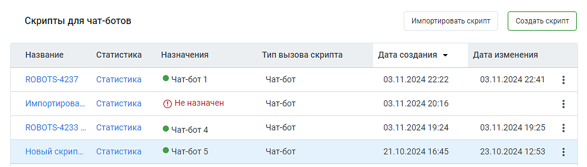

# 4.1. Скрипты для чат-ботов

> Трассировка: PDF §4.1 · сквозные стр. 41-42 · источники: ч.1 `kb/sources/cov-robot-fil/Модуль ЦОВ Робот Фил 2,0_manual_v7.26.28.pdf` с.41-42.

Пример внешнего вида блока "Скрипты для чат-ботов":

Блок содержит следующие элементы:  Кнопка «Создать скрипт» – по клику на кнопку пользователь переходит к первому шагу создания скрипта – выбору шаблона либо созданию скрипта без шаблона.  Кнопка «Импортировать скрипт» – позволяет загружать ранее экспортированные в Конструкторе скрипты.  Название – название скрипта, сохраненное при создании. По двойному клику на название открывается Карточка сценария скрипта. Скрипты, созданные под заказ, перед наименованием

помечаются иконкой , и недоступны для просмотра и редактирования. Скрипты с активным

фоновым сценарием, помечаются иконкой .  Статистика – открывает окно статистики прохода скрипта.  Назначен – имя чат-бота, которому назначен скрипт. Если скрипт назначен нескольким чат-ботам, назначение обозначается пиктограммой «робот» и числом. По наведению на значок, появляется всплывающая подсказка с перечнем имён чат-ботов через запятую.  Тип вызова скрипта – входящий звонок, внутренний звонок или исходящий обзвон.  Дата создания – дата и время создания скрипта в формате дд.мм.гггг чч:мм.  Дата изменения – дата и время последнего изменения скрипта дд.мм.гггг чч:мм.

 Пиктограмма – открывает меню доступных действий со скриптом: назначить чат-бота, редактировать, продублировать, экспортировать или удалить скрипт.
