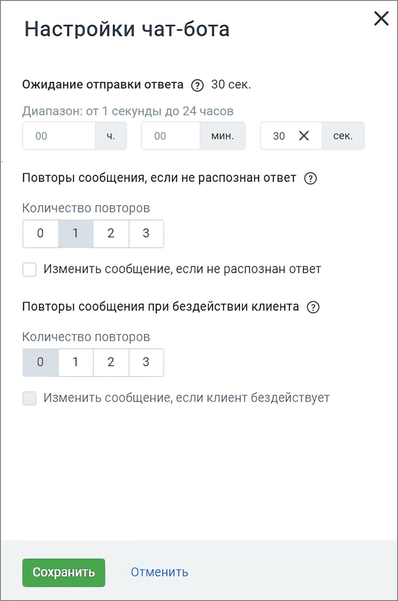

# 4.2. Настройки Чат-бота

> Трассировка: PDF §4.2 · сквозные стр. 42-44 · источники: ч.1 `kb/sources/cov-robot-fil/Модуль ЦОВ Робот Фил 2,0_manual_v7.26.28.pdf` с.42-44.

Важно: Настройки чат-бота задаются индивидуально для каждого скрипта. Кликните по кнопке «Настройки» в правом верхнем углу страницы создания скрипта и заполните форму настроек.

Окно настроек содержит следующие элементы: Шкала «Ожидание отправки ответа» – позволяет установить временной интервал ожидания отправки ответа от 1 секунды до 24 часов. Такой диапазон дает возможность клиенту продолжить диалог с чат-ботом после большого перерыва. Повторы сообщения, если не распознан ответ – выберите количество повторных сообщений (0, 1, 2, 3), если ответ не распознан. Чекбокс «Изменить сообщение, если не распознан ответ» – если отмечен, появляется многострочное текстовое поле "Что напишет чат-бот", где можно задать сообщение для условия «если ответ не распознан». Повторы сообщения при бездействии клиента – выберите количество повторных сообщений (0, 1, 2, 3), если клиент не активен.

Чекбокс «Изменить сообщение, если клиент бездействует» – если отмечен, появляется многострочное текстовое поле «Что напишет чат-бот», где можно задать сообщение для условия «если клиент неактивен». Кнопка Сохранить – клик по кнопке применяет внесенные изменения. Кнопка Отменить – клик по кнопке отменяет внесенные изменения и возвращает к предыдущим настройкам.
