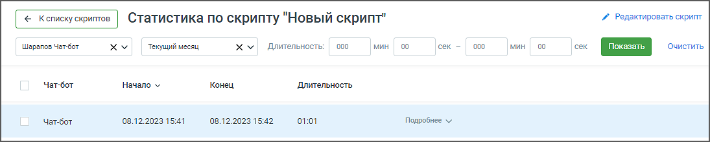
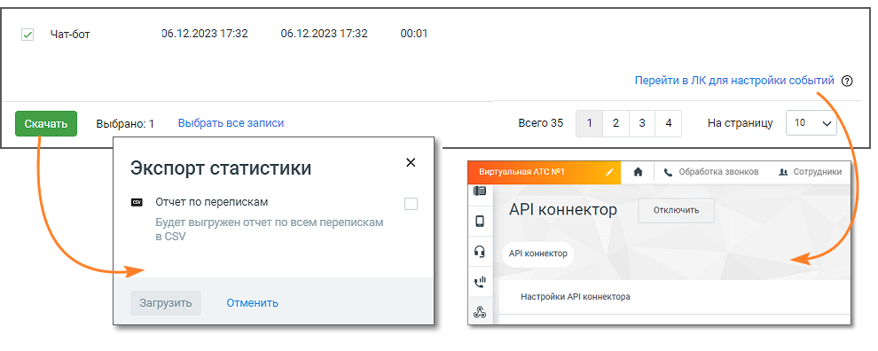

# 4.3. Статистика по скрипту чат-бота

> Трассировка: PDF §4.3 · сквозные стр. 44-46 · источники: ч.1 `kb/sources/cov-robot-fil/Модуль ЦОВ Робот Фил 2,0_manual_v7.26.28.pdf` с.44-46.

Чтобы просмотреть статистику по чат-боту, кликните по кнопке «Статистика» в строке выбранного скрипта. Если по скрипту не было ни одного диалога, его статистика не отображается.

Окно настройки фильтрации содержит следующие элементы:  Кнопка К списку скриптов – нажмите для быстрого возврата к списку всех скриптов.  Название скрипта – показывает текущий выбранный скрипт для просмотра статистики.  Кнопка Редактировать скрипт – позволяет открыть скрипт выбранный скрипт и внести изменения.  Поле выбора чат-бота – список всех чат-ботов из Личного кабинета с чекбоксами для выбора конкретных ботов и общим чекбоксом для выбора всех ботов.  Поле Период – выбор одного из значений: Текущий день / Текущая неделя / Текущий месяц / Произвольный;  Поле Длительность – позволяет указать временные рамки для анализа статистики.  Кнопка Показать – клик по кнопке запускает процесс отображения статистики с учетом выбранных параметров.  Кнопка Очистить – клик по кнопке сбрасывает все выбранные параметры фильтрации для начала нового поиска статистики. Таблица результатов выполнения скрипта представляет собой список отдельных диалогов чат-бота и клиента. Нажатие кнопки Подробнее в каждой строке списка позволяет пользователям увидеть подробную статистику по выполнению конкретного скрипта, включая взаимодействие чат-бота с клиентами,

временные рамки, статусы прохождения и действия, совершенные чат-ботом и клиентами в рамках скрипта. Столбцы таблицы статистики:  Чат-бот – наименование чат-бота, участвовавшего в диалоге  Начало – начало диалога в формате ДД.ММ.ГГГГ ММ:СС  Конец – конец диалога в формате ДД.ММ.ГГГГ ММ:СС  Длительность – длительность диалога в формате ММ:СС Кнопка Подробнее/Свернуть – позволяет раскрыть или скрыть информацию о диалоге. Для каждого диалога доступна следующая информация:  Статус скрипта – показывает статус выполнения скрипта: пройден, не пройден.  Действия чат-бота – перечислены в виде списка, отображают действия, совершенные чат-ботом. Там же размещены пиктограммы, обозначающие блоки скрипта.  Ответ клиента – представлены в виде списка, отображают ответы клиента.  Ветка, по которой пошел чат-бот – отображает дальнейшие действия бота после выполнения текущего блока скрипта. Также в окне статистики чат-бота доступны:  Экспорт статистики в формате CSV  Переход в личный кабинет ВАТС, для настройки API Коннектора, чтобы чат-бот мог сохранять все данные о диалогах во внешнюю систему.

