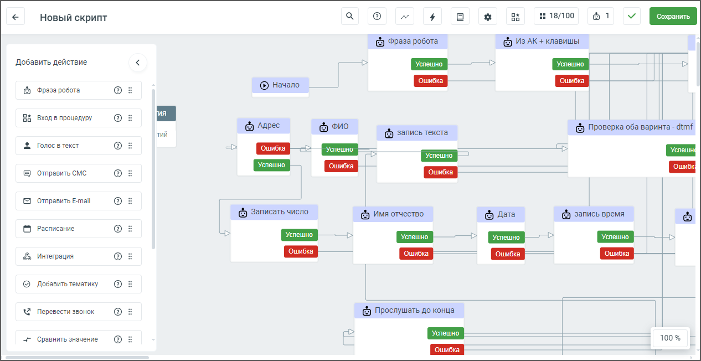
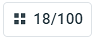
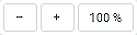
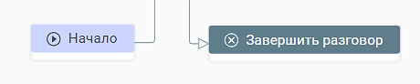
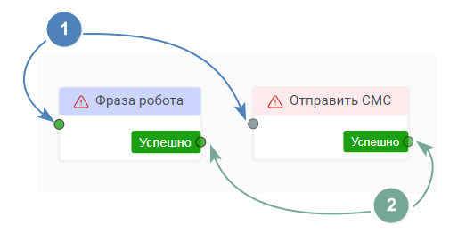
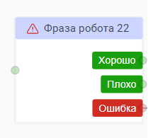

# 5. Конструктор скриптов

> Трассировка: PDF §5 · сквозные стр. 46-49 · источники: ч.1 `kb/sources/cov-robot-fil/Модуль ЦОВ Робот Фил 2,0_manual_v7.26.28.pdf` с.46-49.

Окно конструктора скриптов содержит: 1) Наименование скрипта – для переименования кликните на текущее имя скрипта и отредактируйте его.

2) – справочник возможных ответов абонента (недоступно для робота-администратора).

3) – настройки голоса робота и распознавания ответа в рамках конкретного скрипта. Для каждого скрипта настройки можно изменять (недоступно для робота-администратора).

4) – статистика, для скриптов, завершивших проход, доступна статистика работы скрипта.

5) – переменные, список доступных переменных скрипта и системных переменных.

6) – процедуры, список блоков Процедур, доступных для встраивания в скрипт (недоступно для робота-администратора).

7) – количество задействованных блоков скрипта из 100 возможных.

8) – количество роботов или чат-ботов, назначенных на скрипт.

9) – иконки отсутствия или наличия ошибок скрипта. Уведомление о состояние скрипта при наличии ошибок отображается красным шрифтом. 10) Кнопка «Сохранить» – клик по кнопке сохраняет введенные изменения.

11) – кнопка «К списку скриптов», клик по кнопке открывает главное окно раздела Скрипты.

12) – клик по иконке открывает поле поиска, позволяет искать блоки скрипта по наименованию, типу, или содержимому блоков, чтобы тратить меньше времени на переход и изменение нужной части скрипта.

13) – пиктограммы масштабирования экрана, позволяют увеличивать и уменьшать размер экрана для ускорения работы со скриптом. 14) Поле построения сценария скрипта. 15) Блок Фонового события – по умолчанию не активен, требует активации пользователем (недоступно для робота-администратора). 16) Вертикальное меню с перечнем блоков скрипта. Блоки скрипта доступны в Конструкторе в зависимости от раздела: чат-боты, роботы, роботы-администраторы. Перенесите блок на поле построения сценария, зажав и удерживая на нем левую кнопку мыши.

| Чтобы в поле сценария изменить наименование блока, кликните на текущее наименование и |
| --- |
| отредактируйте его. |

| Совет: также блок действия может быть добавлен на поле построения сценария автоматически, с помощью настроек |
| --- |
| предыдущего блока. |

Максимальное количество блоков скрипта – 100. Каждый скрипт начинается с блока Начало и завершается блоком Завершить разговор. Эти блоки не редактируются.

Если в текущий скрипт настроены переходы из других скриптов, в блоке «Начало» отображается надпись «Переход из N скриптов», где N – их количество. Двойное нажатие левой кнопкой мыши по блоку «Начало» открывает список скриптов, из которых настроен переход.

Каждый блок скрипта (кроме блоков Начало, Фоновые события и Завершить разговор) содержит:

 точку входа для размещения входящей связи – допускается не более 50 точек входа.

 точку выхода для размещения исходящей связи – количество точек выхода не ограничено.

С любым из блоков (кроме блока Фонового сценария) доступны следующие действия: 1) Редактировать – открывает форму настройки соответствующего блока. 2) Копировать – копирует блок с настройками, но без исходящих и входящих связей. 3) Дублировать – дублирует на поле построения скрипта блок с настройками, но без исходящих и входящих связей. 4) Вставить – вставка того блока, который был скопирован и находится в буфере обмена 5) Удалить блок - блок удаляется из поле построения сценария скрипта. От каждого блока действия, кроме блоков «Начало» и «Завершение разговора», можно протянуть соединяющую исходящую стрелку к следующему блоку.

Исключения (невозможно протянуть исходящую стрелку):  К блоку или из блока «Фоновые события»  Из блока «Начало» в любой другой блок  Из блока «Завершение разговора» в любой другой блок  Из блока «Фраза робота», в котором выбран вариант ответа абонента «Распознать и сохранить ответ», в любой блок «Голос в текст».  Из блока «Фраза робота», для направления «Молчание», в любой блок «Голос в текст».  Из блока «Сравнение значения» для направлений «Верно» и «Не верно», в любой блок «Голос в текст» (для исключения ошибок пользователя). Чтобы открыть меню действий с блоком, кликните на поле блока правой кнопкой мыши. Максимальное количество блоков скрипта – 80. В блоках скрипта возможно использование следующих переменных.  поля адресной книги;  поля кампании ИО;  пользовательские переменные, созданные в блоках скрипта, или в справочнике Переменные;  поля профиля сотрудника в Личном кабинете (только получение данных, запись данных в переменную невозможна). Пользователь может выделить несколько блоков на поле конструктора с помощью указателя мыши, после чего скопировать их в буфер обмена и вставить в нужное место (определенное позицией курсора) с помощью сочетания клавиш Ctrl+V. Далее связи между блоками можно откорректировать. При вставке все блоки переносятся вместе, сохраняя взаимное расположение.
