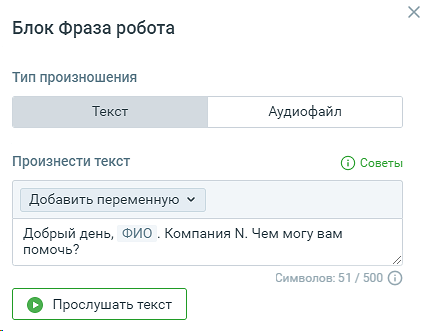
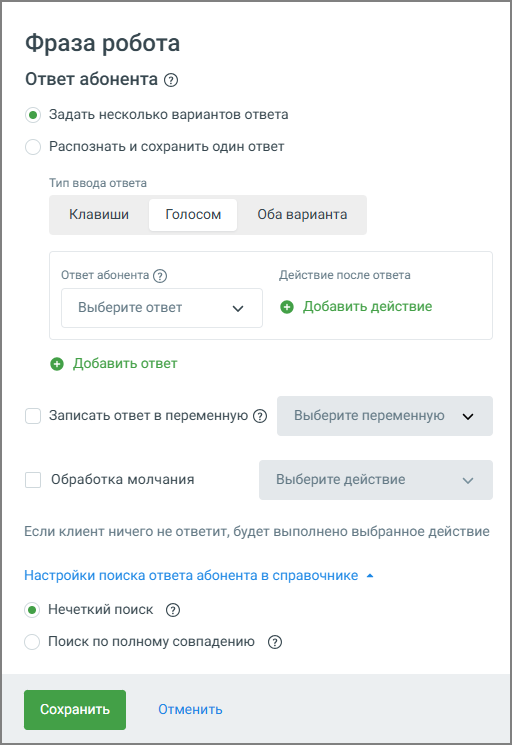
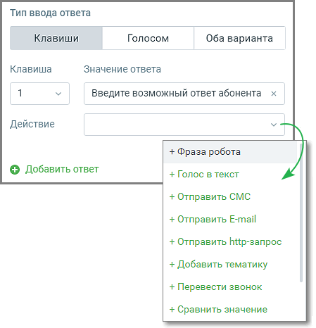
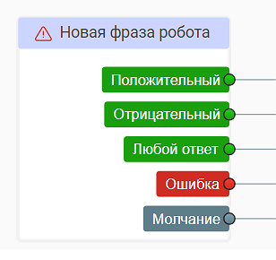
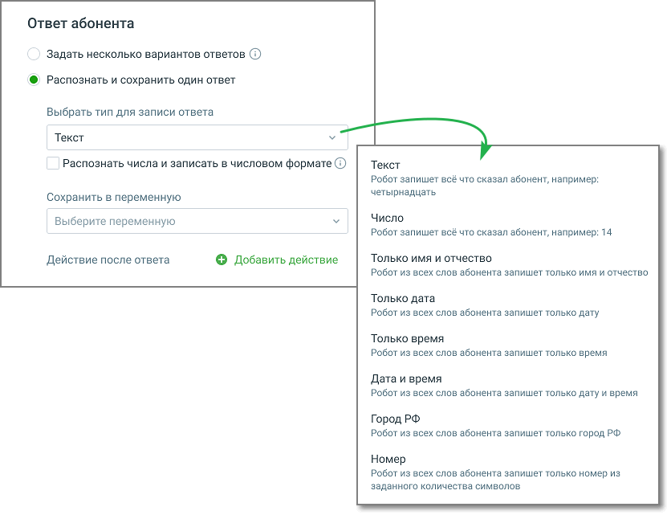
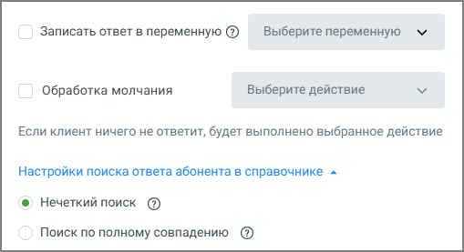
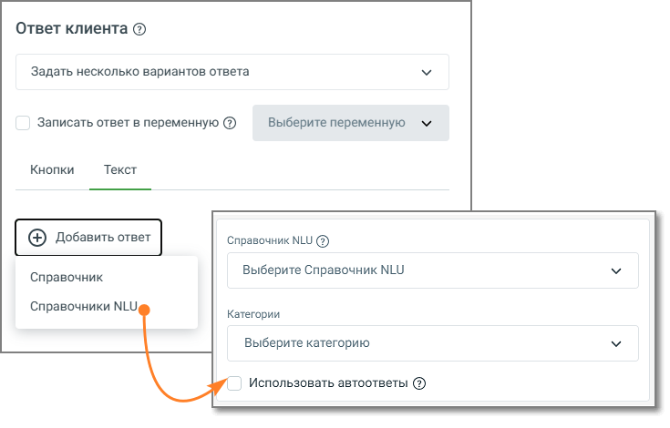

# 5.1. Блок Фраза робота

> Трассировка: PDF §5.1 · сквозные стр. 49-59 · источники: ч.1 `kb/sources/cov-robot-fil/Модуль ЦОВ Робот Фил 2,0_manual_v7.26.28.pdf` с.49-59.

Блок доступен при создании скрипта для Роботов.

| В схеме скрипта присутствует как минимум один блок Фразы робота, связанный с не редактируемым |
| --- |
| блоком «Начало». Первый блок Фразы робота не может быть удален. |

СООБЩЕНИЕ РОБОТА Элементы настроек блока: 1. Название блока – название блока, должно быть уникальным в рамках скрипта. Максимальное количество символов – 50. 2. Переключатель «Текст»:  Произнести текст – текст, который произнесет робот в разговоре с абонентом. Максимальная длина текста 500 символов, без учета переменных.  Добавить переменную – выпадающий список, содержащий все доступные переменные модуля. Клик по кнопке «Добавить переменную» открывает форму поиска переменных, без учета регистра. В форме также доступно создание новой переменной скрипта.  Кнопка «Прослушать текст» – кнопка доступна, если в текстовое поле введен хотя бы один символ, либо добавлена хотя бы одна переменная. По нажатию на кнопку запускается аудиофайл с введенным пользователем текстом, в соответствии с голосовыми настройками (голос, интонация, скорость). Чтобы абоненту было проще понять робота, мы рекомендуем:  Разделяйте текст на предложения.  Пишите короткие и простые предложения.

 Если необходимо сделать ударение, то используйте символ «+» перед гласной. Например, з+амок или зам+ок.  Если необходимо разделить произнесение слова на части, то используйте символ «-». Например, 123456 и 123-456 робот произнесёт по-разному. В общих настройках можно выбрать пол, голос, скорость речи и интонацию у робота. Для подключения премиальных голосов (более естественные и гармоничные) обратитесь к персональному менеджеру. 3. Переключатель «Аудиофайл»:  Проиграть аудиофайл – выберите загруженный, или загрузите аудиофайл, который услышит абонент.  Кнопка «Прослушать запись» – по клику на кнопку запускается воспроизведение аудиофайла. ОТВЕТ АБОНЕНТА 4. Переключатель вариантов ответа абонента «Задать несколько вариантов ответов».

| Если включен переключатель «Задать несколько вариантов ответов», блок ответов абонента имеет |
| --- |
| следующий вид и настройки: |

4.1 Переключатель «Тип ввода ответа – Клавиши» – предусматривает ответ абонента при помощи клавиатуры телефона. При этом робот ожидает только нажатие клавиши, ответ голосом не обрабатывается.  Клавиша – цифры от 1 до 9.

 Значение ответа – значение ответа для соответствующей цифры. Должно быть уникальным в рамках блока.  Кнопка «Добавить действие после ответа» - по нажатию на кнопку добавляется выпадающий список «Действие».  Действие – следующий блок скрипта при выборе этого варианта ответа. Если в рамках одного и того же блока «Фраза робота» в одном из ответов используется значение клавиши, в остальных ответах оно недоступно для выбора.

4.2 Переключатель «Тип ввода ответа – Голосом» - предусматривает голосовой ответ абонента и его распознавание. При этом робот ожидает только голосовой ответ, нажатие на клавиши не обрабатывается.  Ответ абонента – выпадающий список для выбора варианта ответа абонента. Список настраивается в разделе Справочник ответов. При выборе значения «Любой ответ» робот распознает любую фразу, сказанную абонентом, и отобразит ее в статистике. При этом ответом считается только фраза, произнесенная абонентом. Выбранный пакет вариантов ответов Справочника должен быть уникальным в рамках блока.  Кнопка «Добавить действие после ответа» - по нажатию на кнопку добавляется выпадающий список «Действие».

 Действие – следующий блок скрипта при выборе этого варианта ответа. 4.3 Переключатель «Тип ввода ответа – Оба варианта» - предусматривает как клавиши, так и голосовой ответ абонента с его распознаванием. Элементы настроек в этом случае аналогичны настройкам, описанным в п. 4.2 и п. 4.3. Как «ошибка» классифицируется:  если переключатель «Обработка молчания» не установлен – отсутствие ответа абонента или ответ абонента, не распознанный роботом.  если переключатель «Обработка молчания» установлен – ответ абонента, не распознанный роботом. В обоих случаях скрипт идет по ветке «ошибка». Если в случае ошибки действие не предусмотрено, то по умолчанию скрипт идет к блоку «Завершение разговора» (связь создается автоматически).  Кнопка «Действие после ответа» – по нажатию на кнопку добавляется выпадающий список «Действие»  Добавить действие – следующий блок скрипта при выборе этого варианта ответа. 4.4. Кнопка «Добавить ответ» – добавление варианта ответа абонента. Максимальное количество – 50 ответов. Добавленные ответы можно удалять, кликнув по пиктограмме «корзина». Добавленные ответы отображаются в блоке в окне скрипта.

5. Переключатель вариантов ответа абонента «Распознать и сохранить один ответ».

| Если включен переключатель «Распознать и сохранить один ответ», блок ответов абонента имеет |
| --- |
| следующий вид и настройки: |

5.1 Выбрать тип для записи ответа:  Текст – всю распознанную фразу абонента. Числительные будут записаны числом или текстом, в зависимости от состояний переключателя.  Число – все числа, произнесенные абонентом и соответствующие указанному диапазону (по умолчанию от 0 до 2 147 483 647).  Только имя и отчество – имя и/или отчество, которое робот распознает во фразе абонента.  Дата – дату в формате дд.мм.гггг.  Только время – время, произнесенное абонентом, запишется в формате чч:мм.  Дата и время – дату и время в формате дд.мм.гггг чч:мм.  Город РФ – название города РФ, которое робот распознает во фразе абонента.  Номер – последовательность чисел, которые робот распознает во фразе абонента.

5.2 Сохранить в переменную – выпадающий список для выбора переменной, куда при разговоре робота с абонентом будет записана информация. Если выбрана переменная из блока «Исходящий обзвон», то в случае участия робота в кампании ИО, в соответствующее поле задачи капании ИО по завершении звонка запишется фраза, произнесенная абонентом. В форме также доступно создание новой переменной скрипта. 5.3 Кнопка «Добавить действие» – по нажатию на кнопку добавляется выпадающий список «Действие» 5.4 Действие после ответа – следующий блок скрипта при выборе этого варианта ответа. 5.5 Тумблер «Использовать DTMF-команды вместо голоса» - доступен для типов записи ответа Число и Номер. При включенном тумблере робот попросит абонента нажать клавишу на телефоне, чтобы ответить; голосовой ответ абонента в этом случае не обрабатывается. ПРИМЕР 1 Фраза, содержащая названия чисел, интерпретируется по-разному, в зависимости от наличия пауз при произношении. фраза «Тридцать пять шестьдесят восемь» (без паузы) будет записана в переменную как «3568», в то время как «Тридцать <пауза> пять шестьдесят <пауза> восемь» будет записано как «305608». Фразы «Тридцать пять шестьдесят восемь» и «Три пять шесть восемь» записываются в переменную одинаковым числовым набором «3568». Фраза «Номер договора три пять шесть восемь» запишется в переменную как «3568». 6. Чекбокс «Записать ответ в переменную» позволяет автоматически сохранять любой ответ пользователя в выбранную переменную сценария. В переменную фиксируются как нажатия клавиш, так и ответы, полученные через голосовой ввод. Если в блоке предусмотрены повторы (например, при некорректном ответе или отсутствии ввода), в переменную записывается последний ответ пользователя, по которому происходит выход из блока.

|  | Чекбокс «Обработка молчания» – доступен, если в блоке имеется хотя бы один ответ. При отмеченном |
| --- | --- |
| чекбоксе если абонент ничего не отвечает или не нажимает ни одну из кнопок, то диалог двигается по ветке |  |
| «Молчание». Выбор доступных действий при этом не включает переход к блоку «Голос в текст». |  |

| 7. Чекбокс «Настройки поиска ответа абонента в справочнике» – при включенном чекбоксе вне |
| --- |
| зависимости от склонения слова робот распознает слово правильно. |

| Нечеткий поиск – в ответе абонента допускается изменения окончаний слов, их порядка, вставка |
| --- |
| посторонних слов. |
| Пример «заказать воду»: будет распознано «заказать холодную воду» и «воду нужно заказать»; не |
| будет распознано «заказ». |
| Полное совпадение – не допускается изменение окончаний слов. Если фраза не содержит |
| специальных символов, то все ее слова должны содержаться в анализируемом тексте в любом |
| порядке. |
| Пример «Заказать воду»: будет распознано «заказать холодную воду»; не будет распознано «заказ», |
| «хочу заказать воды». |

Работа блока с NLU и базами знаний При активной услуге и включённой функции в блоке «Фраза робота» становится доступна расширенная обработка ответов с использованием NLU. Последовательно откройте Обработка ответа → Ответ клиента → Задать несколько вариантов ответа → Текст → Добавить ответ. Основные возможности:  При добавлении ответа теперь можно выбрать источник данных: o Справочник NLU o Справочник ответов  При выборе Справочника NLU отображается список категорий, доступных для использования в сценарии.

 Возможны два варианта логики ветвления. При настройке сценария вы можете выбрать, как именно Справочник NLU будет анализировать запросы пользователя и по каким данным принимать решение о следующем шаге в диалоге. o По всей базе знаний – робот сравнивает запрос пользователя со всеми категориями. Это удобно, если диалог может касаться любых тем и важно учитывать полный набор категорий (например: «Баланс», «Тарифы», «Поддержка»). o По отдельным выбранным категориям – робот анализирует только указанные категории. Такой вариант используют, если в определённой части сценария важно учитывать только узкий круг тем (например, внутри ветки «Оплата услуг» проверяются только категории «Баланс» и «Пополнение»).  Если используются отдельные категории, то все остальные автоматически обрабатываются в общей ветке «по умолчанию», куда попадают совпадения по всем невыделенным категориям.  Словари из справочника и ветки базы знаний могут работать параллельно: o сначала выполняется поиск по словарям; o затем происходит проверка по базе знаний робота.  После выбора категории её название становится недоступным для редактирования.  Чекбокс «Использовать автоответы» включает возможность использования настроенных в Справочнике NLU автоответов. 8. Кнопка «Сохранить» – сохраняет внесенные изменения, форма настроек блока закрывается. 9. Кнопка «Отменить» – закрывает форму настройки блока, без сохранения изменений.

| Совет: Пользователь может настроить в скрипте робота запись набора цифр, введенных с клавиатуры телефона |
| --- |
| абонента, чтобы собирать с клиентов такие данные, которые содержат только числа. Например: номер лицевого |
| счета, номера договора, паспорта. Данный способ сбора данных является более точным, чем распознавание голоса. |

Для настройки следует выполнить следующие действия:

 Выбрать блок «Фраза робота» (блоков может быть несколько)  Ввести текст для синтеза речи роботом, например: «Введите пожалуйста номер лицевого счета»  Выбрать настройку «Распознать и сохранить один ответ»  Выбрать тип переменной для записи «Число», или «Текст» с дополнительной настройкой «Распознать числа и записать в числовом формате», или «Номер».  Сохранить блок  Сохранить скрипт Когда робот произнесет фразу из блока «Фраза робота» и собеседник введет номер с помощью клавиатуры мобильного или городского телефона, этот номер будет сохранен роботом в заданную в блоке переменную.
