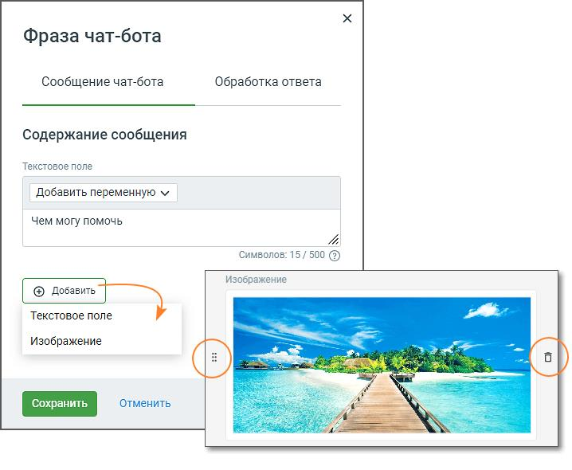
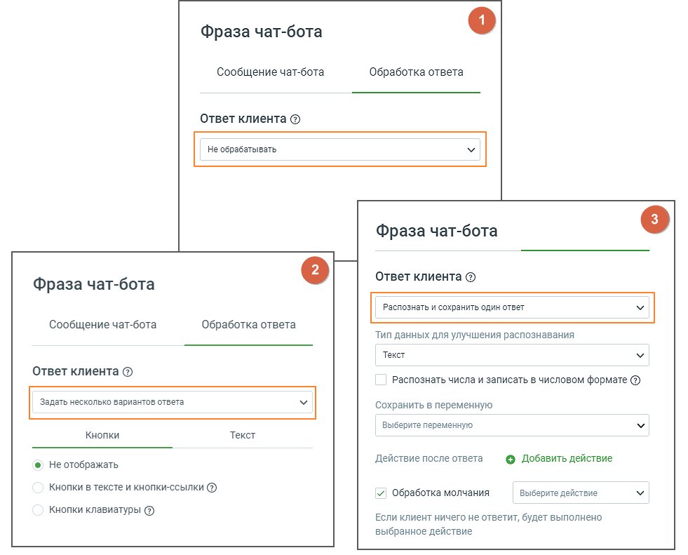
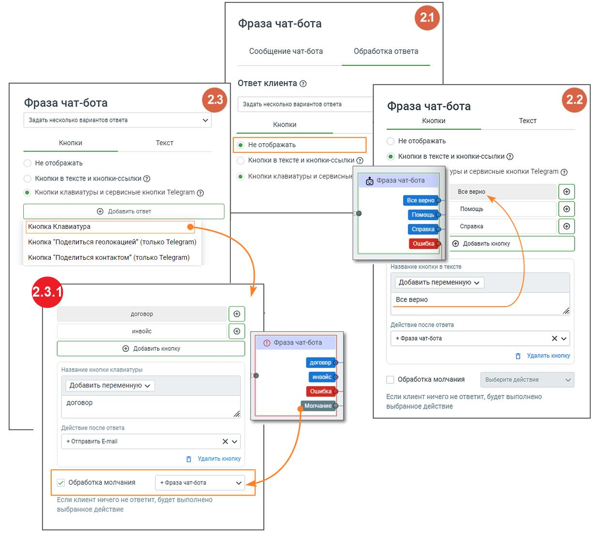
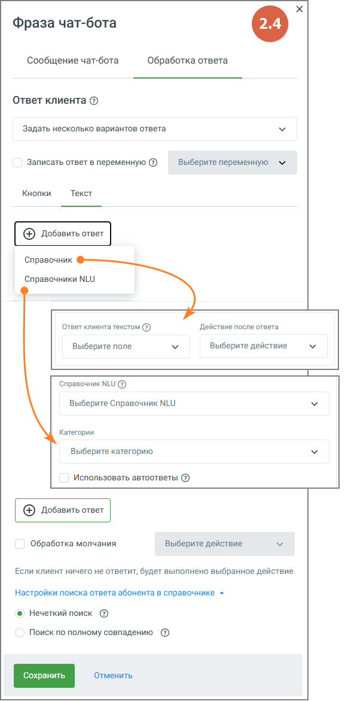
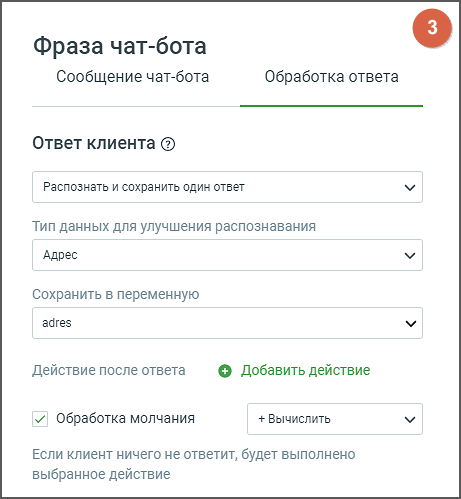

# 5.2. Блок Фраза чат-бота

> Трассировка: PDF §5.2 · сквозные стр. 59-67 · источники: ч.1 `kb/sources/cov-robot-fil/Модуль ЦОВ Робот Фил 2,0_manual_v7.26.28.pdf` с.59-67.

| В схеме скрипта присутствует как минимум один блок Фразы чат-бота, связанный с не редактируемым |
| --- |
| блоком «Начало». Первый блок Фразы чат-бота не может быть удален. |

Элементы настроек блока:

| Каждый блок содержит пиктограммы перемещения |
| --- |
| кнопки Сохранить, Отменить. |

| Кнопка «Сохранить» – сохраняет внесенные изменения, форма настроек блока закрывается. |
| --- |
| Кнопка «Отменить» – закрывает форму настройки блока, без сохранения изменений. |

СООБЩЕНИЕ ЧАТ-БОТА 1. Название блока – название блока, должно быть уникальным в рамках скрипта. Максимальное количество символов – 50.

2. Текстовое поле – текст, который напишет чат-бот в диалоге с абонентом. Максимальная длина текста 500 символов, без учета переменных. 3. Добавить переменную – выпадающий список, содержащий все доступные переменные модуля. Клик по кнопке «Добавить переменную» открывает форму поиска переменных, без учета регистра. В форме также доступно создание новой переменной скрипта. 4. Кнопка «Добавить» – нажатие на кнопку открывает выпадающий список для добавления следующего текстового поля или изображения. При выборе изображения оно отобразится в блоке. При создании скрипта в диалог чат-бота можно добавлять изображения, которые добавлялись ранее, и находятся в Хранилище файлов Личного Кабинета ВАТС. ОБРАБОТКА ОТВЕТА

При обработке ответов клиентов предусмотрены три варианта действий

1. Вариант «Не обрабатывать». При выборе этого варианта ответ клиента не обрабатывается. Чат завершается. 2. Вариант «Задать несколько вариантов ответа»: Кнопки / Текст. При выборе этого варианта пользователь имеет возможность управлять отображением в чате: 2.1 не отображать – кнопки чат-бота не отображаются; 2.2 кнопки в тексте – под сообщением чат-бота размещены кнопки, которые могут быть активированы в процессе диалога с клиентом. Если пользователь в окне диалога кликнет по названию кнопки, то чат-бот выполнит соответствующее действие, привязанное к этой кнопке; кнопки-ссылки – кнопки-ссылки привязаны к определенным веб-страницам, перенаправляя пользователя на соответствующие адреса. Не предусмотрено добавление действий после активации этих кнопок. При использовании только кнопок-ссылок, чат- бот автоматически перейдет по ветке "Успешно" сразу после отображения сообщения чат-бота; 2.3 кнопки клавиатуры и сервисные кнопки Телеграм – это элементы управления, которые позволяют пользователям в чате быстро отправлять данные. Клик по кнопке "Добавить ответ" открывает меню с тремя опциями:  Кнопка "Клавиатура" – при выборе данного варианта, чат-бот выполнит соответствующее действие, привязанное к данной кнопке;  Кнопка "Поделиться геолокацией" – отправляет текущее местоположение (работает только в мобильной версии Telegram).  Кнопка "Поделиться контактом" – отправляет сохраненный контакт.

Как это работает: 2.3.1 Кнопка Клавиатура – под окном ввода сообщений в чате располагаются кнопки клавиатуры. 2.3.2 Поделится геолокацией и контактом – в блоке ответа чат-бота выберите опцию Сервисные кнопки Telegram и задайте действие для кнопки: поделиться контактом или поделиться локацией. При нажатии кнопки пользователем, данные сохраняются в системные переменные:  Контакт – номер телефона в международном формате, например +79991112233.

 Локация – координаты, например 55°39'45.3"N 37°32'47.8"E. Особенности:  Кнопки работают только в Telegram, использование в других каналах не поддерживается.  Геолокацией можно поделиться только с мобильной версии Telegram. В веб- и десктоп- версиях эта функция недоступна. 2.4 При выборе переключателя «Текст» чат-бот анализирует все слова, введённые клиентом, и сопоставляет их с вручную заданными вариантами ответов, записями из справочника, а также с данными из базы знаний (Справочник NLU). Такой подход позволяет строить ветвления сценария не только на основе точных текстовых совпадений, но и с учётом смысла сообщений клиента.

Кнопка «Добавить ответ» открывает выбор источника обработки сообщения. Доступны два варианта:  Справочник – используется для сопоставления ответа с полями справочника и выполнения заданных действий.  Справочник NLU – обрабатывает ответы на основе базы знаний. При выборе Справочника NLU становится доступен список категорий, определённых в соответствующей базе знаний. Настроить ветвление можно как на весь Справочник NLU в целом, так и на отдельные категории. Если выбраны конкретные категории, остальные части базы обрабатываются по принципу: поиск совпадений по всем категориям, не выделенным в отдельные ветки. Чекбокс «Использовать автоответы» включает возможность использования настроенных в Справочнике NLU автоответов. Поиск ответов осуществляется поэтапно: сначала проверяются совпадения по словарям из справочника, затем – по базе знаний Справочника NLU. Если совпадение найдено, выполняется действие, настроенное в поле «Действие после ответа» – например, переход к следующей фразе, запуск сценария или выполнение команды.

| Чекбокс «Обработка молчания» – при проставленном чекбоксе если абонент ничего не отвечает или не |
| --- |
| нажимает ни одну из кнопок, то диалог двигается по ветке «Молчание». |

3. Вариант «Распознать и сохранить один ответ». При выборе типа данных "Текст" распознаются все написанные клиентом слова. В остальных случаях чат-бот распознает только выбранный тип данных. Например, если выбран тип данных «Адрес», а написано: «Мой адрес – Москва, Декабристов 12, кв.23», то чат-бот распознает и сохранит в переменную только «г. Москва, ул. Декабристов, д.12, кв.23».

