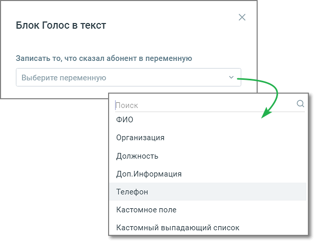

# 5.3. Блок Голос в текст

> Трассировка: PDF §5.3 · сквозные стр. 67-68 · источники: ч.1 `kb/sources/cov-robot-fil/Модуль ЦОВ Робот Фил 2,0_manual_v7.26.28.pdf` с.67-68.

Блок доступен только при создании скрипта для Роботов.

Элементы настроек блока: 1. Название блока – название блока, должно быть уникальным в рамках скрипта. Максимальное количество символов – 50. 2. Записать то, что сказал абонент в переменную – в выбранную переменную будет записан ответ абонента при разговоре робота с абонентом. Если выбрана переменная из блока «Исходящий обзвон», то в случае участия робота в кампании ИО, в соответствующее поле задачи капании ИО по завершении звонка запишется фраза, произнесенная абонентом. В форме также есть поле поиска по переменным (без учета регистра) и доступно создание новой переменной скрипта. 3. Кнопка «Сохранить» – сохраняет внесенные изменения, форма настроек блока закрывается. 4. Кнопка «Отменить» – закрывает форму настройки блока, без сохранения изменений.
