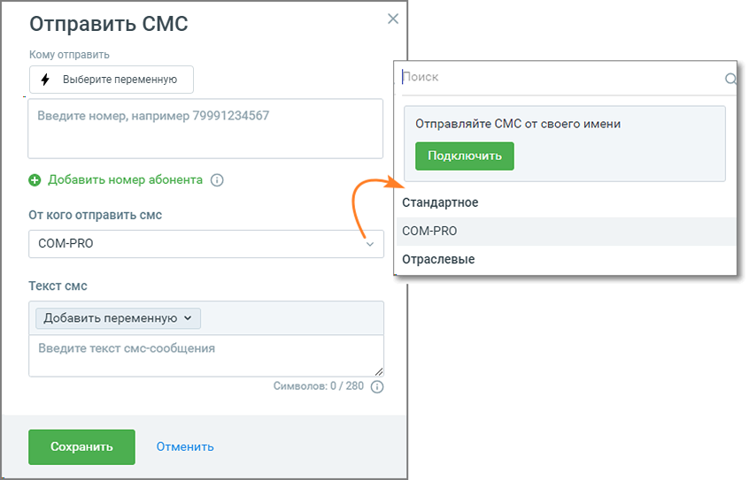

# 5.4. Блок Отправить СМС

> Трассировка: PDF §5.4 · сквозные стр. 68-70 · источники: ч.1 `kb/sources/cov-robot-fil/Модуль ЦОВ Робот Фил 2,0_manual_v7.26.28.pdf` с.68-70.

Блок доступен при создании скрипта для Роботов, Роботов-администраторов и Чат-ботов.

Элементы настроек блока: 1. Название блока – название блока, должно быть уникальным в рамках скрипта. Максимальное количество символов – 50. 2. Ссылка «Добавить номер абонента» - клик по ссылке добавляет номер текущего абонента в список получателей смс-сообщения. При разговоре по скрипту робот отправит смс-сообщение на номер абонента, с которым ведется разговор. Опция недоступна для скриптов чат-ботов. 3. Кому отправить смс – поле для ввода получателей смс-сообщения. Доступные для ввода символы: цифры 0-9, запятая, точка, пробел, ( , ) , - , _ ,+, * , @. Также можно отправлять СМС на номер, который сохранён в переменной. 4. От кого отправить смс – поле для ввода отправителя смс-сообщения. Открывает выпадающий список доступных имен отправителей. Клик по кнопке Подключить открывает страницу Личного кабинета пользователя ВАТС Общие настройки/Дополнительные настройки/Отправка SMS. Здесь пользователь может подключить услуги «Отраслевое имя» и «Индивидуальное имя». 5. Добавить переменную – выпадающий список всех доступных переменных модуля для вставки в тексте смс-сообщения (поиск переменных без учета регистра). Допускается использование не более трех переменных. В форме также доступно создание новой переменной скрипта. 6. Текст смс – текст смс-сообщения, максимальное количество 280 символов, без учета переменных. 7. Кнопка «Сохранить» – сохраняет внесенные изменения, форма настроек блока закрывается. 8. Кнопка «Отменить» – закрывает форму настройки блока, без сохранения изменений.

