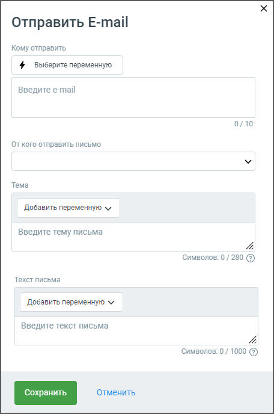

# 5.5. Блок Отправить E-mail

> Трассировка: PDF §5.5 · сквозные стр. 70-71 · источники: ч.1 `kb/sources/cov-robot-fil/Модуль ЦОВ Робот Фил 2,0_manual_v7.26.28.pdf` с.70-71.

Блок доступен при создании скрипта для чат-ботов, Роботов и Роботов-администраторов.

Элементы настроек блока:

1. Название блока – название блока, должно быть уникальным в рамках скрипта. Максимальное количество символов – 50. 2. Кому отправить – поле для ввода получателей E-mail сообщения. Максимальное количество адресов – 10. Также можно отправлять E-mail на номер, который сохранён в переменной. При этом робот /чат-бот выполнит поиск клиента в адресной книге и, если в его карточке указан e-mail, отправит на него письмо. В случае отсутствия e-mail, робот/чат-бот пропустит шаг с отправкой письма и продолжит выполнение сценария. 3. От кого отправить e-mail – поле для ввода отправителя. Открывает выпадающий список доступных имен отправителей. Добавить электронные адреса отправителей можно в Контакт центре MANGO OFFICE, раздел «Настройки/Телефония и E-mail/Электронный адрес компании». 4. Добавить переменную – выпадающий список всех доступных переменных модуля для вставки в тексте E-mail сообщения (поиск переменных без учета регистра). Допускается использование не более 10 переменных. В форме также доступно создание новой переменной скрипта. 5. Тема письма – поле ввода темы письма, не более 200 символов. Также можно выбрать тему, которая сохранена в переменной. 6. Текст письма – текст сообщения, максимальное количество 1000 символов, без учета переменных. 7. Кнопка «Сохранить» – сохраняет внесенные изменения, форма настроек блока закрывается. 8. Кнопка «Отменить» – закрывает форму настройки блока, без сохранения изменений.
