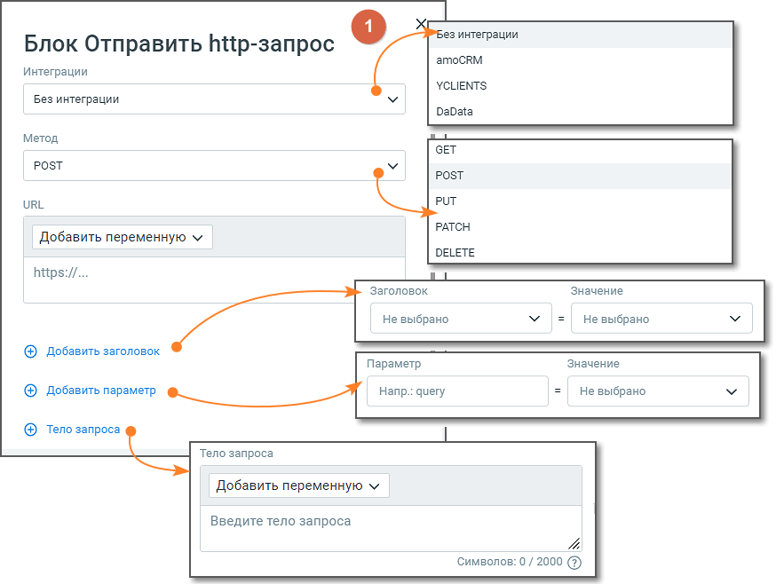
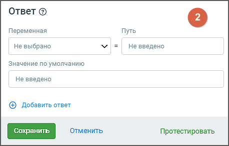
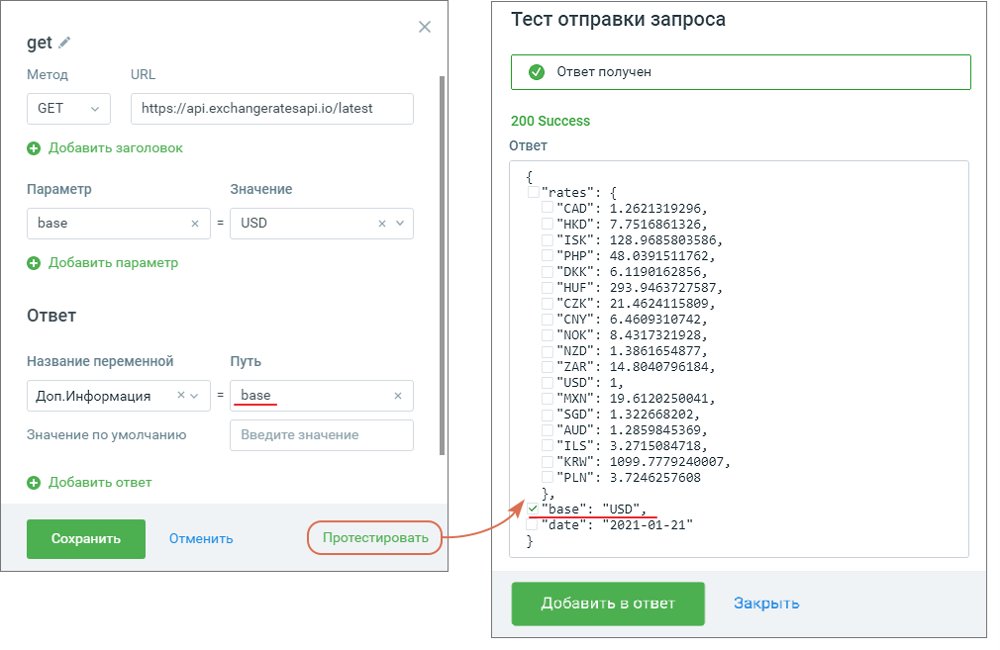

# 5.6. Блок Отправить http-запрос

> Трассировка: PDF §5.6 · сквозные стр. 71-77 · источники: ч.1 `kb/sources/cov-robot-fil/Модуль ЦОВ Робот Фил 2,0_manual_v7.26.28.pdf` с.71-77.

Блок доступен при создании скрипта для Роботов, Роботов-администраторов и Чат-ботов. Блок состоит из двух частей: 1 - Запрос и 2 - Ответ.

Элементы настроек блока:

Элементы настроек части «Запрос»: 1. Название блока – название блока, должно быть уникальным в рамках скрипта. Максимальное количество символов – 50. 2. Интеграции – варианты интеграций AmoCRM, YCLIENTS (только для скриптов Роботов), DaData, API Коннектор, RetailCRM. 3. Метод – метод http-запроса. Выпадающий список содержит: GET, POST, PUT, DELETE, PUTCH 4. URL – URL http-запроса. В URL можно добавить переменную. 5. Добавить заголовок – по клику на кнопку открываются два поля. Добавить поля можно не более 10 раз.  Заголовок – название заголовка запроса. Выпадающий список содержит заголовки Authorization, Accept, Accept-Charset, Accept-Encoding, Accept-Language, Cache-Control, Content-Length, Content-Type, Proxy-Authorization, Cookie. Помимо выбора готовых заголовков в блоке доступен ввод нового заголовка, необходимого пользователю.  Значение – поле для ввода значения заголовка. 6. Добавить параметр – по клику на кнопку открываются два поля: параметр и значение. Добавить поля можно не более 30 раз. 7. Тело запроса – по клику на кнопку появляется текстовое поле ввода кода запроса, не более 2000 символов. Доступно только для методов POST, PUT. В поле возможно добавление из выпадающего списка всех доступных переменных модуля. В форме также доступно создание новой переменной скрипта. 8. Параметры обработки таймаутов и повторов запросов – в блоке доступны параметры для управления повторными попытками и временем ожидания отклика от сервера:  timeoutms – время ожидания ответа от сервера (в миллисекундах). Если по истечении указанного времени ответ не получен, запрос завершается с ошибкой таймаута. Значение по умолчанию: 15000 (15 секунд).  retryqnt – количество повторных попыток выполнения запроса при срабатывании таймаута. При указании значения больше 0 система выполнит повтор запроса указанное количество раз. Значение по умолчанию: 0 (повторы отключены). Пример 1. Если задать timeoutms = 10000 и retryqnt = 2, то при отсутствии ответа от сервера в течение 10 секунд запрос будет выполнен повторно до 2 раз. Элементы настроек части «Ответ»: 9. Добавить ответ – по клику на кнопку открываются три поля. Добавить поля можно не более 20 раз.  Название переменной – выпадающий список всех доступных переменных модуля (поиск переменных без учета регистра). В форме также доступно создание новой переменной скрипта.  Путь – поле ввода пути для переменной.  Значение по умолчанию – значение переменной по умолчанию. Просмотрите правила работы с HTTP-ответом в формате JSON, размещенные в блоке Ответ под пиктограммой (?).

Если выбрана переменная из блока «Исходящий обзвон», то в случае участия робота в кампании ИО, значение будет передано в соответствующее поле задачи капании ИО. 10. Кнопка «Удалить строку» – удалить строки Параметр и Заголовок. 11. Кнопка «Сохранить» – сохраняет внесенные изменения, форма настроек блока закрывается. 12. Кнопка «Отменить» – закрывает форму настройки блока, без сохранения изменений. 13. Кнопка «Протестировать»– предварительное тестирование запроса. Если в запросе в качестве значений были использованы переменные, в форме тестирования запроса пользователь должен задать значения для каждой используемой переменной.

Администратор, отвечающий за настройку роботов, может получать и использовать параметры полученного ответа http-запроса, не прописывая пути ответа вручную. Для этого в Тесте отправки запроса необходимо проставить чекбокс соответствующего ответа и нажать кнопку «Добавить в ответ». Обработка HTTP-ответов Для обработки всех кодов ответа на HTTP-запросы, в блок "Отправить HTTP-запрос" добавлен кастомный путь для записи кодов ответов сервера. Это позволяет настраивать действия робота в зависимости от возвращаемого кода. 1. Как это работает:  Коды ответов сервера записываются в переменную -r.code через настроенный путь.  При тестировании HTTP-запроса код ответа автоматически отображается в всплывающем окне. 2. Как настроить  В блоке "Отправить HTTP-запрос" укажите путь для записи кода ответа в переменную - r.code.  Добавьте в скрипт условия для обработки каждого из ожидаемых кодов ответа.  3. Пример использования обработки HTTP-ответов

Задача: При отправке данных в систему CRM робот должен обрабатывать коды ответа сервера. Если сервер вернул код 200, робот записывает информацию в CRM и сообщает об успешной операции. Если сервер вернул код 404, робот информирует администратора, что указанный ресурс не найден. Если сервер вернул код 500, робот делает повторный запрос через 5 минут. Пример работы блока:

В Статистике прохода скрипта результат работы блока отображается следующим образом: Http-запрос: <Название блока HTTP запроса> : <Статус выполнения> Варианты статуса выполнения: «Выполнен»/»Не выполнен». В случае, если статус выполнения «Не выполнен», в Статистике по скрипту дополнительно отображается код ошибки:

| Http-запрос: <Название блока HTTP запроса> : <Статус выполнения> (код ошибки: <код |
| --- |
| ответа http>) |

Возможна настройка действия в случае, если http-запрос не отработан и данные не получены. В этом случае скрипт идет по ветке «Ошибка». Если в случае ошибки действие не предусмотрено, по умолчанию ветка ведет к блоку «Завершение разговора». Примеры взаимодействия модуля ЦОВ «Робот Фил 2,0» с Битрикс24 ЗАДАЧА 1: Робот звонит на произвольный номер. Если абонент является потенциальным клиентом, создается лид в Битрикс 24. - Робот звонит по номеру - Робот произносит фразу «Добрый день. Как вас зовут?» - Клиент сообщает имя. Имя записывается в переменную «ФИО» - Робот произносит фразу «Хотите стать нашим клиентом?» - Если клиент отвечает «Да» - отправляется запрос «Создание Лида в Битрикс 24 с параметрами  phone = номер телефона абонента  name = ФИО. Решение: Метод: POST URL: https://b24-14vdhy.bitrix24.ru/rest/1/4u5164khkssd9mmf/crm.lead.add Заголовок: Content-Type Значение: application/json Тело запроса: { «fields»: { «TITLE»:»test1», «NAME»:»{ФИО}», «PHONE»: [{ «VALUE»:»{Телефон}», «VALUE_TYPE»:»WORK» }] }} Параметры «номер телефона» и «ФИО» передаются в теле запроса, где  «TITLE»:»test1» - название лида;  «NAME»:»{ФИО}» - имя;  «PHONE» - телефон в Битрикс24. Это массив, поэтому даже если передаем один номер, то передаем его в таком формате [{ «VALUE»:»{Телефон}», «VALUE_TYPE»:»WORK» }], где value это номер телефона, а value_type тип номера

ЗАДАЧА 2: На робота поступает звонок с номера, который заведен как Лид в Битрикс. По номеру телефона робот получает данные Лида и использует их в скрипте. Решение: Метод: POST URL: https://b24-14vdhy.bitrix24.ru/rest/1/4u5164khkssd9mmf/crm.lead.list Заголовок: Content-Type Значение: application/json Тело запроса: {«filter»: { «PHONE»: «{Телефон}» },»select»: [ «ID», «TITLE», «NAME», «POST», «COMPANY_TITLE» ]} Параметры фильтрации передаются в теле запроса, где  «PHONE» - фильтр по телефону - используется телефон звонившего на робота  массив данных select - выбранные поля для возврата в ответе. Из ответа производится запись данных в переменные ФИО = Name, Должность =Post, Организация = Company_Title Описание настроек на стороне Битрикс24:
