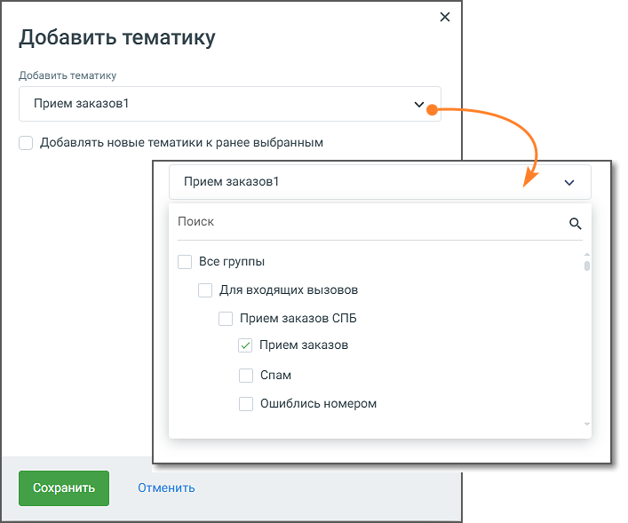

# 5.7. Блок Добавить тематику

> Трассировка: PDF §5.7 · сквозные стр. 77-79 · источники: ч.1 `kb/sources/cov-robot-fil/Модуль ЦОВ Робот Фил 2,0_manual_v7.26.28.pdf` с.77-79.

Блок доступен только при создании скрипта для Роботов. В процессе работы по скрипту робот проставляет звонку тематику в соответствии с настройками блока.

Элементы настроек блока: 1. Название блока – название блока, должно быть уникальным в рамках скрипта. Максимальное количество символов – 50. 2. Добавить тематику – выпадающий список тематик, настроенных в Контакт-центре MANGO OFFICE. 3. Чекбокс «Добавлять новые тематики к ранее выбранным» – данная опция позволяет не заменять текущие тематики, а добавлять новые к уже установленным. ПРИМЕР Была выбрана тематика: Маркетинг Вы выбираете: Аналитика С чекбоксом включённым итог будет: Маркетинг, Аналитика С чекбоксом выключенным итог будет: только Аналитика 4. Кнопка «Сохранить» – сохраняет внесенные изменения, форма настроек блока закрывается. 5. Кнопка «Отменить» – закрывает форму настройки блока, без сохранения изменений.

ПРИМЕР Робот делает несколько попыток дозвона. Первая попытка дозвона неуспешна – тематики не проставляются. Вторая попытка дозвона успешна - робот дозванивается до абонента, проходит скрипт, проставляет тематики.

| Если в скрипте несколько блоков "Добавить тематику", остаются только тематики, указанные в последнем |
| --- |
| блоке скрипта. Тематики предыдущих блоков перезаписываются (в рамках одного прохода скрипта). |

Тематики, проставленные роботом в процессе разговора, отображаются в Статистике скрипта. Если робот участвовал в кампании Исходящего обзвона Контакт-центра MANGO OFFICE, проставленные тематики также отображаются в Истории вызовов (общая статистика) и карточке кампании Исходящего обзвона.

| Важно: для отображения статистики в Контакт-центре необходимо, чтобы в скрипте робота и кампании Исходящего |
| --- |
| обзвона были настроены одинаковые тематики. |
