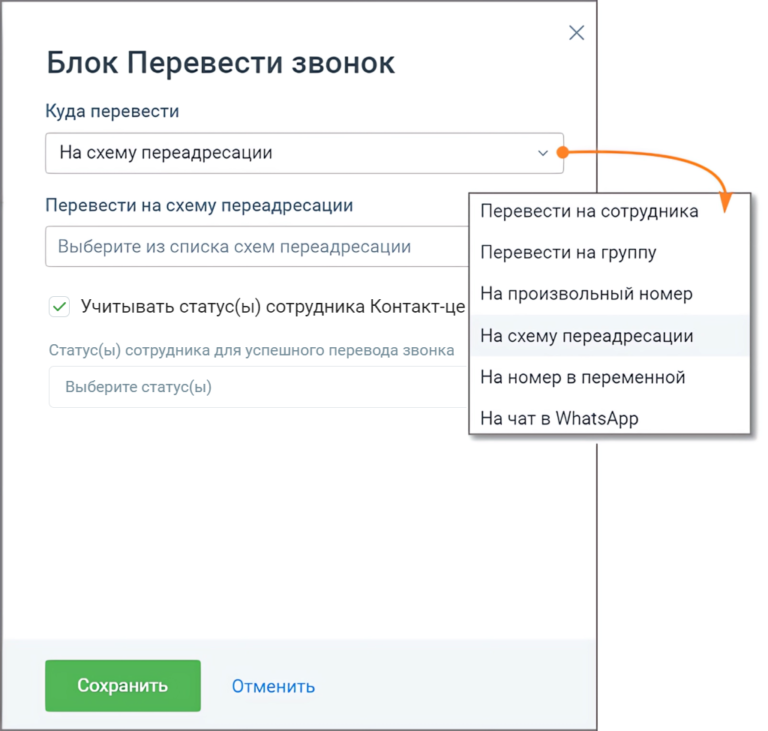

# 5.8. Блок Перевести звонок

> Трассировка: PDF §5.8 · сквозные стр. 79-81 · источники: ч.1 `kb/sources/cov-robot-fil/Модуль ЦОВ Робот Фил 2,0_manual_v7.26.28.pdf` с.79-81.

Блок доступен только при создании скрипта для Роботов. Робот выполняет обзвон в рамках кампании исходящего обзвона, в случае согласия/заинтересованности абонента, переводит звонок.

Элементы настроек блока: 1. Название блока – название блока, должно быть уникальным в рамках скрипта. Максимальное количество символов – 50. 2. Переключатель «Куда перевести»:

 На сотрудника – звонок будет переведен на сотрудника, выбранного в выпадающем списке «Сотрудники». Список сформирован из сотрудников, подключенных к ВАТС.  На группу – чат будет переведен на группу, выбранную в выпадающем списке «Группы»;  На произвольный номер – откроется поле для ввода номера, на который будет переведен звонок;  На схему переадресации – звонок будет переведен на схему переадресации, выбранную в выпадающем списке;  На номер в переменной – звонок будет переведен на номер, вписанный в переменную, выбранную в выпадающем списке переменных;  На чат в WhatsApp – звонок будет переведен на чат в выбранном канале (если у клиента более одного канала, предусмотрен выпадающий список каналов). Также здесь предусмотрен выбор шаблона WhatsApp HSM, в соответствии с которым клиенту будет отправляться текстовое сообщение. 3. Чекбокс «Учитывать статусы сотрудника Контакт-центра» – если чекбокс отмечен робот проверяет статус оператора перед переводом звонка. Перевод звонка происходит только в том случае, если статус оператора соответствует статусу Контакт-центра, который разрешает перевод вызова. В противном случае робот пойдет по ветке «ошибка»; 4. Кнопка «Сохранить» – сохраняет внесенные изменения, форма настроек блока закрывается. 5. Кнопка «Отменить» – закрывает форму настройки блока, без сохранения изменений. При переводе звонка сотруднику данные из кампании Исходящего обзвона передаются в Контакт-центр. Таким образом сотрудник будет иметь всю необходимую информацию для разговора с абонентом.
