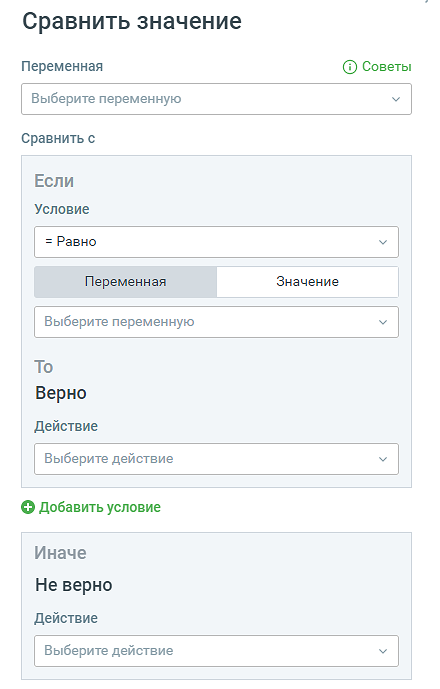
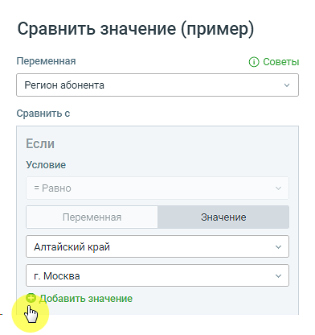

# 5.9. Блок Сравнить значение

> Трассировка: PDF §5.9 · сквозные стр. 81-84 · источники: ч.1 `kb/sources/cov-robot-fil/Модуль ЦОВ Робот Фил 2,0_manual_v7.26.28.pdf` с.81-84.

Блок доступен при создании скрипта для Роботов, Роботов-администраторов и Чат-ботов. В блоке можно настроить сравнение числовых или длин строковых переменных с переменными или указанными значениями. В дальнейшем пользователь может настроить последующие действия в скрипте в зависимости от результата сравнения.

Элементы настроек блока: 1. Название блока – название блока, должно быть уникальным в рамках скрипта. Максимальное количество символов – 50. 2. Переключатель Переменная/Значение:  Переменная – выпадающий список, содержащий все доступные переменные модуля (поиск переменных без учета регистра). М

В форме также доступно создание новой переменной для текущего скрипта кликом по кнопке

 Значение – выбранное пользователем значение для сравнения. Может быть задано несколько значений. 3. Условие - выпадающий список доступных значения сравнения:  = Равно  ⩾ Больше или равно  > Больше  < Меньше

| ⩽ |
| --- |
| ≠ |

 Количество символов в строке больше  Количество символов в строке меньше 4. Переключатель «Переменная/Значение» - содержит:  Переменная – список всех доступных переменных модуля. В форме также доступно создание новой переменной скрипта.  Значение – открывается поле ввода, в котором доступен ввод любых символов. Максимальное количество символов – 7. Может быть задано несколько значений. 5. Кнопка «Добавить условие» – можно добавить до десяти условий. 6. Действие ВЕРНО/НЕ ВЕРНО – следующий блок скрипта при выборе этого варианта ответа. 7. Кнопка «Сохранить» – сохраняет внесенные изменения, форма настроек блока закрывается. 8. Кнопка «Отменить» – закрывает форму настройки блока, без сохранения изменений. ПРИМЕР Используя блок Сравнить значение и переменную «Регион абонента» можно определять из какого региона звонит клиент и настраивать дальнейшую работу скрипта с учетом этого региона. Для сравнения можно задавать несколько значений.

