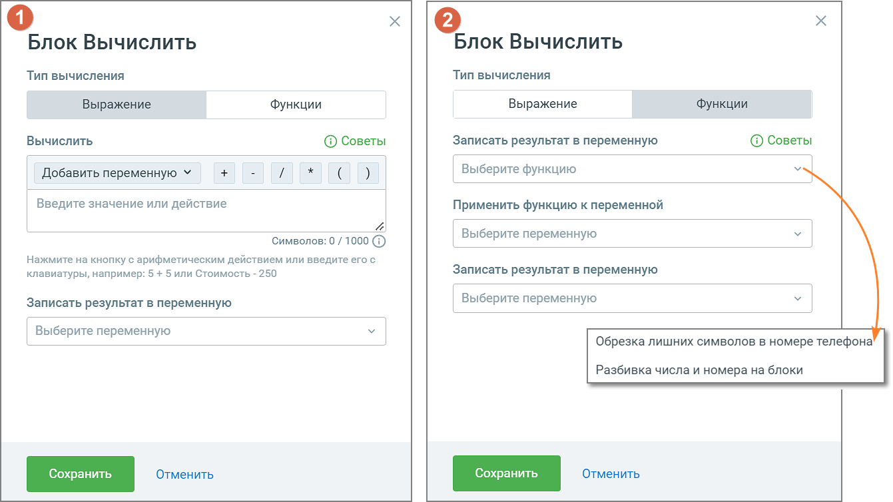

# 5.10. Блок Вычислить

> Трассировка: PDF §5.10 · сквозные стр. 84-86 · источники: ч.1 `kb/sources/cov-robot-fil/Модуль ЦОВ Робот Фил 2,0_manual_v7.26.28.pdf` с.84-86.

Блок доступен при создании скрипта для Роботов, Роботов-администраторов и Чат-ботов. В блоке настраиваются простые вычисления. В вычислениях могут быть только числа или числовые переменные, а также поддерживаемые конструктором логические символы. В процессе прохождения скрипта робот выполняет вычисления и записывает итог в переменную.

1) Тип вычисления «Выражение» Элементы настроек блока: 1. Название блока – название блока, должно быть уникальным в рамках скрипта. Максимальное количество символов – 50. 2. «Добавить переменную» – выпадающий список, содержащий все доступные переменные модуля (поиск переменных без учета регистра). В форме также доступно создание новой переменной для текущего скрипта кликом по кнопке

3. Вычисления – блок позволяет производить арифметические действия и сохранять результат в переменную. Блок работает только с числами. Правила написания формул можно просмотреть,

нажав на кнопку . В блоке доступны следующие вычислительные операции:  Сложение;  Вычитание;  Деление;  Умножение;  Открывающая скобка;  Закрывающая скобка. 4. Записать результат в переменную – список переменных с возможностью создания пользовательских переменных, аналогично п. 2. 5. Кнопка «Сохранить» – сохраняет внесенные изменения, форма настроек блока закрывается.

6. Кнопка «Отменить» – закрывает форму настройки блока, без сохранения изменений. 2) Тип вычисления «Функции» Блок позволяет использовать следующие функции:  Обрезка лишних символов в номере телефона – удаляет все символы, кроме цифр. Решает проблему: при передаче номера со знаком «+» во внешние системы или Google Sheets возможна ошибка, если ожидается числовой формат.  Разбивка числа и номера на блоки – позволяет роботу произносить числа частями по три символа. Решает проблему: длинные числа звучат естественно – например, вместо «Один миллион двести двадцать одна тысяча…» робот скажет «Сто двадцать два, сто пятьдесят четыре, семь».  Объединение – записывает в одну переменную несколько переменных или переменную и текст.  Преобразование даты к формату ДД.ММ.ГГГГ ЧЧ:ММ – меняет формат 2021-05- 21T17:53:03+03:00 на 21.05.2021 17:53.  Преобразование даты к формату Timestamp – конвертирует дату в числовой формат Unix- времени. Пример: 03.05.2024 → 1714683600.  Экранирование символов из переменной – делает строку корректной для передачи в JSON. Пример: ООО "Манго офис" → ООО \"Манго офис\".  Разбивка по разделителю – делит текст в переменной на части по выбранному символу. Пример: price = 979.81 → 979 и 81.  Регулярные выражения – преобразуют данные по заданному шаблону. Пример: (\d{4})-(\d{2})-(\d{2}) с форматом "$3.$2.$1" превратит 2025-08-21 в 21.08.2025.  Получение данных из виджета Манго Диалогов – (только для чат-ботов) если на сайте пользователя установлен виджет Манго Диалоги «Чат на сайте», функция позволяет чат-боту автоматически получать данные о клиенте (имя, ID, URL, UTM-метки и др.).
