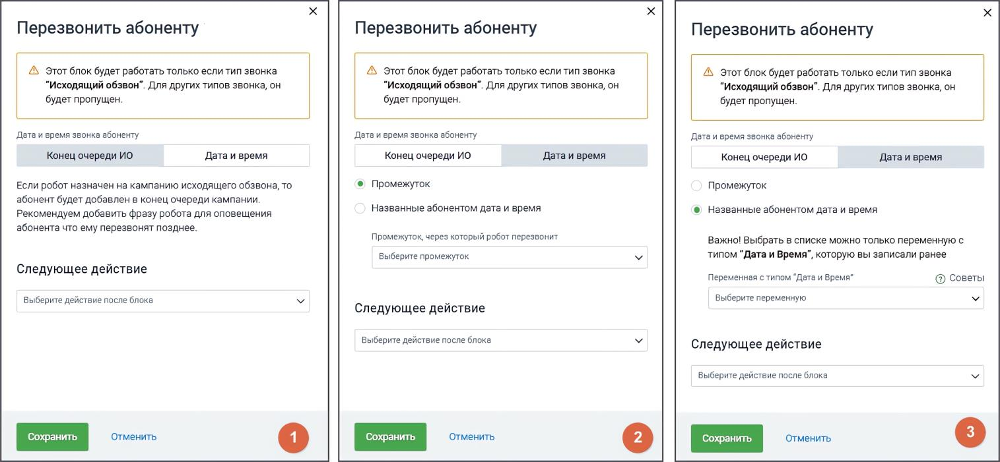

# 5.11. Блок Перезвонить абоненту

> Трассировка: PDF §5.11 · сквозные стр. 86-88 · источники: ч.1 `kb/sources/cov-robot-fil/Модуль ЦОВ Робот Фил 2,0_manual_v7.26.28.pdf` с.86-88.

Блок доступен только при создании скрипта для Голосовых роботов. Если клиенту в текущий момент времени не удобно общаться, робот выполнит возврат текущего задания исходящего обзвона в конец очереди текущей кампании, и произведет повторный звонок. Важно: Блок предназначен только для звонков с типом «Исходящий обзвон».

Настройки блока В блоке доступны два варианта установки времени перезвона: 1. Конец очереди ИО – абонент добавляется в конец очереди текущей кампании исходящего обзвона. 2. Дата и время – робот перезвонит в определенное время, которое может быть установлено одним из способов: o Промежуток – выбор фиксированного временного интервала. Доступные варианты: 5 минут, 10 минут, 15 минут, 30 минут, 1 час, 3 часа, 6 часов. o Названные абонентом дата и время – используется ранее сохраненная переменная типа "Дата и Время", полученная от абонента.

| Важно: Если очередь на исходящий обзвон переполнена, вызов может быть поставлен в очередь с задержкой, |
| --- |
| выходящей за пределы установленного промежутка. |

Дополнительные условия  Блок "Перезвонить абоненту" нельзя связать с аналогичным блоком в рамках одного скрипта.  Для повышения гибкости можно использовать большее количество предустановленных промежутков времени для перезвона.  В сценариях, где требуется учитывать загруженность очереди, можно дополнительно отслеживать статус постановки звонка в очередь. Настройки завершения блока После блока "Перезвонить абоненту" необходимо задать следующее действие:

 Выбрать другой блок в скрипте для продолжения обработки вызова. Клик по кнопке «Добавить действие» открывает список всех доступных блоков скрипта.  При необходимости, настроить обработку ошибок, если вызов не может быть поставлен в очередь повторного дозвона. После настройки блока нажмите Сохранить для применения изменений или Отменить для их отмены.
