# 5.12. Блок Интеграция

> Трассировка: PDF §5.12 · сквозные стр. 88-116 · источники: ч.1 `kb/sources/cov-robot-fil/Модуль ЦОВ Робот Фил 2,0_manual_v7.26.28.pdf` с.88-116.

Блок доступен при создании скрипта для Роботов, Роботов-администраторов и Чат-ботов. При экспорте-импорте скрипта с блоком «Интеграция» все пользовательские настройки, связанные с этим блоком, сохраняются для последующего использования.

Интеграция с Google-таблицами

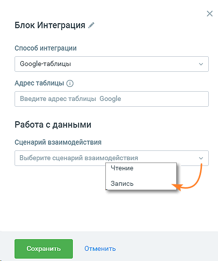

Элементы настроек блока: 1. Способ интеграции – Google-таблицы; 2. Адрес таблицы – URL адрес Google-таблицы. Таблица должна быть открыта для редактирования по ссылке в настройках доступа. 3. Сценарий взаимодействия – чтение или запись.

Сценарий «Чтение»

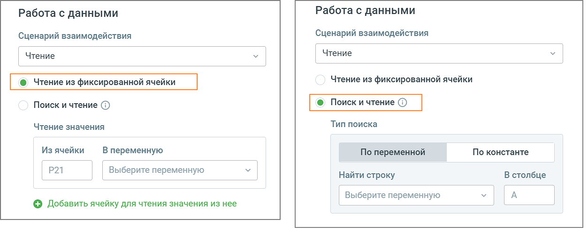

Чтение / Из фиксированной ячейки Робот обращается к конкретной ячейке Google-таблицы для чтения данных и записывает прочитанные данные в переменную. Доступно обращение к множеству ячеек для чтения и запись в переменные из них. a) Ячейка – поле для ввода номера ячейки Google-таблицы. Данные будут считываться из этой ячейки и записываться в выбранную переменную. b) Переменная – выпадающий список, содержащий все доступные переменные модуля (поиск переменных без учета регистра). В выбранную переменную будет записано значение ячейки Google-таблицы. В форме также доступно создание новой переменной для текущего скрипта кликом по кнопке

c) – клик по пиктограмме добавляет новую строку с полями «Ячейка» и «Переменная». Максимальное количество строк - 20. d) Действие – выпадающий список для выбора следующего блока скрипта. Чтение / Поиск и чтение Робот производит поиск в Google-таблице по константе или данным из переменной. В случае если константа была найдена, робот обратится к столбцам строки найденной константы для чтения данных из них и запишет данные в переменные. a) Тип поиска – условия поиска: по переменной, по константе. b) Найти строку

 по переменной – выпадающий список, содержащий все доступные переменные модуля (поиск переменных без учета регистра). В форме также доступно создание новой переменной для текущего скрипта.  по константе – поле для ввода значения (константы), по которому пользователь хочет найти строку в заданном в п.с столбце. Максимальное количество символов для ввода: 100. c) В столбце – номер столбца, в котором пользователь хочет провести поиск переменной или константы, указанных в п.b. После нахождения переменной/константы система определяет строку, в которой они содержатся. d) Из столбца – поле для ввода номера столбца Google-таблицы, на пересечение которого со строкой, определенной в п.с, находится ячейка с данными. e) Переменная - выпадающий список, содержащий все доступные переменные модуля. В выбранную переменную будет записано значение ячейки из п.e Google-таблицы.

f) – клик по пиктограмме добавляет новую строку с полями «Из столбца» и «Переменная». Максимальное количество строк - 20. g) Действие – выпадающий список для выбора следующего блока скрипт Сценарий «Запись»

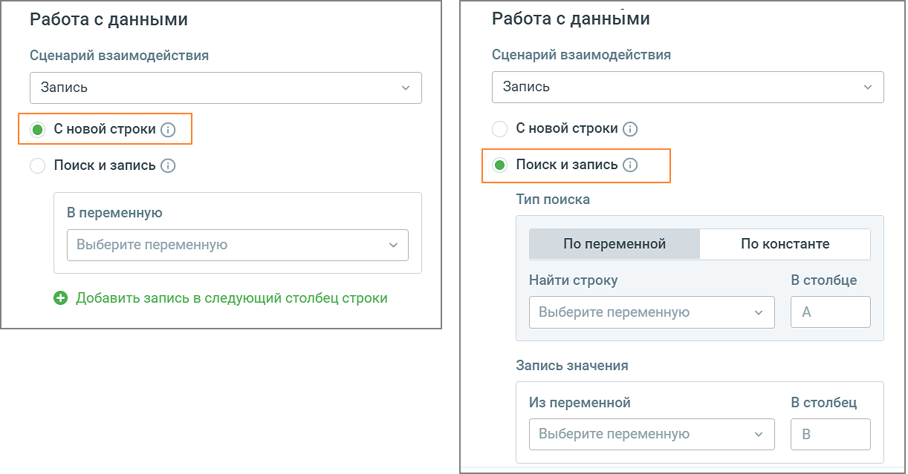

Запись / С новой строки Робот при каждом обращении к таблице для записи, создаст новую строку и запишет данные переменных в столбцы строки таблицы.

a) Переменная – выпадающий список, содержащий все доступные переменные модуля (поиск переменных без учета регистра). В форме также доступно создание новой переменной для текущего скрипта кликом по кнопке

b) – клик по пиктограмме добавляет новую строку с полем «Переменная». Максимальное количество строк - 20. c) Действие – выпадающий список для выбора следующего блока скрипта. Запись / Поиск и запись Робот производит поиск в таблице по константе или данным переменной. В случае если константа была найдена, робот запишет значение или данные переменных в столбцы строки найденной константы. a) Тип поиска – условия поиска: по переменной, по константе. b) Найти строку  по переменной – выпадающий список, содержащий все доступные переменные модуля (поиск переменных без учета регистра). В форме также доступно создание новой переменной для текущего скрипта.  по значению – поле для ввода значения, по которому пользователь хочет найти строку в заданном в п.с столбце. Максимальное количество символов для ввода: 100. c) В столбце – номер столбца, в котором пользователь хочет провести поиск переменной или константы, указанных в п.b. После нахождения переменной/константы система определяет строку, в которой они содержатся. d) Из переменной - выпадающий список, содержащий все доступные переменные модуля. Из выбранной переменной будет взято значение для записи в ячейку из п.e Google-таблицы. e) В столбец – поле для ввода номера столбца Google-таблицы, на пересечение которого со строкой, определенной в п.с, будет записана ячейка.

f) – клик по пиктограмме добавляет новую строку с полями «Из столбца» и «Переменная». Максимальное количество строк - 20. g) Действие – выпадающий список для выбора следующего блока скрипта. Интеграция с Адресной книгой Контакт-центра Опция недоступна для скриптов чат-ботов.

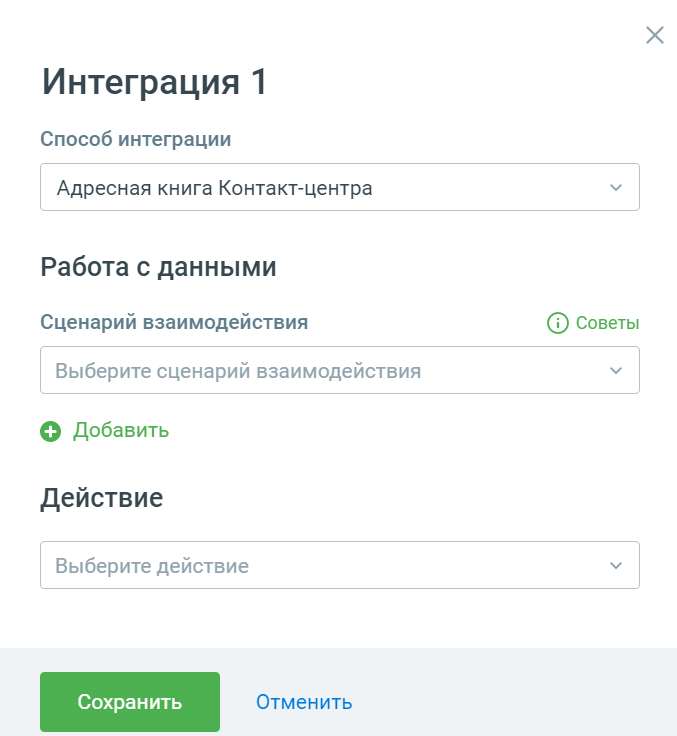

Элементы настроек блока: 1. Способ интеграции – Адресная книга Контакт-центра; 2. Сценарий взаимодействия – выпадающий список: создание или изменение контакта.  Переменная скрипта – выпадающий список, содержащий все доступные переменные модуля (поиск переменных без учета регистра). В форме также доступно создание новой переменной для текущего скрипта кликом по кнопке

 Поле адресной книги – выпадающий список, содержащий все доступные поля Адресной книги Контакт-центра. 3. Действие – выпадающий список для выбора следующего блока скрипта. При прохождении скрипта робот запишет данные выбранной переменной в соответствующее поле Адресной книги. Блок наиболее эффективно использовать вместе с блоком «Сравнить значения».

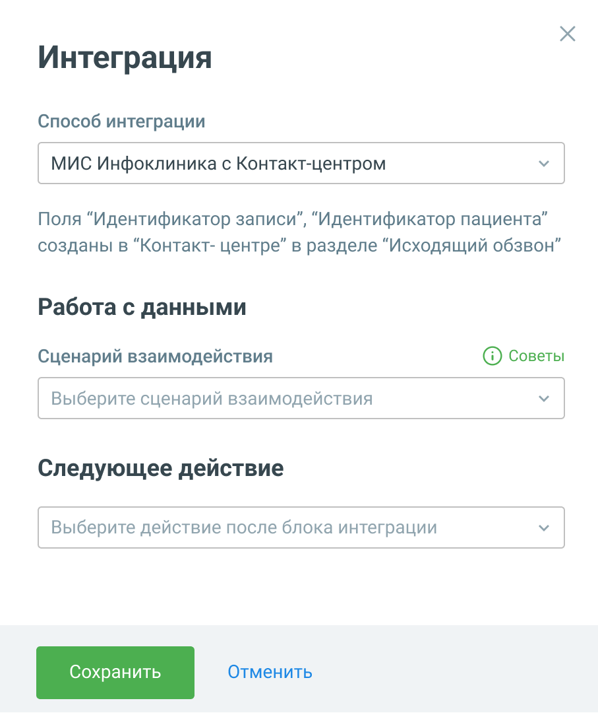

Интеграция с МИС Инфоклиника Опция недоступна для скриптов чат-ботов. Блок позволяет настраивать следующие действия робота:  Обзвон записанных на прием клиентов с помощью роботов или операторов Контакт- Центра по заданным пользователем параметрам;  Автоматическое подтверждение записей на прием;  Автоматическая отмена записей на прием. С порядком подключения интеграции вы можете ознакомиться в разделе Интеграция с МИС Инфоклиника. После подключения интеграции блок скрипта имеет следующий вид:

1. Способ интеграции – МИС Инфоклиника с Контакт-центром; 2. Сценарий взаимодействия – варианты: подтверждение записи на прием, отмена записи на прием. 3. Следующее действие – следующий блок скрипта. Перед звонком осуществляется обязательная проверка записи клиента на актуальность, чтобы не звонить повторно клиентам, которые самостоятельно позвонили в клинику и перенесли, подтвердили или отменили свою запись. Только если запись не изменена, она попадает в кампанию ИО на обзвон. Интеграция с Битрикс Блок позволяет настраивать работу со сделками и лидами CRM Битрикс. Робот будет создавать новый лид/сделку в CRM.

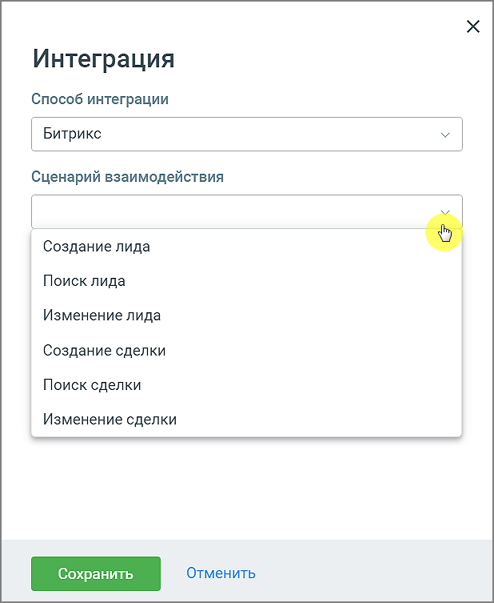

Элементы настроек блока:

1. Способ интеграции – Битрикс; 2. Сценарий взаимодействия – варианты: создание лида, поиск лида, изменение лида, создание сделки, поиск сделки, изменение сделки.

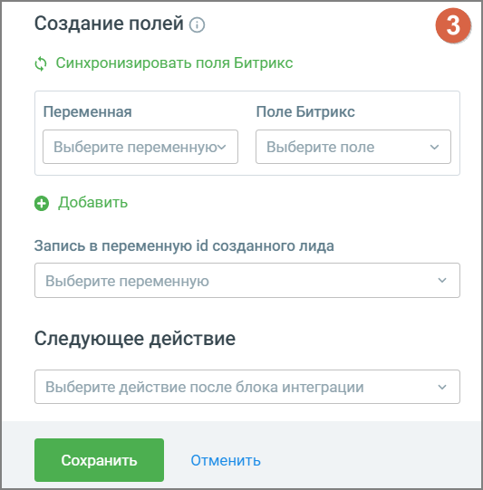

3. Создание полей (сценарий «создение лида/сделки»):  Выберите переменную – выпадающий список, содержащий все доступные переменные

модуля. Клик по кнопке открывает поле для создания новой переменной скрипта.  Поле Битрикс – выпадающий список, содержащий все доступные поля для лида/сделки Битрикс. «Добавить» – по клику на кнопку добавляется еще одна связка «переменная – поле Битрикс». Добавить связку можно не более 10 раз. 4. Запись в переменную ID созданного лида/сделки – выпадающий список, содержащий все доступные

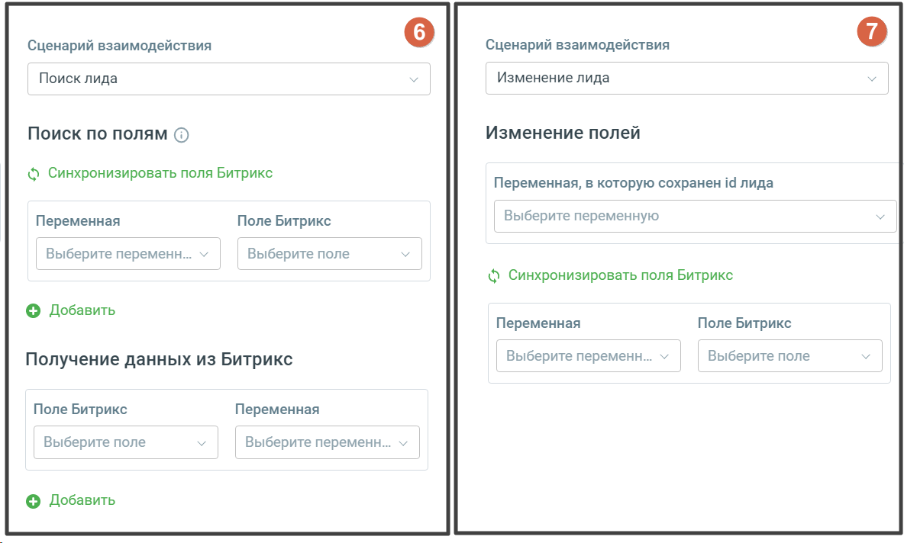

переменные модуля. Клик по кнопке открывает поле для создания новой переменной скрипта. 5. Следующее действие – следующий блок скрипта. После прохода скрипта в Битрикс24:

 создается лид/сделка  в лиде/сделке отображаются указанные в настройках блока "Интеграции" данные

6. Поиск по полям (сценарий «поиск лида/сделки»): поиск с последующей синхронизацией может производиться как по переменным модуля, так и полям Битрикс24. При проходе скрипта происходит сопоставление полученных полей для поиска в Битрикс24 с переменными робота. Далее происходит получение и запись полученных данных найденного в Битрикс24 лида/сделки, в переменные робота. 7. Изменение полей (сценарий «изменение лида/сделки»): робот вносит изменения в данные лид/сделки в Битрикс24. Например, чтобы актуализировать информацию по клиентам для менеджеров по продажам. После прохода скрипта в Битрикс24:изменяется лид/сделка, в лиде/сделке отображаются измененные данные. Интеграция с кампанией исходящего обзвона Контакт-центра Интеграция с кампанией исходящего обзвона контакт-центра представляет собой многофункциональный инструмент, обеспечивающий эффективное взаимодействие с абонентами и управление процессами кампании. Помимо создания заданий на перезвон, когда операторы заняты, доступны дополнительные функции, позволяющие расширить и улучшить работу кампании.

При создании задания на обратный звонок, робот передает в систему все необходимые данные о клиенте и предыдущем взаимодействии, что позволяет оператору эффективно подготовиться к разговору и максимально качественно обработать звонок. Функциональные возможности:  Мониторинг показателей: Робот-администратор обеспечивает доступ к актуальным данным о кампании, включая ASR, ACD и количество успешных разговоров, что позволяет своевременно принимать решения для оптимизации процессов.  Управление кампаниями: Пользователи могут приостанавливать и перезапускать кампании, тем самым гарантируя бесперебойную работу и повышая её эффективность.  Оптимизация базы номеров: Предусмотрена автоматическая замена телефонных номеров на иные, что позволяет улучшить результаты обзвона.  Расширение контактной базы: Через HTTP-запросы к системе можно добавлять новые контакты в список обзвона.  Корректировка состава операторов: Система предлагает возможность менять операторов обзвона, освобождая или назначая их для определённых задач.  Уведомления о проблемах: В случае возникновения проблем, робот-администратор уведомит руководителя, обеспечивая оперативное реагирование на ситуацию.

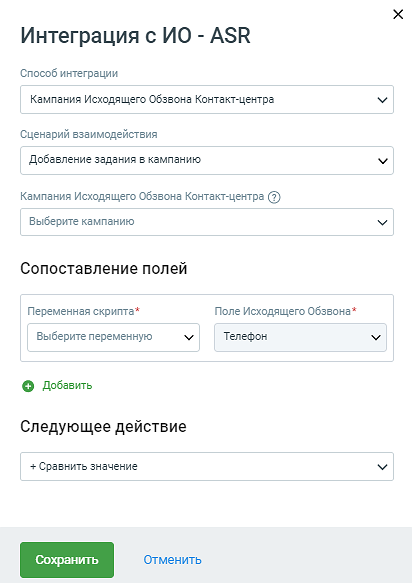

Элементы настроек блока: 1. Выбор кампании Исходящего обзвона – выпадающий список кампани ИО Контакт-центра Важно: Для выбора кампаний ИО доступны только «бессрочные» кампании. 2. Сценарий взаимодействия – выбор действий, производимых с кампанией ИО. Варианты:  запуск кампании  остановка кампании  замена номеров – при выборе данного сценария отображается поле для выбора номера для замены.

 получение показателей кампании – при выборе данного сценария отображаются связка полей для выбора показателя (ASR, ACD, успешные разговоры, общее количество звонков) и переменной, куда он будет записан.  добавление задания в кампанию – при выборе данного сценария отображается связка: o Переменная скрипта – выпадающий список, содержащий ТОЛЬКО переменные

скрипта. Клик по кнопке открывает поле для создания новой переменной скрипта. o Поле Исходящего обзвона – выпадающий список, содержащий все стандартные и пользовательские поля кампаний ИО, с возможностью настроить передачу в них данных при создании. 3. Кнопка «Добавить» – по клику на кнопку добавляется еще одна связка полей. Добавить связку можно не более 10 раз. 4. Следующее действие – следующий блок скрипта. После прохода скрипта робот создает задания в настроенной кампании ИО, и передает всю необходимую информацию, заданную в полях блока. В разделе Статистика отображается информация о взаимодействии робота с кампанией ИО. Пример: Сценарий «Замена номера телефона» Пользователь модуля «Роботы», который настраивает скрипт роботизированного обзвона, может автоматически изменять номер телефона из определенного списка, когда эффективность кампании обзвона падает ниже установленных критериев. Это дает возможность быстро реагировать на изменения в работе кампании и пытаться улучшить показатели эффективности, такие как коэффициент успешных звонков (ASR) или средняя продолжительность разговора (ACD). Из скриншота ниже видно, что интерфейс позволяет пользователю:  Выбрать сценарий – Замена номеров  Выбрать кампанию, для которой нужно настроить подмену номеров.  Определить порядок, в котором будут использоваться альтернативные номера телефонов (с указанием приоритетов).  Добавлять новые номера для использования.

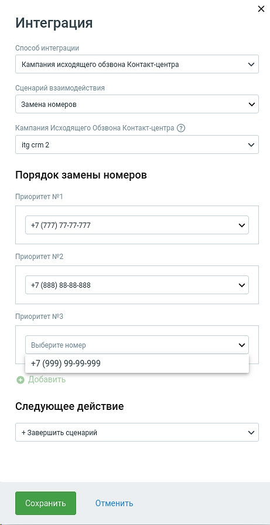

Пример: Сценарий «Управление показателями кампании исходящего обзвона (ИО) по API» Пользователям предоставляется возможность комплексного управления кампаниями ИО с помощью робота-администратора. Этот инструмент позволяет отслеживать и регулировать ключевые показатели

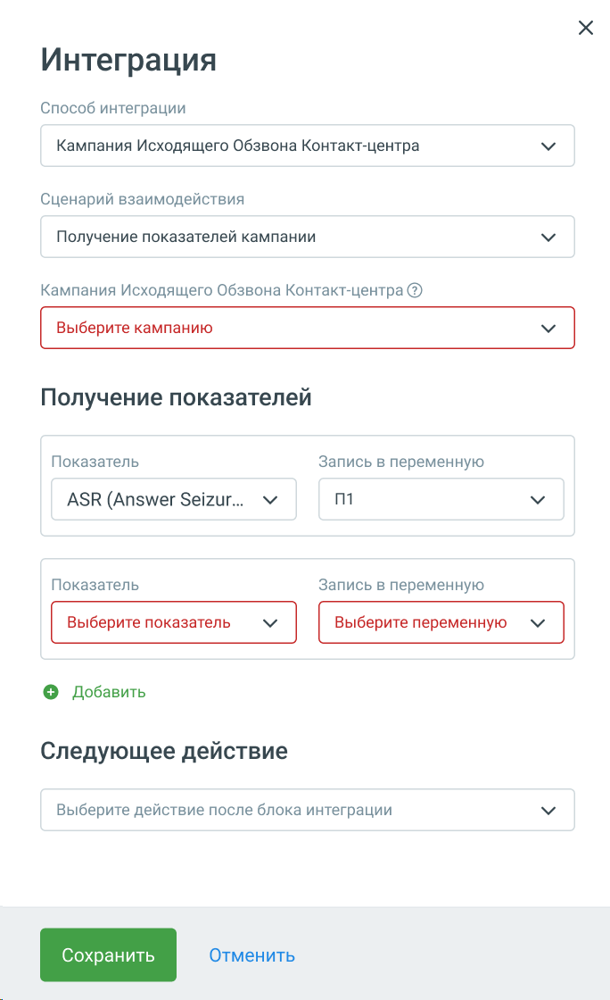

эффективности, такие как коэффициент успешных вызовов (ASR), средняя продолжительность звонка (ACD), а также общее число успешных разговоров.

При помощи метода API, робот-администратор имеет возможность извлекать данные по идентификатору кампании, включая статистику по звонкам и детализацию результатов. Вся информация представлена в удобном для анализа виде, что делает управление кампаниями максимально эффективным.

1. Детализация показателей кампании  Успешные разговоры: Количество задач со статусом "4 - завершен", где длительность разговора была больше нуля, отображает число эффективных взаимодействий с клиентами.  Общее количество звонков: Фиксируется общее число попыток дозвона, что позволяет оценить объем работы, проделанной кампанией, и выявить потенциальные возможности для увеличения продуктивности.  ASR (Answer Seizure Ratio) определяется как отношение попыток дозвона с результатом "1 - разговор состоялся" к общему количеству попыток дозвона.  ACD (Average Call Duration) средняя длительность разговора по задачам в статусе "4 - завершен" с длительностью разговора > 0 (в секундах) 2. Результаты попытки дозвона:  1 - разговор состоялся: успешное соединение;  2 - абонент занят: звонок не может быть выполнен из-за занятости абонента;  3 - абонент не взял трубку: не удалось дозвониться;  4 - абонент недоступен: абонент не может быть достигнут;  5 - оператор занят: оператор, отвечающий за вызовы, занят;  6 - оператор не взял трубку: оператор не ответил на звонок;  7 - оператор недоступен: оператор временно или постоянно недоступен;  8 - некорректный номер: номер телефона не существует или введен неверно;  10 - Оператор не дождался ответа: звонок был прерван, так как оператор не дождался ответа;  20 - Остановлено оператором: звонок был остановлен оператором по определенной причине;  21-24 - АнтиРобот: ряд кодов, указывающих на различные сценарии, связанные с системой АнтиРобот. 3. Статусы задачи: Предоставляются статусы для отслеживания прогресса выполнения задач:  0 - остановлен: задача остановлена;  1 - в очереди: задача находится в очереди на исполнение;  2 - дозвон: процесс дозвона в данный момент;  3 - разговор: происходит разговор;  4 - завершен: задача успешно выполнена;  5 - в очереди после неудачной попытки: задача возвращена в очередь после неудачи;  6 - удален: задача была удалена из системы. Интеграция AmoCRM Данная интеграция позволяет роботу создавать новую сделку в AmoCRM. Благодаря этому можно экономить ресурсы операторов и менеджеров на звонки, для выявления первичного интереса клиента к услуге или товару.

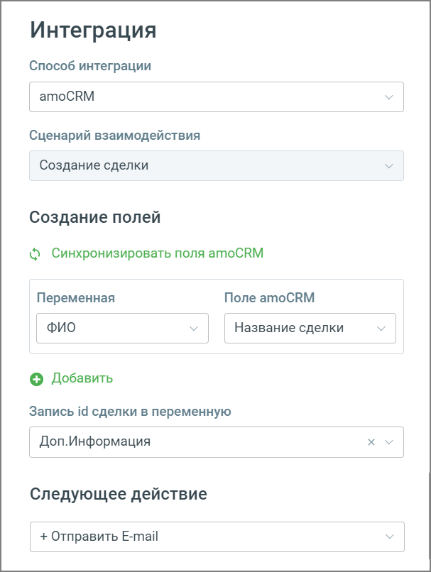

Элементы настроек блока: 1. Сценарий взаимодействия – создание сделки; 2. Создание полей  Переменная – выпадающий список, содержащий все доступные пользовательские и системные

поля. Клик по кнопке открывает поле для создания новой переменной.  Поле AmoCRM – выпадающий список, содержащий все стандартные и пользовательские поля кампании CRM, с возможностью настроить передачу в них данных при создании. «Добавить» – по клику на кнопку добавляется еще одна связка «переменная – поле AmoCRM». Добавить связку можно не более 10 раз.

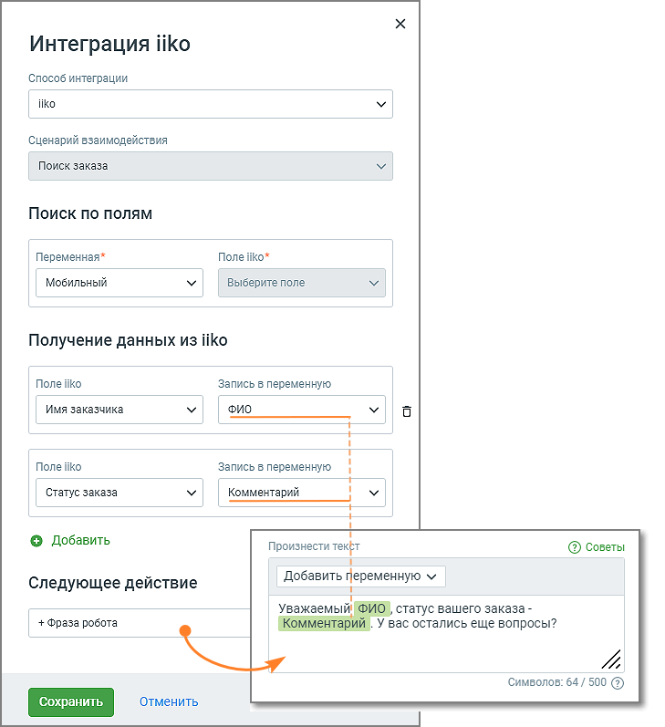

3. Следующее действие – следующий блок скрипта. После прохода скрипта в AmoCRM создается сделка. В сделку передаются указанные в настройках блока "Интеграции" данные. ID сделки записывается в указанную переменную. В разделе Статистика отображается информация о взаимодействии робота с AmoCRM. Интеграция с IIKO Данная интеграция позволяет роботу проверять наличие заказа по номеру телефона в момент звонка, чтобы экономить время операторов и консультировать клиентов по текущим данным заказа с помощью роботов. Возможности голосового робота:

Элементы настроек блока: 1. Способ интеграции – iiko; 2. Сценарий взаимодействия – поиск заказа; 3. Поиск по полям:

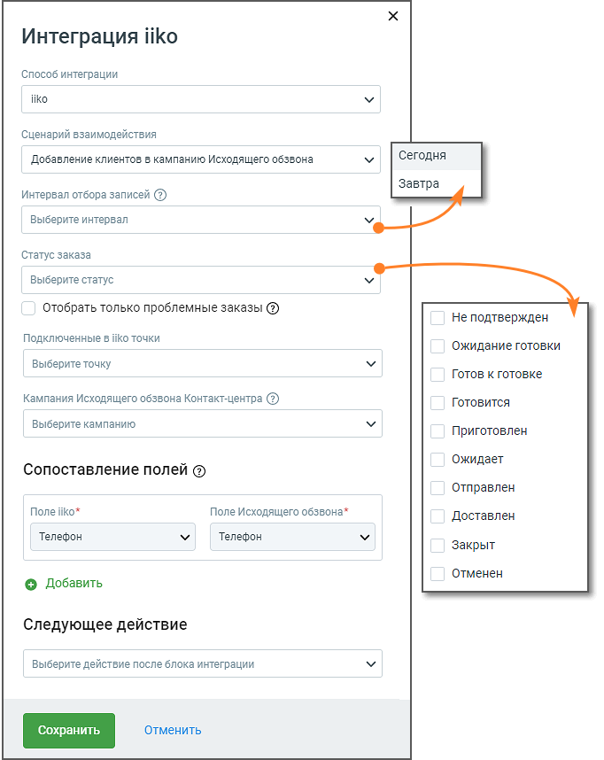

 Переменная – выпадающий список, содержащий все доступные переменные модуля. Клик по кнопке «Создать переменную» открывает поле для создания новой переменной скрипта.  Поле iiko – не доступно для изменения. По умолчанию – мобильный телефон заказчика. 4. Получение данных из iiko:  Поле iiko – список наименований поля в алфавитном порядке. Выбранное поле будет просматривать робот, полученные данные запишет в переменную; o Время выполнения заказа o Время завершения приготовления o Время отправки доставки o Время подтверждения заказа o Время создания заказа o Дом o Имя заказчика o Имя курьера o Имя оператора, принявшего заказ o Квартира o Комментарий к заказу o Номер заказа o Срок поставки (в минутах) o Статус заказа o Сумма заказа o Телефон заказчика o Телефон курьера o Телефон оператора, принявшего заказ o Улица o Фактическое время доставки o Фамилия заказчика  Запись в переменную – данные, соответствующие выбранному наименованию поля iiko, будут записаны в выбранную переменную. Выпадающий список, содержащий все доступные переменные модуля. 5. Следующее действие – следующий блок скрипта. Например, можно выбрать блок «Фраза робота», и робот произнесет клиенту статус его заказа.

| 6. Совет. Если у вас нет опыта в настройке данного типа скрипта, вы можете воспользоваться преднастроенным |
| --- |
| шаблоном «Интеграция с программой iiko. Входящий звонок», откорректировав его под свои потребности. |

Возможности робота-администратора: В дополнение к возможностям обычного робота робот-администратор может получать и обзванивать список клиентов, у которых есть заказы в iiko, которые невозможно приготовить (например, нет ингредиентов). После получения информации от робота-администратора клиент может сделать другой заказ через оператора или отменить заказ через голосового робота.

Элементы настроек блока: 1. Способ интеграции – iiko; 2. Сценарий взаимодействия – добавление клиентов в кампанию Исходящего обзвона; 3. Интервал отбора записей – сегодня, завтра; 4. Статус заказа – информация о том, на какой стадии обработки находится заказ;

5. Отобрать только проблемные заказы – если чекбокс проставлен, будут отображаться только те заказы, по которым в iiko была нажата кнопка "Проблема". 6. Подключенные в iiko точки – выбор из списка филиалов, подключенных при настройке интеграции. 7. Кампания Исходящего обзвона Контакт-центра – кампания ИО, по которой робот-администратор будет осуществлять обзвон. 8. Сопоставление полей:  Поле iiko – не доступно для изменения. По умолчанию – мобильный телефон заказчика.  Поле Исходящего обзвона – не доступно для изменения. По умолчанию – мобильный телефон заказчика; 9. «Добавить» – по клику на кнопку добавляется еще одна связка «поле iiko – поле Исходящего обзвона». Добавить связку можно не более 10 раз. Возможные значение поля iiko:  ФИО  Имя  Фамилия  Комментарий  Пол  Дата рождения  Идентификатор заказа  Идентификатор организации  Статус заказа  Информация об отмене  Комментарий к заказу  Сумма  Номер заказа  Наименование продуктов  Тип оплаты 10. Следующее действие – следующий блок скрипта. Например, можно выбрать блок «Фраза робота», и робот произнесет клиенту статус его заказа. Статусы заказа:

| Статус на входе (ENG) | Статус на выходе (RUS) |
| --- | --- |
| Unconfirmed | Не подтвержден |
| WaitCooking | Ожидание готовки |
| ReadyForCooking | Готов к готовке |

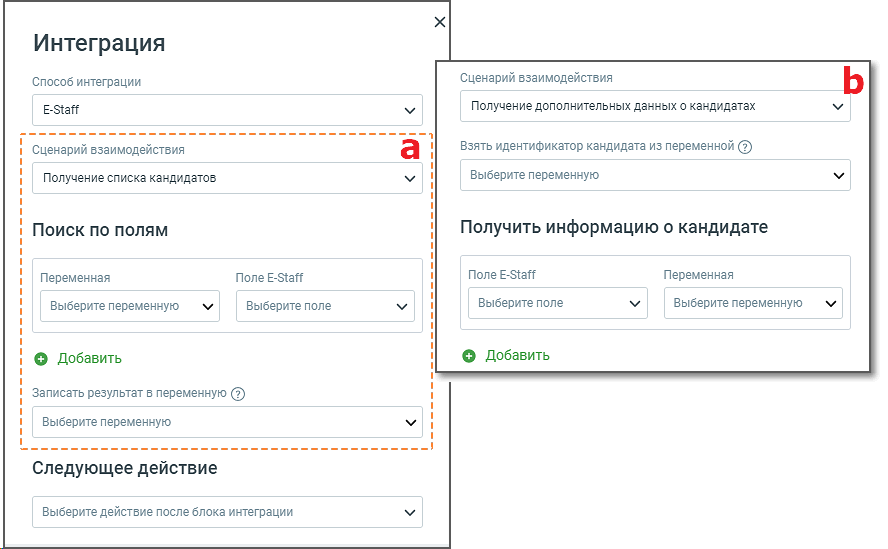

| CookingStarted | Готовится |
| --- | --- |
| CookingCompleted | Приготовлен |
| Waiting | Ожидает |
| OnWay | Отправлен |
| Delivered | Доставлен |
| Closed | Закрыт |
| Cancelled | Отменен |

Интеграция с E-Staff Данная интеграция позволяет роботу-администратору получать список кандидатов для обзвона и передавать их для обзвона.

Элементы настроек блока: 1. Способ интеграции – E-Staff; 2. Сценарий взаимодействия – варианты: получение списка кандидатов, получение дополнительных данных о кандидатах. Cценарий взаимодействия (a): Поиск по полям.  Переменная – выпадающий список, содержащий переменные скрипта. Клик по кнопке «Создать переменную» открывает поле для создания новой переменной скрипта.  Поле E-Staff – выпадающий список, содержащий переменные, получаемые из E-Staff.  Номер  Моб. телефон  Регион поиска работы (ID из внутреннего справочника)  Статус кандидата  Начиная с даты обновления анкеты  Заканчивая датой обновления анкеты  Записать результат в переменную – выпадающий список, содержащий переменные скрипта. После прохождения блока в выбранную переменную будет записан результат прохождения. Доступно создание новых переменных.

Cценарий взаимодействия (b): Получить дополнительных данных о кандидатах.  Взять идентификатор кандидата из переменной – выпадающий список, содержащий переменные скрипта и системные переменные модуля. Клик по кнопке «Создать переменную» открывает поле для создания новой переменной скрипта.  Поле E-Staff – выпадающий список, содержащий переменные, получаемые из E-Staff.  Имя  Фамилия  Отчество  Дата рождения  Моб. телефон  E-Mail  Образование/Год окончания  Образование/Учебное заведение  Образование/Специальность  Образование/Дополнительное образование  Образование/Доп. сведения  Список дополнительного образования  Место работы/Дата начала работы  Место работы/Дата окончания работы  Место работы/Название компании  Место работы/Местонахождения организации  Место работы/Сфера деятельности  Место работы/Вебсайт организации  Место работы/Должность  Место работы/Уровень з/п  Место работы/Обязанности и достижения  Место работы/Комментарий рекрутера  Все предыдущие места работы  Событие/Дата  Событие/Тип события  Событие/Идентификатор подстатуса  Событие/Идентификатор вакансии  Событие/Комментарий  Все события  Переменная – выпадающий список, содержащий переменные скрипта и системные переменные модуля. Клик по кнопке «Создать переменную» открывает поле для создания новой переменной скрипта. 3. Кнопка «Добавить» – нажатие на кнопку добавляется связку «Переменная»-«Поле». 4. Следующее действие – следующий блок скрипта. Например, можно выбрать блок «Отправить e- mail», и робот отправит соискателю тестовое задание. Интеграция с YCLIENTS Данная интеграция позволяет роботу-администратору получать список клиентов, зарегистрированных на услугу, и осуществлять их обзвон с целью освобождения графика работы мастеров от тех клиентов,

которые не планируют приходить. Это позволяет эффективно использовать время и предоставлять свободные слоты новым клиентам.

| Данная интеграция доступна только при создании скрипта для робота-администратора. Для остальных роботов |
| --- |
| интеграция с YCLIENTS доступна в блоке «HTTP-запрос». |

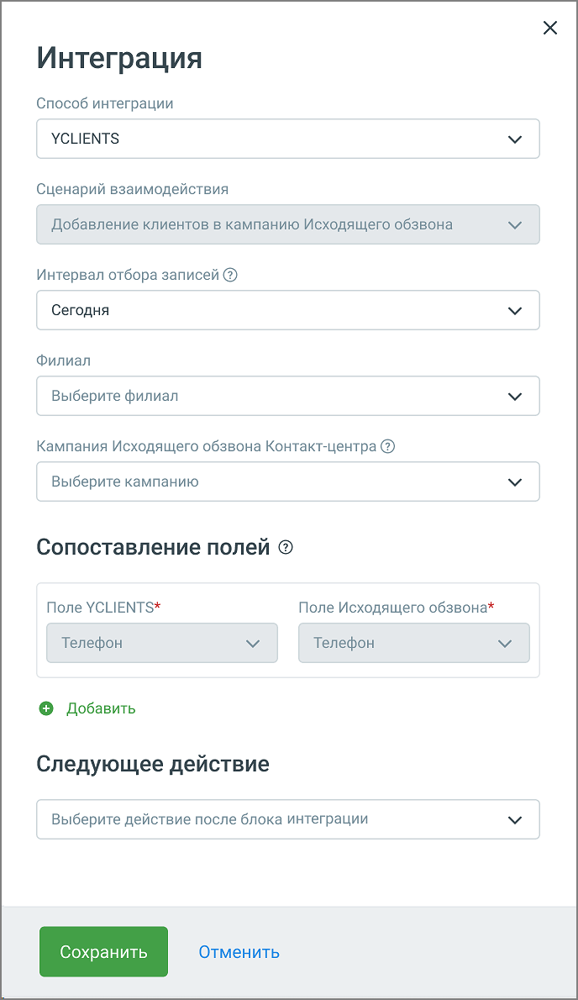

Элементы настроек блока:

<!-- изображение на стр. 115: байты не извлечены (PyMuPDF недоступен) -->

1. Способ интеграции – YCLIENTS; 2. Сценарий взаимодействия – добавление клиентов в кампанию Исходящего обзвона. 3. Интервал отбора записей – варианты: сегодня, завтра, сегодня и завтра.  Если выбрано “Сегодня”- робот соберет все записи клиентов, сделанные с 00.00 до 23.59 на дату запуска робота.  Если выбрано “Завтра”- робот соберет все записи клиентов, сделанные с 00.00 до 23.59 на дату после даты запуска робота. 4. Филиал – выпадающий список созданных в YCLIENTS филиалов, из которого будут браться записи. 5. Кампания Исходящего обзвона Контакт-центра – выпадающий список доступных кампаний ИО, по абонентам которой будет совершаться обзвон. 6. Сопоставление полей:  Поле Исходящего обзвона: Выберите поле Исходящего обзвона, которое будет сопоставлено с полем YCLIENTS.  Поле YCLIENTS: Выберите поле из YCLIENTS, которое будет сопоставлено с полем Исходящего обзвона. Варианты: o Наименование услуг (через запятую) o Персонал/Идентификатор сотрудника o Персонал/ФИО сотрудника o Персонал/Специализация o Клиент/Идентификатор клиента o Клиент/Имя клиента o Клиент/Фамилия клиента o Клиент/Отображаемое имя клиента o Клиент/Почтовый адрес o Клиент/Количество успешных посещений o Клиент/Количество неудачных посещений o Клиент/Скидка o Данные записи/Идентификатор записи o Данные записи/Идентификатор кампании o Данные записи/Дата записи o Данные записи/Дата создания записи o Данные записи/Комментарий o Данные записи/Онлайн запись o Данные записи/Посещаемость o Данные записи/Подтверждение o Данные записи/Оплачено полностью o Данные записи/Статус платежа o Данные записи/Предоплаченный 7. Кнопка «Добавить» – нажатие на кнопку добавляется связку полей. Максимально - 7 связок. 8. Следующее действие – следующий блок скрипта. Например, можно выбрать блок «Отправить SMS», и робот отправит клиенту уведомление об отмене записи на услугу.

<!-- изображение на стр. 116: байты не извлечены (PyMuPDF недоступен) -->
