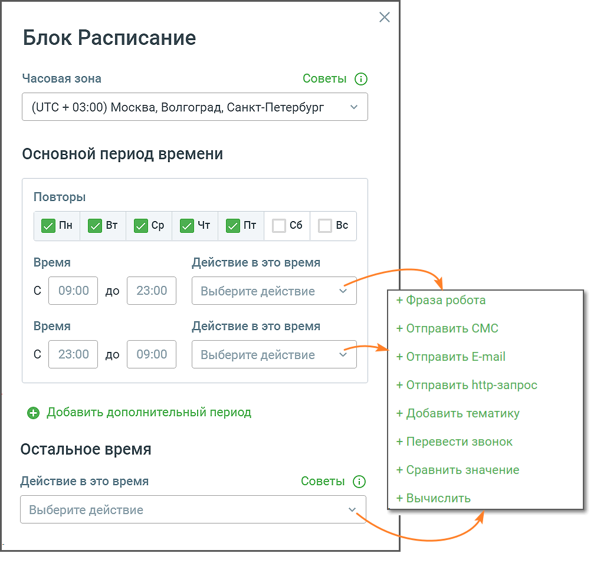

# 5.13. Блок Расписание

> Трассировка: PDF §5.13 · сквозные стр. 116-117 · источники: ч.1 `kb/sources/cov-robot-fil/Модуль ЦОВ Робот Фил 2,0_manual_v7.26.28.pdf` с.116-117.

Блок доступен при создании скрипта для Роботов и Чат-ботов. Блок позволяет настраивать действия робота в зависимости от дня недели и времени суток.

Элементы настроек блока: 1. Название блока – название блока, должно быть уникальным в рамках скрипта. Максимальное количество символов – 50. 2. Часовая зона – выбор часовой зоны, в которой будет действовать Расписание. 3. Основной и дополнительный период времени – выбор времени, когда произойдет действие робота. Выбор дня недели в одном из периодов, исключает возможность выбора этого дня недели в другом периоде. 4. Остальное время – действие робота запускается при условии, что текущие день или время (в момент звонка) не указаны в интервале основного или дополнительного периодов. 5. Кнопка «Сохранить» – сохраняет внесенные изменения, форма настроек блока закрывается. 6. Кнопка «Отменить» – закрывает форму настройки блока, без сохранения изменений.

