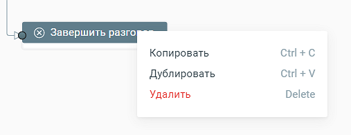

# 5.14. Блок Завершить

> Трассировка: PDF §5.14 · сквозные стр. 117 · источники: ч.1 `kb/sources/cov-robot-fil/Модуль ЦОВ Робот Фил 2,0_manual_v7.26.28.pdf` с.117.

Блоки доступны при создании скрипта для Роботов, Роботов-администраторов и Чат-ботов.  Завершить разговор – завершает скрипт робота  Завершить диалог – завершает скрипт чат-бота  Завершить сценарий – завершает скрипт робота-администратора Блоки не редактируются. Блоки могут быть скопированы в буфер обмена, продублированы в поле создания сценария скрипта, удалены.

Блоки Завершить являются обязательным завершающим блоком любого скрипта.
